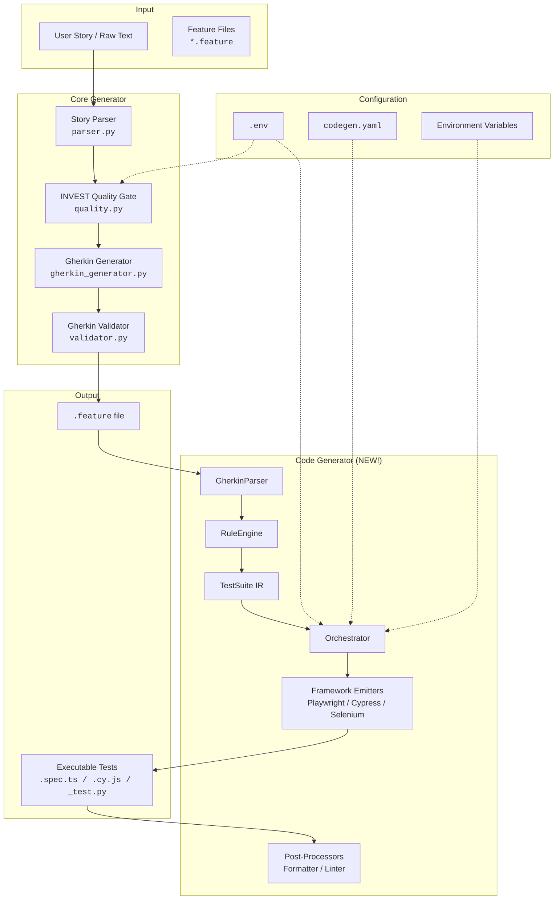

# Antinode Norma

[](https://github.com/bmrtech-oss/antinode-norma/actions/workflows/ci.yml)
[](https://codecov.io/gh/bmrtech-oss/antinode-norma)
[](https://sonarcloud.io/dashboard?id=bmrtech-oss_antinode-norma)
[](https://github.com/bmrtech-oss/antinode-norma/network/alerts)
[](https://python.org)
[](https://opensource.org/licenses/MIT)
[](https://github.com/modelcontextprotocol)

BDD feature file generator with an INVEST quality gate.  
Transform raw user stories into validated Gherkin `.feature` files.  
**Now also generates executable test scripts** from those feature files.

Built with a data-centric, functional philosophy – inspired by Rich Hickey.

Works with **any LLM** (Claude, GPT, OpenRouter, local) and integrates via **MCP** (Model Context Protocol) for tool-based orchestration.

---

## 📚 Documentation

- [Tutorial](docs/TUTORIAL.md) – A walkthrough for Phase 8 documentation and community onboarding.
- [Client Usage Guide](docs/CLIENT_USAGE.md) – Step-by-step setup with JIRA and OpenRouter.
- [Docker and Local Development](docs/DOCKER.md) – Run the full project locally with Docker/Podman.
- [Testing Guide](docs/TESTING.md) – How to run and extend the test suite.
- [Troubleshooting](TROUBLESHOOTING.md) – Common errors and recovery steps.
- [Changelog](CHANGELOG.md) – Release history and version notes.
- [Contributing Guide](CONTRIBUTING.md) – Guidelines for contributors.
- [Code Generation Module](antinode_norma/codegen/README.md) – Generate Playwright, Cypress, and Selenium tests from Gherkin.
- [End‑to‑End Workflow Guide](docs/E2E_WORKFLOW.md) – Complete BDD lifecycle from story to tests.
- [Visual Testing (Phase 4)](docs/VISUAL_TESTING.md) – Playwright snapshot guidance and CLI flags.

---

## Quick Start

```bash
# Install
git clone https://github.com/antinodelabs/antinode-norma.git
cd antinode-norma
pip install -e .

# Configure
cp .env.example .env
# Edit .env with your API keys (see Configuration below)

# Generate a feature file
anorm generate "As a user, I want to reset my password so that I can regain access."

# Preview generation without writing files
anorm generate "As a user, I want to reset my password so that I can regain access." --dry-run

# Use interactive retry mode for failed story generation
anorm generate "As a user, I want to reset my password so that I can regain access." --interactive

# Generate executable tests from the feature file
python -m antinode_norma.codegen.cli.commands generate -f features/reset_password.feature -fw playwright
```

---

## Features

### Core BDD Generator
- **INVEST quality assessment** – Checks stories against Independent, Negotiable, Valuable, Estimable, Small, Testable.
- **Automatic Gherkin generation** – Uses your preferred LLM to produce feature files.
- **MCP server** – Exposes tools (`submit_story`, `improve_story`, `generate_feature`) for integration with connectors (JIRA, GitHub, etc.).
- **Provider-agnostic LLM** – Switch between Anthropic, OpenAI, OpenRouter, or local models via configuration.
- **CLI and library** – Use as a command-line tool or import into your own system.
- **Quality-first** – Rejects stories that don't meet INVEST criteria, with actionable suggestions.
- **Learning from failures** – Capture Playwright test failures and use them to improve future generation. Use `anorm learn --show-suggestions` to surface failure-driven healing recommendations.
- **Interactive CLI** – Retry failed generation or resolve unmapped steps on the fly using `--interactive`.
- **Shell completion** – Generate completion scripts for bash, zsh, or PowerShell with `anorm completion <shell>`.
- **Batch generation** – Generate tests for multiple feature files in parallel with configurable workers.
- **Pure-core design** – Business logic is side-effect free, easy to test and extend.
- **Comprehensive test suite** – Unit and integration tests with `pytest`.
- **OpenRouter support** – Use free/open models via OpenRouter with the official OpenAI SDK.

### Code Generation (NEW!)
- **Framework-agnostic** – Generate tests for Playwright, Cypress, or Selenium from the same feature files.
- **Quality enhancements** – Page Objects, reusable step definitions, Scenario Outlines, and data-driven testing.
- **AI-powered step mapping** – Natural language Gherkin is mapped to Playwright actions with optional LLM fallback to the RuleEngine.
- **Configurable** – Control output quality via `codegen.yaml`, `.env`, or environment variables.
- **Post‑processing** – Auto-format and lint generated code with Prettier, Black, ESLint, or flake8.
- **Extensible** – Add support for new frameworks with a simple emitter interface.
- **Rich Hickey-inspired design** – Data-driven pipeline with immutable models and pure functions.

---

## Installation

```bash
git clone https://github.com/antinodelabs/antinode-norma.git
cd antinode-norma
pip install -e .
```

For development, install additional test dependencies:

```bash
pip install -r requirements-dev.txt
```

---

## Configuration

Copy `.env.example` to `.env` and fill in your API keys:

```bash
cp .env.example .env
```

Edit `.env` with your preferred LLM provider:

```ini
# LLM Configuration
# Supported providers: anthropic, openai, openrouter, local, mock
LLM_PROVIDER=openrouter

# For Anthropic:
ANTHROPIC_API_KEY=sk-...

# For OpenAI:
OPENAI_API_KEY=sk-...

# For OpenRouter (uses OpenAI SDK with custom base URL):
OPENROUTER_API_KEY=sk-or-...
LLM_MODEL=openai/gpt-oss-120b:free
LLM_BASE_URL=https://openrouter.ai/api/v1
LLM_TEMPERATURE=0.2
LLM_MAX_TOKENS=1024

# JIRA (optional – for the connector)
JIRA_SERVER=https://your-domain.atlassian.net
JIRA_TOKEN=your_personal_access_token

# Code Generation (optional – for antinode_norma.codegen)
CODEGEN_DEFAULT_FRAMEWORK=playwright
CODEGEN_OUTPUT_DIR=generated_tests
CODEGEN_QUALITY_USE_PAGE_OBJECTS=true
CODEGEN_QUALITY_GENERATE_STEP_DEFS=true
CODEGEN_QUALITY_RUN_FORMATTER=true
CODEGEN_QUALITY_USE_LLM_MAPPING=true
CODEGEN_QUALITY_LLM_MAPPING_CACHE_SIZE=1000
CODEGEN_QUALITY_LLM_MAPPING_TIMEOUT=5
```

> **Note:** OpenRouter uses the `extra_body={"provider": {"require_parameters": True}}` to track reasoning tokens automatically.

---

## Usage

### CLI – Generate a feature file

```bash
anorm generate "As a user, I want to reset my password so that I can regain access. Acceptance criteria: click forgot password, receive email, set new password."
```

Output:

```
Feature file written: features/reset_password.feature
```

### CLI – Generate executable tests

```bash
python -m antinode_norma.codegen.cli.commands generate -f features/reset_password.feature -fw playwright
```

This produces Playwright test scripts in `generated_tests/playwright/`.

**Options:**
- `-f, --feature` – path to the `.feature` file (required).
- `-o, --output` – output directory (overrides config).
- `-fw, --framework` – target framework: `playwright`, `cypress`, or `selenium`.
- `-c, --config-file` – optional YAML configuration file.

### CLI – Check quality only

```bash
anorm generate --quality-only "My story..."
```

This returns the INVEST quality score and any issues without generating a file.

### CLI – Dry-run generation

```bash
anorm generate --dry-run "My story..."
```

Preview the generated feature path without writing files to disk.

### CLI – Interactive generation

```bash
anorm generate --interactive "My story..."
```

If generation fails, the CLI can prompt you to retry with corrected story text.

### CLI – Parse a feature file

```bash
anorm parse --feature-file features/reset_password.feature
```

Inspect mapped step actions from an existing Gherkin feature.

### CLI – Shell completion

```bash
anorm completion bash > ~/.bashrc
anorm completion zsh > ~/.zshrc
anorm completion powershell > $PROFILE
```

Enable tab completion for the `anorm` command in your shell.

### CLI – Read from file

```bash
anorm generate --file story.txt
```

### MCP Server

Start the Norma MCP server:

```bash
anorm serve
```

This exposes the tools over stdio (or SSE with `--transport sse`).

### JIRA Connector

Run the JIRA connector (fetches issues labelled `bdd-ready` and submits them to Norma):

```bash
python -m antinode_norma.connectors.jira_connector
```

The connector now also supports issue fetch, comments, and workflow transitions for richer JIRA automation.

### Advanced Integrations

Antinode Norma also supports:
- TestRail case upload and result reporting
- Slack and Teams webhook notifications
- CLI commands for JIRA, TestRail, and notification workflows
- CI/CD templates for GitHub Actions and GitLab CI

See [docs/ADVANCED_INTEGRATIONS.md](docs/ADVANCED_INTEGRATIONS.md) for setup and examples.

### Python API

```python
import asyncio
from antinode_norma.runner import run_agent_from_raw

async def main():
    result = await run_agent_from_raw("User story...")
    print(result["feature_path"])

asyncio.run(main())
```

### Python API – Code Generation

```python
from antinode_norma.codegen import Orchestrator

orchestrator = Orchestrator()
orchestrator.generate(
    feature_path="features/login.feature",
    output_dir="my_tests",
    framework="playwright"
)
```

For detailed step-by-step instructions with JIRA and OpenRouter, see the [Client Usage Guide](docs/CLIENT_USAGE.md).  
For full code generation documentation, see the [Code Generation Module README](antinode_norma/codegen/README.md).

---

## Architecture

### Original High‑Level Architecture (ASCII)

```text
+-----------------+      +-----------------+
|  JIRA Connector |      |  GitHub Issues  |
+-----------------+      +-----------------+
         |                        |
         +------------+-----------+
                      |
                      v
            +---------------------+
            |  MCP Transport       |
            |  (stdio / SSE)       |
            +---------------------+
                      |
                      v
            +---------------------+
            |  Norma MCP Server    |
            |  (exposes tools)     |
            +---------------------+
                      |
                      v
            +---------------------+
            |  Pure Core (no I/O)  |
            |  - parse_story       |
            |  - compute_quality   |
            |  - generate_gherkin  |
            |  - validate_gherkin  |
            +---------------------+
                      |
                      v
            +---------------------+
            |  Effects             |
            |  (file, LLM)         |
            +---------------------+
```

### Code Generation Module (ASCII)

```text
+------------------+     +-------------------+     +------------------+
|  Feature File    | --> |   GherkinParser   | --> |   RuleEngine     |
|  (*.feature)     |     |                   |     |                  |
+------------------+     +-------------------+     +------------------+
                                                           |
                                                           v
+------------------+     +-------------------+     +------------------+
|  TestSuite (IR)  | <-- |   Orchestrator    | <-- |   Step Mappings  |
|                  |     |                   |     |                  |
+------------------+     +-------------------+     +------------------+
        |
        v
+------------------+     +-------------------+     +------------------+
|   Emitters       | --> | PlaywrightEmitter | --> |  .spec.ts        |
|                  |     | CypressEmitter    | --> |  .cy.js          |
|                  |     | SeleniumEmitter   | --> |  _test.py        |
|                  |     | PageObjectEmitter | --> |  *.page.ts       |
|                  |     | StepDefEmitter    | --> |  common_steps.ts |
+------------------+     +-------------------+     +------------------+
                                 |
                                 v
                      +------------------+
                      | Post-Processors  |
                      | Formatter/Linter |
                      +------------------+

Configuration sources: codegen.yaml, .env, environment variables
```

### Overall Architecture (Mermaid)



---

## Project Structure

```text
antinode-norma/
├── antinode_norma/          # Python package
│   ├── core/                # Pure business logic
│   │   ├── schemas.py       # Data schemas
│   │   ├── quality.py       # INVEST quality checks
│   │   ├── parser.py        # Story -> structured data
│   │   ├── gherkin_generator.py
│   │   └── validator.py     # Gherkin validation
│   ├── codegen/             # NEW! Test code generation module
│   │   ├── models/          # Immutable data models (TestSuite, TestCase, etc.)
│   │   ├── parsers/         # GherkinParser
│   │   ├── engine/          # RuleEngine, Orchestrator, QualityConfig
│   │   ├── emitters/        # Playwright, Cypress, Selenium emitters
│   │   ├── templates/       # Jinja2 templates (optional)
│   │   ├── post_processors/ # CodeFormatter, CodeLinter
│   │   ├── cli/             # Click-based CLI commands
│   │   ├── utils/           # File I/O, logging helpers
│   │   └── config.py        # Configuration management
│   ├── server/              # MCP server
│   │   └── mcp_server.py
│   ├── connectors/          # External integrations
│   │   └── jira_connector.py
│   ├── utils/               # Helpers
│   │   ├── llm_factory.py   # LLM provider abstraction
│   │   └── file_writer.py
│   ├── cli.py               # Click CLI
│   └── runner.py            # Orchestration
├── bin/
│   └── anorm                # CLI wrapper
├── docs/                    # Documentation
│   ├── CLIENT_USAGE.md      # Client setup guide
│   └── TESTING.md           # Testing guide
├── tests/                   # Test suite
│   ├── unit/                # Fast unit tests
│   ├── integration/         # Tests with real LLM calls
│   └── connectors/          # Connector tests (mocked)
├── features/                # Sample feature files
├── generated_tests/         # Generated test scripts (output)
├── .env.example
├── README.md
├── requirements.txt
├── requirements-dev.txt
├── setup.py
├── pyproject.toml
└── pytest.ini
```

---

## LLM Provider Support

Set `LLM_PROVIDER` in `.env`:

| Provider  | Required Env Vars               | Notes |
|-----------|---------------------------------|-------|
| `anthropic` | `ANTHROPIC_API_KEY`             | Uses Claude models |
| `openai`    | `OPENAI_API_KEY`                | Uses GPT models |
| `openrouter`| `OPENROUTER_API_KEY`            | Free/open models via OpenRouter (uses OpenAI SDK) |
| `local`     | `LLM_URL` (local server endpoint) | For self-hosted models |
| `mock`      | None                            | For testing without real LLM |

---

## Testing

The project uses `pytest` with a comprehensive test suite.

Install test dependencies:

```bash
pip install -r requirements-dev.txt
```

Run all tests (unit + integration):

```bash
pytest
```

Run only unit tests (fast, no external calls):

```bash
pytest -m "not integration"
```

Run integration tests (requires `OPENROUTER_API_KEY` set):

```bash
pytest -m integration
```

Generate coverage report:

```bash
pytest --cov=antinode_norma --cov-report=html
```

For detailed testing instructions, see the [Testing Guide](docs/TESTING.md).

---

## Using the Dockerfile

### Build the image

```bash
docker build -t antinode-norma .
```

### Run the CLI

```bash
docker run --rm -e OPENROUTER_API_KEY=sk-or-... antinode-norma anorm generate "Your story..."
```

### Run the MCP server (requires stdio mapping)

For the MCP server, you need to run the container in interactive mode with stdio redirection. This is more complex and typically not needed; the CLI is the main use case.

### Run tests inside the container

```bash
docker run --rm antinode-norma pytest -m "not integration"
```

---

## Docker Compose

This project includes `docker-compose.yml` to run the repo locally in a single container with mounted source files and environment support.

### Environment setup

Use `.env.example` for real credentials, or copy `.env.docker.example` for a fully local development/demo environment that uses the mock LLM provider:

```bash
cp .env.docker.example .env
```

### Build the Docker image

```bash
docker compose build
```

### Zero-config Docker demo

Run a complete mock generation cycle without external API keys:

```bash
docker compose run --rm app /bin/sh -lc "cp .env.docker.example .env && anorm generate 'As a user, I want to reset my password so that I can regain access.'"
```

For a free-tier OpenRouter demo, set your key and run:

```bash
docker compose run --rm app -e OPENROUTER_API_KEY=sk-or-... anorm generate "As a user, I want to reset my password so that I can regain access."
```

### Run the CLI

```bash
docker compose run --rm app anorm generate "Your story..."
```

### Local development notes

For a fully local flow without external LLM calls, copy `.env.example` to `.env` and set:

```ini
LLM_PROVIDER=mock
```

When you use `LLM_PROVIDER=mock`, the container can exercise local generation and codegen end-to-end without external API credentials.

### Run tests in the container

```bash
docker compose run --rm app pytest -m "not integration"
```

### Open a shell

```bash
docker compose run --rm app bash
```

### Podman compatibility

If you prefer Podman, the same `docker-compose.yml` can be used with `podman-compose`.

For full container development instructions, see [Docker and Local Development](docs/DOCKER.md).

---

## License

This project is licensed under the MIT License – see the [LICENSE](LICENSE) file for details.

---

## Philosophy

Named after the Latin word for *rule* or *standard*, **Norma** ensures that every specification meets a baseline of quality before becoming executable. It is designed with simplicity, data-orientation, and functional purity – principles championed by Rich Hickey.

The **code generation module** extends this philosophy to the test automation layer – turning validated Gherkin into clean, maintainable, and production-ready test code.

Built with ❤️ by [Antinode Labs](https://antinodelabs.com/).