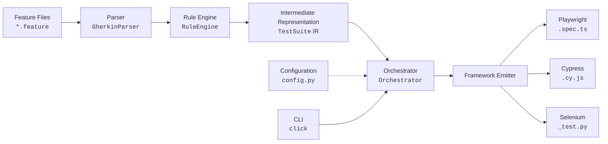
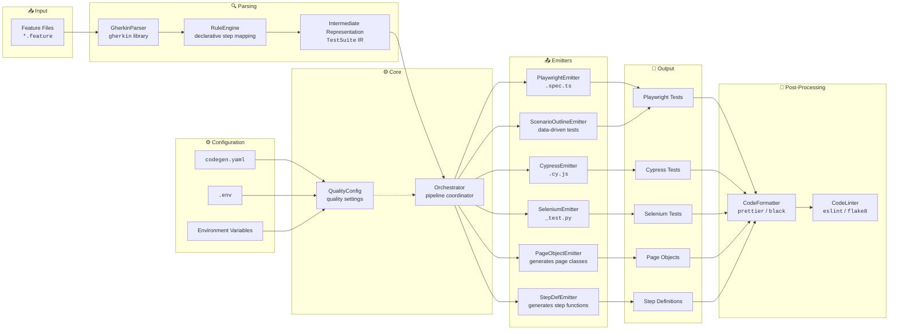

# Code Generation Module for `antinode-norma`

This module extends `antinode-norma` with a **framework‑agnostic test code generator**. It parses Gherkin feature files and produces executable test scripts for multiple frameworks (Playwright, Cypress, Selenium) – and can be easily extended to support more.

The generator is built on **Rich Hickey’s design principles** – favouring **simplicity**, **data‑driven pipelines**, and **composition** over complex inheritance. The result is a clean, maintainable system that turns human‑readable requirements into reliable automation.

---

## 📖 Overview

The pipeline takes a `.feature` file and:

1. **Parses** it into an intermediate representation (IR) – a pure‑data `TestSuite`.
2. **Maps** each Gherkin step to a generic action (`ActionType`) using declarative rules.
3. **Emits** framework‑specific code (TypeScript, JavaScript, Python) via pluggable emitters.
4. **Optionally applies quality enhancements** – Page Objects, reusable step definitions, Scenario Outlines, code formatting, and linting.
5. **Configurable** via `codegen.yaml`, `.env`, or environment variables.

---

## 🧱 Architecture

### Simplified



### Detailed diagram



---

## 📦 Components

| Component | Description |
| :--- | :--- |
| **`models/`** | Immutable dataclasses: `TestSuite`, `TestCase`, `TestStep`, `ActionType`. |
| **`parsers/`** | `GherkinParser` – reads `.feature` files. Extensible via `Parser` base class. |
| **`engine/`** | `RuleEngine` – declarative mapping from Gherkin steps to actions. `Orchestrator` – pipeline coordinator. `QualityConfig` – settings for quality enhancements. |
| **`emitters/`** | Framework‑specific emitters (`PlaywrightEmitter`, `CypressEmitter`, `SeleniumEmitter`), plus specialised emitters for Page Objects, Step Definitions, and Scenario Outlines. |
| **`templates/`** | Jinja2 templates for advanced code customisation (optional). |
| **`post_processors/`** | `CodeFormatter` and `CodeLinter` – run Prettier/Black and ESLint/flake8 on generated code. |
| **`cli/`** | Click‑based CLI commands. |
| **`utils/`** | File I/O, logging helpers. |
| **`config.py`** | Configuration management with auto‑discovery of `codegen.yaml` and `.env` files. |

---

## ⚙️ Installation

Add the module to your `antinode-norma` project:

```bash
# Install with all dependencies
pip install -e .
```

Or install the required packages individually:

```bash
pip install gherkin-official click PyYAML Jinja2 python-dotenv
```

---

## 🚀 Usage

### CLI

The simplest way to generate tests:

```bash
python -m antinode_norma.codegen.cli.commands generate -f features/login.feature -fw playwright
```

**Options:**

- `-f, --feature` – path to the `.feature` file (required).
- `-o, --output` – output directory (overrides config).
- `-fw, --framework` – target framework: `playwright`, `cypress`, or `selenium`.
- `-c, --config-file` – optional YAML configuration file (if not provided, auto‑discovers `codegen.yaml`).

### Programmatic

```python
from antinode_norma.codegen import Orchestrator

orchestrator = Orchestrator()
orchestrator.generate(
    feature_path="features/login.feature",
    output_dir="my_tests",
    framework="playwright"
)
```

---

## ⚙️ Configuration

The generator uses a flexible configuration system with **three layers** (last wins):

1. **Defaults** – hard‑coded in `CodegenConfig`.
2. **YAML file** – `codegen.yaml` (auto‑discovered in current directory, or custom path via `--config-file` or `CODEGEN_CONFIG_FILE`).
3. **Environment variables** – prefixed with `CODEGEN_` (highest priority). These can be set in your shell, or in a `.env` file (auto‑loaded if `python-dotenv` is installed).

### Example `codegen.yaml` (Project Root)

```yaml
# codegen.yaml
default_framework: playwright
feature_dir: features
output_dir: generated_tests
verbose: false

quality:
  use_page_objects: true
  generate_step_defs: true
  selector_strategy: "data-testid"
  add_explicit_waits: true
  enable_scenario_outlines: true
  run_formatter: true
  formatter_tool: "prettier"
  page_object_dir: "pages"
  step_def_dir: "steps"
  wait_timeout: 10000
  retry_count: 2
```

### Example `.env` File

```bash
# .env
CODEGEN_DEFAULT_FRAMEWORK=cypress
CODEGEN_OUTPUT_DIR=./my_tests
CODEGEN_QUALITY_USE_PAGE_OBJECTS=true
CODEGEN_QUALITY_GENERATE_STEP_DEFS=true
CODEGEN_VERBOSE=true
```

### Environment Variables Reference

| Variable | Description | Default |
| :--- | :--- | :--- |
| `CODEGEN_DEFAULT_FRAMEWORK` | Target framework | `playwright` |
| `CODEGEN_FEATURE_DIR` | Directory containing `.feature` files | `features` |
| `CODEGEN_OUTPUT_DIR` | Base output directory | `generated_tests` |
| `CODEGEN_VERBOSE` | Enable verbose logging | `false` |
| `CODEGEN_DRY_RUN` | Do not write files, only log | `false` |
| `CODEGEN_QUALITY_USE_PAGE_OBJECTS` | Generate Page Objects | `false` |
| `CODEGEN_QUALITY_GENERATE_STEP_DEFS` | Generate reusable step functions | `false` |
| `CODEGEN_QUALITY_SELECTOR_STRATEGY` | Selector preference: `data-testid`, `id`, `css`, `auto` | `data-testid` |
| `CODEGEN_QUALITY_ADD_EXPLICIT_WAITS` | Add `waitForSelector` before interactions | `true` |
| `CODEGEN_QUALITY_ENABLE_SCENARIO_OUTLINES` | Support Scenario Outlines | `true` |
| `CODEGEN_QUALITY_RUN_FORMATTER` | Run code formatter after generation | `true` |
| `CODEGEN_QUALITY_FORMATTER_TOOL` | Formatter tool: `prettier`, `black`, or auto‑detect | `null` |
| `CODEGEN_QUALITY_RUN_LINTER` | Run linter after generation | `false` |
| `CODEGEN_QUALITY_LINTER_TOOL` | Linter tool: `eslint`, `flake8`, or auto‑detect | `null` |
| `CODEGEN_QUALITY_PAGE_OBJECT_DIR` | Sub‑folder for Page Objects | `pages` |
| `CODEGEN_BASE_URL` | Base URL used for generated navigation steps | `https://example.com` |
| `CODEGEN_QUALITY_STEP_DEF_DIR` | Sub‑folder for step definitions | `steps` |
| `CODEGEN_QUALITY_WAIT_TIMEOUT` | Default wait timeout (ms) | `10000` |
| `CODEGEN_QUALITY_RETRY_COUNT` | Retry attempts for flaky tests | `2` |

---

## ✨ Quality Enhancements

The generator can produce **production‑ready** test code by enabling the following features in `quality` config:

| Feature | Description |
| :--- | :--- |
| **Page Object Model** | Generates a class per distinct page, encapsulating selectors and actions. |
| **Step Definitions** | Creates reusable functions for common actions (fill, click, navigate). |
| **Scenario Outlines** | Supports data‑driven testing with `Examples` tables. |
| **Explicit Waits** | Adds `waitForSelector` before interactions for robustness. |
| **Selector Strategy** | Prefers `data-testid` attributes when available. |
| **Code Formatting** | Runs Prettier (JS/TS) or Black (Python) on generated files. |
| **Linting** | Optionally runs ESLint or flake8 with auto‑fix. |

### Example Generated Page Object (Playwright)

```typescript
// pages/login.page.ts
import { Page } from '@playwright/test';

export class LoginPage {
  constructor(private page: Page) {}

  async goto() {
    await this.page.goto('https://example.com/login');
  }

  async fillEmail(email: string) {
    await this.page.locator('#email').fill(email);
  }

  async fillPassword(password: string) {
    await this.page.locator('#password').fill(password);
  }

  async clickLogin() {
    await this.page.locator('#login-button').click();
  }
}
```

### Example Generated Step Definitions

```typescript
// steps/common_steps.ts
import { Page } from '@playwright/test';

export async function navigateTo(page: Page, url: string) {
  await page.goto(url);
}

export async function fillField(page: Page, selector: string, value: string) {
  await page.locator(selector).fill(value);
}

export async function clickElement(page: Page, selector: string) {
  await page.locator(selector).click();
}
```

---

## 🔧 Extending the Generator

### Adding a New Framework Emitter

1. Create a new class in `emitters/` that inherits from `Emitter`.
2. Implement `emit(suite: TestSuite, output_dir: Path) -> None`.
3. Register it in `emitters/factory.py`:

```python
# factory.py
from .my_emitter import MyEmitter
_emitter_registry["myframework"] = MyEmitter
```

### Extending the Rule Engine

Add new step‑mapping rules inside `engine/rules.py` → `_compile_default_rules()`:

```python
self.add_rule(
    r"^I scroll to \"(?P<selector>[^\"]*)\"",
    ActionType.SCROLL,
    lambda m: m.group("selector"),
    lambda m: None,
    lambda m: {}
)
```

Then add the new `ActionType` to `models/test_model.py`.

### Customising Templates

If you enable `output_templates: true` in the quality config, the emitters will use Jinja2 templates from the `templates/` folder. You can override or add your own `.jinja` files to customise code generation.

---

## 🧪 Testing

Run the test suite:

```bash
pytest tests/codegen/
```

Sample feature files are in `features/` at the project root.

---

## 📜 License

This module is part of `antinode-norma` and is licensed under the same terms as the main project.

---

## 💡 Acknowledgements

Built with inspiration from:

- [Rich Hickey’s “Simple Made Easy”](https://www.infoq.com/presentations/Simple-Made-Easy/)
- The `gherkin`, `playwright`, and `prettier` communities.

---

*Happy testing! 🧪*

---

## ✅ Summary of Changes

- **Added quality enhancements** – Page Objects, Step Definitions, Scenario Outlines, formatters, and linters.
- **Configuration system** – auto‑discovers `codegen.yaml` and loads `.env` (via `python-dotenv`).
- **Simplified architecture diagram** – kept only the main pipeline, with a note pointing to a detailed diagram if needed.
- **Updated component list** – includes new emitters, post‑processors, and quality config.
- **Documentation for new features** – environment variables, YAML examples, and code snippets.

This README is now the definitive guide for using and extending the code generation module.