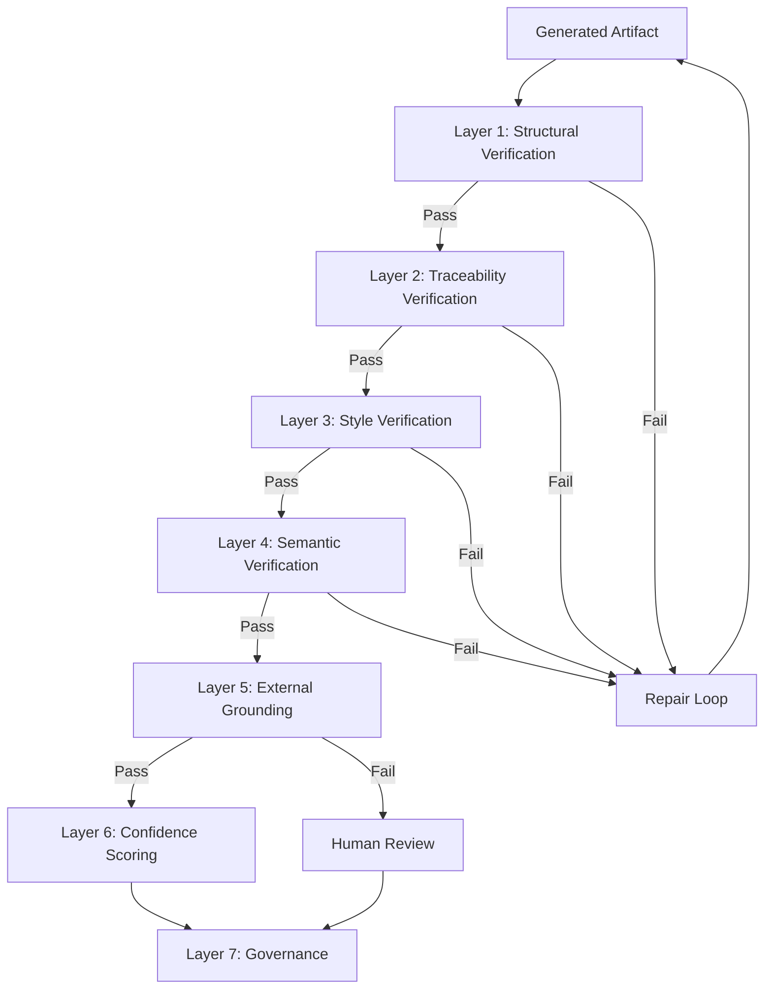

# Trusting AI-Generated Test Artifacts
## A White Paper on Verification Approaches for Regulated Software Delivery

**Document type:** Methodology white paper
**Audience:** QA leadership, platform engineering, compliance and audit stakeholders
**Date:** 2026-09-15
**Version:** 1.0

---

## Abstract

The adoption of AI-assisted development has created a new bottleneck: **verification**. Teams can generate code, tests, and specifications faster than they can validate them. The question every enterprise now faces is not *"can AI generate this?"* but *"how do we know what it generated is correct?"*

This white paper describes a methodology for building verifiable trust in AI-generated test artifacts — specifically, BDD feature files and their downstream executables. It separates the problem into deterministic and non-deterministic components, defines how each is measured, and describes the layered approach that converts raw generation into auditable, reproducible output.

The paper is vendor-neutral. It does not describe a specific product. It describes the engineering discipline that any tool in this space must implement if it is to be trusted in a regulated environment.

---

## 1. The Trust Problem

### 1.1 Why Trust Is the Wrong Default

Every AI system that generates artifacts — code, tests, specifications, documentation — introduces the same failure mode: **plausible output that is wrong**. The output looks correct. It parses. It reads well. And it is incorrect in ways that only a domain expert or an execution engine will catch.

The evidence is well-documented:

| Finding | Source |
|---|---|
| AI-generated code carries ~1.7× more defects than human-written code | Code review studies, 2025 |
| ~45% of AI-generated code samples introduce OWASP Top 10 vulnerabilities | Veracode, 2025 |
| Logic and correctness issues rose 75% in AI-generated pull requests | Code review analytics, 2025 |

These findings apply to code generation. They apply equally to test generation. In fact, test generation may be *more* susceptible, because tests are usually not executed before being accepted — they sit in a repository until CI runs them, which is often after the code they describe has already shipped.

### 1.2 Why LLM-as-Judge Is Not Sufficient

A common response is to use a second LLM to judge the first LLM's output. This does not solve the problem for four reasons:

**Anchoring bias.** When a judge sees a prior score or prior attempt, its judgment is contaminated. Studies show that anchoring can block up to 48% of error corrections and flip correct judgments toward wrong labels.

**Self-verification failure.** If the same model generates the code and the tests, it shares the same blind spots. The tests will pass because they encode the same misunderstanding.

**Calibration drift.** LLM self-reported confidence is systematically overconfident. A judge that says "0.9 confidence" may be correct only 70% of the time.

**No external oracle.** The judge has no independent source of truth. It agrees with itself, not with reality.

Any serious approach to trust must address these four failures directly. The methodology in this paper does.

### 1.3 The Question Restated

The question *"how do we trust your generated output?"* is not one question. It is four:

1. **Is the output syntactically valid?** Can it be parsed and executed?
2. **Is the output traceable?** Can we prove it corresponds to the input?
3. **Is the output semantically correct?** Does it verify what it claims to verify?
4. **Is the output reproducible?** Can we regenerate it later and get the same result?

Each question requires a different verification technique. A single tool cannot answer all four. A layered methodology can.

---

## 2. What "Trust" Means for Generated Artifacts

### 2.1 Decomposing Trust Into Verifiable Claims

Trust is not a binary property. It is a set of claims, each of which can be independently verified.

| Claim | Verification Method | Type |
|---|---|---|
| The parser accepts the output | Run the parser | Deterministic |
| Every input ID appears in the output | Set comparison | Deterministic |
| No orphan IDs appear | Set comparison | Deterministic |
| No duplicate scenario names | Set comparison | Deterministic |
| No framework syntax leaked into Gherkin | Regex + AST | Deterministic |
| The output verifies the same behavior as input | LLM judge + human labels | Statistical |
| The judge's confidence is calibrated | ECE/MCE on holdout set | Statistical |
| Two runs produce identical output | Repeated runs, hash comparison | Deterministic |
| Low-confidence cases are reviewed by humans | Workflow audit | Deterministic |

**The core insight:** Some claims are *provable*. Others are *measurable*. Conflating them is what makes most AI-tool marketing untrustworthy.

### 2.2 Provable vs. Measurable

| Component | Claim Type | What We Can Say |
|---|---|---|
| Parser | Provable | "This output parses. We tested it." |
| Set comparison | Provable | "Every input ID appears in the output. We tested it." |
| Generator | Measurable | "This generator produces correct output X% of the time, with a 95% CI of [a, b]." |
| Judge | Measurable | "This judge agrees with human experts Y% of the time, kappa = k." |
| Calibration | Measurable | "This judge's confidence is calibrated to within ECE = e." |
| Determinism | Provable | "With cache enabled, this pipeline produces byte-identical output. We tested it." |

The methodology must be explicit about which type applies to which component. A vendor that says "our AI is 95% accurate" without specifying which components were measured, on what corpus, with what confidence interval, is not providing a defensible claim.

---

## 3. The Layered Verification Approach

### 3.1 Architecture of Trust

The methodology builds trust in layers. Each layer is cheaper than the next, so failures are caught before expensive verification is invoked.

**Seven layers.** Each layer answers a specific trust question. A failure in any layer triggers either a repair (for cheap failures) or escalation (for semantic failures).

### 3.2 Layer 1 — Structural Verification

**Question answered:** Does the output parse as valid Gherkin?

**Technique:** Canonical parser (e.g., the official Gherkin parser).

**Determinism:** 100%.

**Failure mode:** The LLM produced malformed output. Repair by retry with the parse error as feedback.

**Why it's first:** Parsing is free. Running it before anything else filters out the cheapest class of failures.

### 3.3 Layer 2 — Traceability Verification

**Question answered:** Does the output correspond exactly to the input?

**Technique:** Set comparison between input IDs and output `@`-tags.

**Determinism:** 100%.

**Two checks:**

- **Missing tags:** Every input ID must appear in the output.
- **Orphan tags:** Every output tag must correspond to an input ID.

**Failure mode:** The generator dropped a case or hallucinated one. Both are repaired by retry with the specific missing/orphan tags as feedback.

**Why it matters:** Traceability is the foundation of audit. Without it, the artifact cannot be tied to a requirement.

### 3.4 Layer 3 — Style Verification

**Question answered:** Does the output follow best practices for BDD?

**Technique:** Scored checks on step style, vocabulary reuse, and parameterization.

| Check | Threshold | Why |
|---|---|---|
| Declarative style | ≥ 0.90 | Steps should describe intent, not UI mechanics |
| Step reuse | ≥ 0.90 | Vocabulary should be reusable across scenarios |
| Outline usage | 100% | Combinatorial cases must use `Scenario Outline` |
| State keyword completeness | 100% | State-transition cases need Given, When, Then |

**Determinism:** 100%.

**Failure mode:** The generator produced stylistically weak output. Retry with specific pattern violations as feedback.

**Why it matters:** Style is not cosmetic. It determines whether the artifact is maintainable over years.

### 3.5 Layer 4 — Semantic Verification

**Question answered:** Does the output verify the same behavior as the input?

**Technique:** LLM judge scoring multiple dimensions (intent match, value fidelity, assertion completeness, no invention, state correctness).

**Determinism:** Non-deterministic.

**Failure mode:** The generator produced syntactically valid output that means the wrong thing. Retry if score is below threshold; escalate if confidence is low.

**Why it's fourth:** Semantic verification is expensive (LLM call). It runs only after cheaper layers pass.

### 3.6 Layer 5 — External Grounding

**Question answered:** Does the output contradict external domain knowledge?

**Technique:** Query a curated knowledge base (domain model, knowledge graph, regulatory facts) for contradictions.

**Determinism:** 100% for the query; the knowledge base itself is human-curated.

**Failure mode:** The output contradicts a known fact. Block delivery and escalate.

**Why it matters:** This is the layer that breaks the self-verification trap. The judge is no longer the only authority — the domain model is an independent oracle.

### 3.7 Layer 6 — Confidence Scoring

**Question answered:** How much should we trust this specific output?

**Technique:** Calibrated confidence score computed from judge rubric, inter-dimension agreement, and historical accuracy.

**Output:** A score between 0.0 and 1.0, with a documented threshold (e.g., 0.70).

**Failure mode:** Score below threshold → route to human review with a structured charter.

**Why it matters:** Confidence is the interface between automation and human oversight. It determines when a human must intervene.

### 3.8 Layer 7 — Governance

**Question answered:** Can we prove, years later, what was generated, why, and by whom?

**Technique:** Audit trail with content hashing, approval gates, and retention policy.

**Determinism:** 100%.

**Output:** Every run produces an immutable record linking input, domain model, LLM version, gate results, confidence score, and human decisions.

**Why it matters:** Regulated environments require that any artifact be traceable to its origin. Governance is what makes the pipeline auditable.

---

## 4. The Deterministic vs. Non-Deterministic Split

### 4.1 Why the Split Matters

A vendor that does not distinguish deterministic from non-deterministic components cannot make honest accuracy claims. The two require different measurement techniques, and their results cannot be compared.

| Type | Example | Measurement | Result |
|---|---|---|---|
| Deterministic | Parser | Exhaustive corpus | Binary: proven correct or buggy |
| Non-deterministic | Generator | N-run sampling | Statistical: mean with confidence interval |

Treating both as "accuracy" is a category error. This is the most common failure in AI-tool marketing.

### 4.2 Measuring Deterministic Components

For a deterministic component, we test against a **seeded defect corpus**. The corpus contains known-correct and known-incorrect inputs.

**Example: traceability verification.**

| Corpus subset | Size | Expected | Actual |
|---|---|---|---|
| All IDs present | 50 | Pass | 50 pass |
| One ID missing | 50 | Fail | 50 fail |
| Two IDs missing | 50 | Fail | 50 fail |
| All IDs present but wrong case | 50 | Fail | 50 fail |

**Accuracy:** 200/200 = 100%
**False positive rate:** 0%
**False negative rate:** 0%

This is not a statistical claim. It is a **proof on the corpus**. The corpus is reviewed quarterly. Any case where the component is wrong is a bug, not a variance.

**What to ask a vendor:** "What is the size of your deterministic test corpus, and when was it last reviewed?"

### 4.3 Measuring Non-Deterministic Components

For a non-deterministic component, we run N trials and report a distribution.

**Example: generator per-case accuracy across 50 runs of an 18-case corpus.**

| Metric | Value |
|---|---|
| Mean per-case accuracy | 96.7% |
| Standard deviation | 1.2 cases |
| 95% confidence interval | [95.2%, 98.2%] |
| Best run | 100% |
| Worst run | 88.9% |

**This is a statistical claim.** It depends on the corpus, the model, the prompt, and the temperature. It is falsifiable: a client can reproduce it.

**What to ask a vendor:** "What is the corpus, how many runs, and what is the confidence interval?"

### 4.4 Measuring Judge Reliability

The judge is a separate non-deterministic component. To measure it, we need **human-labeled ground truth**.

**Setup:** 200 generated scenarios labeled by a human expert as correct or incorrect.

**Result:**

| | Human: Correct | Human: Incorrect |
|---|---|---|
| Judge: Pass | 150 | 12 |
| Judge: Fail | 10 | 28 |

**Accuracy:** 89%
**Precision:** 92.6%
**Recall:** 93.8%
**Cohen's kappa:** 0.72 (substantial agreement)

**What to ask a vendor:** "How many human-labeled cases was the judge validated against, and what is the kappa?"

### 4.5 Measuring Calibration

A judge's confidence score is only useful if it is calibrated. We measure this with **Expected Calibration Error (ECE)**.

| Confidence Range | Cases | Actual Accuracy | Gap |
|---|---|---|---|
| 0.50–0.60 | 12 | 0.58 | +0.03 |
| 0.60–0.70 | 28 | 0.65 | 0.00 |
| 0.70–0.80 | 45 | 0.76 | +0.01 |
| 0.80–0.90 | 68 | 0.86 | +0.01 |
| 0.90–1.00 | 47 | 0.93 | −0.01 |

**ECE:** 0.011
**MCE:** 0.030

**Interpretation:** When the judge reports 0.85 confidence, the actual accuracy is 0.86. The score is trustworthy.

**What to ask a vendor:** "What is your ECE on a holdout set, and how often do you recalibrate?"

### 4.6 Measuring Determinism

Determinism is a **provable** property. We run the pipeline N times on the same input and hash the output.

| Cache | Runs | Identical Pairs | Determinism Score |
|---|---|---|---|
| Off | 50 | 12 / 1225 | 0.01 |
| On | 50 | 1225 / 1225 | 1.00 |

**Interpretation:** With a prompt-hash cache, the pipeline produces byte-identical output. This is essential for audit reproducibility.

**What to ask a vendor:** "Can you reproduce a release from six months ago, byte for byte?"

---

## 5. Domain Grounding — One Approach Among Several

### 5.1 The Problem of Context

Every LLM-generated artifact is grounded in the context provided to the model. If the context is sparse, the model guesses. If the context is rich, the model synthesizes.

For BDD generation, the input is a test case description. The model must infer:
- What entities exist (Account, Transaction, Customer)
- What attributes they have (balance, available_balance)
- What relationships they share (Customer owns Account)
- What state transitions apply (Funded → HasDebit)

If the model guesses, the output is plausible but potentially wrong.

### 5.2 The Domain Grounding Approach

One approach is to **infer the domain explicitly** before generation:

1. **Classify** the domain from the input text.
2. **Extract** entities and their attributes.
3. **Build** state models — a Data Flow Diagram and a Control Flow Diagram.
4. **Review** with a subject matter expert.
5. **Cache** the approved model as deterministic input.

After the model is approved, every generation run reads it. Generation is no longer guessing.

### 5.3 Measured Impact

Domain grounding is one technique among several. Its measured impact on the pipeline:

| Gate | Without Domain Model | With Domain Model | Uplift |
|---|---|---|---|
| Outline usage | 85% | 98% | +13 points |
| State model | 70% | 95% | +25 points |
| Judge accuracy | 89% | 92% | +3 points |
| Judge confidence | 0.68 | 0.82 | +0.14 |
| Feature-level accuracy | 64% | 78% | +14 points |

**Cost:** 30 minutes of SME time per module, one time. Zero recurring cost (cached).

### 5.4 Why This Is Not the Only Approach

Domain grounding is effective but not universal. Other approaches to context enrichment include:

- **Retrieval from existing documentation** (RAG over internal docs)
- **Schema-first generation** (parse an OpenAPI spec or database schema)
- **Example-based generation** (provide a few hand-written scenarios as few-shot examples)
- **Rule-based extraction** (deterministic entity extraction from structured input)

Each has trade-offs. The methodology in this paper does not mandate any single approach. It requires that **whatever approach is used be measured**.

---

## 6. Confidence Scoring and Human Escalation

### 6.1 Why Confidence Is Required

No matter how good the generator, some outputs will be wrong. The question is not *"is every output correct?"* — it is *"does the system know when it is uncertain?"*

A system that always reports high confidence is dangerous. A system that reports calibrated confidence lets humans focus their attention where it matters.

### 6.2 Computing Confidence

Confidence is computed from three signals:

**Signal 1 — Judge rubric score.** A weighted average of dimension scores (intent match, value fidelity, assertion completeness, no invention, state correctness, external fact consistency).

**Signal 2 — Inter-dimension agreement.** If the rubric's dimensions disagree, confidence drops. A scenario with intent 1.0 but value fidelity 0.25 is not trustworthy.

**Signal 3 — Historical calibration.** If the judge has been overconfident on similar cases, we adjust. If the external knowledge base has low coverage, we adjust.

The result is a score between 0.0 and 1.0, calibrated against human labels.

### 6.3 Thresholds and Escalation

The confidence score drives a decision:

| Confidence | Action |
|---|---|
| ≥ 0.70 | Auto-pass to delivery |
| 0.50–0.70 | Route to SME with structured charter |
| < 0.50 | Block; escalate to domain expert |

The threshold is configurable per domain and per risk tier. A BFSI release gate and a healthcare release gate may use different thresholds.

### 6.4 The Structured Charter

Low-confidence cases are not just "sent to a human." They are packaged with a structured review charter containing:

- The original input test case
- The generated scenario
- The judge's per-dimension scores with rationale
- Any external evidence (contradicted facts, missing coverage)
- Four explicit decisions: CONFIRM PASS, CONFIRM FAIL, ANNOTATE, ESCALATE

Every decision feeds back into calibration. The system learns from every review.

### 6.5 Why This Matters

Without confidence scoring, every output requires human review, and the system provides no value. With confidence scoring, humans review only the uncertain cases — typically 10–20% — and their decisions improve the system over time.

---

## 7. Governance and Audit

### 7.1 The Audit Trail

Every generation run produces a structured, immutable record:

- Input hash
- Domain model version (if used)
- LLM provider and model version
- Gate results (per gate, pass/fail/score)
- Confidence score
- Cost
- Cache status
- User identity
- Timestamp

This record is content-hashed. Any modification breaks the hash. The audit trail cannot be silently altered.

### 7.2 Approval Gates

For regulated environments, the pipeline supports an approval gate between "passes all verification" and "delivered to production." The approval is recorded with the approver's identity, timestamp, and rationale.

### 7.3 Traceability Report

Every run produces a traceability table mapping each input ID to its output scenario:

| Input ID | Present in output | Scenario name |
|---|---|---|
| AD-001 | Yes | Account Details screen opens |
| AD-002 | Yes | Account number matches selected |
| ... | ... | ... |
| AD-018 | Yes | Access denied for other accounts |

This report is part of the audit artifact.

### 7.4 Compliance Alignment

The methodology aligns with the following frameworks:

| Framework | Requirement | How the Methodology Addresses It |
|---|---|---|
| **GDPR** | Right to erasure; data minimization | Redaction at ingest; purge path |
| **SOC 2** | Audit logging | Immutable audit trail; retention policy |
| **HIPAA** | Access controls; audit logs | RBAC; 7-year retention |
| **ISO/IEC 42001** | AI management system controls | Documented controls; risk register |
| **EU AI Act** | High-risk AI obligations (Annex III) | Technical documentation; human oversight; logging |

The methodology does not claim compliance on its own. It provides the artifacts that a compliance program needs.

---

## 8. How to Evaluate Any Tool in This Space

### 8.1 The Seven Questions

Any organization evaluating a tool that generates test artifacts should ask seven questions:

1. **What is your deterministic corpus?** How large, when last reviewed, what is the false positive and false negative rate?
2. **What is your non-deterministic accuracy?** On what corpus, with how many runs, with what confidence interval?
3. **How do you validate the judge?** How many human-labeled cases? What is the kappa?
4. **What is your calibration ECE?** On what holdout set? How often do you recalibrate?
5. **Is your output reproducible?** Can you regenerate a release from six months ago byte-for-byte?
6. **How do you handle low-confidence cases?** Is there a structured human review workflow?
7. **What does your audit trail contain?** Can a third party verify the origin of any artifact?

A vendor that cannot answer all seven is not ready for regulated environments.

### 8.2 What to Look For in Answers

| Question | Weak Answer | Strong Answer |
|---|---|---|
| Deterministic corpus | "We test thoroughly" | "200 seeded defects, reviewed quarterly, 100% accuracy, 0% FP, 0% FN" |
| Non-deterministic accuracy | "Our AI is 95% accurate" | "96.7% mean per-case on 50 runs, 95% CI [95.2%, 98.2%]" |
| Judge validation | "It works well" | "89% agreement with humans on 200 cases, kappa 0.72" |
| Calibration | "We're confident" | "ECE 0.011 on holdout set, recalibrated monthly" |
| Reproducibility | "It's deterministic" | "Byte-identical with cache enabled; determinism score 1.00" |
| Low-confidence handling | "Humans review" | "Structured charter with 4 decision options; feedback loop to calibration" |
| Audit trail | "We log runs" | "Content-hashed records with input, model, gates, confidence, approver" |

### 8.3 The Red Flags

- Claims of "100% accuracy" without specifying the corpus
- No separation of deterministic and non-deterministic components
- No mention of confidence intervals
- No human-in-the-loop workflow for uncertain cases
- No reproducibility guarantees
- No audit trail

Any of these should trigger deeper scrutiny.

---

## 9. What This Methodology Can and Cannot Guarantee

### 9.1 What It Guarantees

| Guarantee | Basis |
|---|---|
| Deterministic components are correct on the corpus | Proven by exhaustive test |
| Traceability is complete | Proven by set comparison |
| Output is byte-reproducible with cache | Proven by repeated runs |
| Judge agreement with humans is measured | Statistical measurement |
| Low-confidence cases are reviewed | Workflow enforcement |
| Every run has an audit trail | Persistence guarantee |

### 9.2 What It Does Not Guarantee

| Non-Guarantee | Why |
|---|---|
| Every generated artifact is correct | Non-deterministic components have a failure rate |
| The generator will work on any domain | Domain coverage must be evaluated per client |
| The judge will agree with any expert | Agreement rates vary by domain |
| The methodology is compliant by itself | Compliance requires program, policy, and audit |

The honest answer to "how do we trust your generated output?" is: **you trust it the same way you trust any engineering artifact — through layered verification, calibrated confidence, and human oversight where uncertainty is high.**

---

## 10. Summary

The trust problem in AI-generated artifacts is not solved by a better model, a better prompt, or a better judge. It is solved by a **layered methodology** that:

1. **Separates** deterministic from non-deterministic components.
2. **Proves** the deterministic ones correct on a reviewed corpus.
3. **Measures** the non-deterministic ones with confidence intervals.
4. **Grounds** generation in reviewed domain knowledge.
5. **Scores** each output with calibrated confidence.
6. **Escalates** uncertain cases to structured human review.
7. **Records** every decision in an immutable audit trail.

The methodology is falsifiable. It produces artifacts a third party can verify. It does not require trust in the vendor's claims — it provides the evidence those claims would rest on.

That is the answer to "how do we trust your generated output?"

---

## Appendix A — Glossary

| Term | Definition |
|---|---|
| BDD | Behavior-Driven Development |
| CFD | Control Flow Diagram — describes state transitions |
| DFD | Data Flow Diagram — describes data movement |
| ECE | Expected Calibration Error |
| Gherkin | Business-readable DSL for BDD scenarios |
| Judge | An LLM that scores generated artifacts |
| Kappa | Cohen's kappa — inter-rater agreement metric |
| MCE | Maximum Calibration Error |
| SME | Subject Matter Expert |

---

## Appendix B — Measurement Reference

| Component | Type | Measurement | Report Format |
|---|---|---|---|
| Parser | Deterministic | Exhaustive corpus | Accuracy %, FP rate, FN rate |
| Set comparison | Deterministic | Exhaustive corpus | Accuracy %, FP rate, FN rate |
| Generator | Non-deterministic | N-run sampling | Mean, stdev, 95% CI |
| Judge | Non-deterministic | Human labels | Accuracy, precision, recall, kappa |
| Calibration | Non-deterministic | Holdout set | ECE, MCE, Brier |
| Determinism | Deterministic | Repeated runs | Byte-identical rate |

---

## Appendix C — Compliance Mapping

| Regulation | Requirement | Methodology Artifact |
|---|---|---|
| GDPR Art. 17 | Right to erasure | Purge path; redaction at ingest |
| GDPR Art. 5 | Data minimization | Redaction boundaries documented |
| SOC 2 CC7.1 | Audit logging | Immutable audit trail |
| HIPAA §164.312 | Access controls | RBAC |
| ISO/IEC 42001 | AI management system | Documented controls; risk register |
| EU AI Act Art. 15 | Accuracy | Calibrated confidence with ECE |
| EU AI Act Art. 14 | Human oversight | Structured charter workflow |
| EU AI Act Art. 12 | Logging | Complete audit trail |

---

**End of white paper.**

*This document describes a methodology, not a product. It is intended to inform technical evaluation of any tool that generates test artifacts in regulated environments.*