# ADR-001: NORMA-BDD / Aegis — Platform Extension and Market Positioning

**Single-file architecture decision record. Version 15.1 — FROZEN.**

**Status:** FROZEN — Execution begins at P0-T01.
**Date:** 2026-09-15
**Supersedes:** v1–v15
**Total tasks:** 101 | **Total phases:** 16 | **Duration:** 12–14 weeks (3 reviewers)

---

## 1. Context

### 1.1 Product Context

Antinode Norma is our own repository — a BDD agent that transforms user stories into Gherkin and executable tests, with INVEST input gates, MCP-native integration, codegen, and a pure-core design.

We are extending it into **Aegis**: an evidence and governance layer for AI-generated software and AI systems in high-stakes domains.

### 1.2 Market Context

The verification bottleneck created by AI code generation is real, growing, and expensive:

| Market | 2025 | 2031 | CAGR |
|---|---|---|---|
| AI-powered software testing & QA | $9.32B | $39.43B | 26.88% |
| LLM evaluation as a service | $1.73B | $6.31B | 29.50% |
| AI evaluation platforms | — | $16.54B (2035) | 30.02% |

**Why the market exists:**
- AI-generated code carries ~1.7× more defects than human-written code.
- ~45% of AI-generated code samples introduce OWASP Top 10 vulnerabilities.
- Logic and correctness issues rose 75% in AI-generated pull requests.

**Why pure LLM-as-judge is not enough:**
- Anchoring bias: prior scores block corrections and flip correct judgments.
- Self-verification is fundamentally unsound.
- Confidence calibration remains an open research problem.

### 1.3 Strategic Position

Aegis occupies the middle ground between pure LLM-as-judge (fast but unreliable) and formal verification (reliable but slow and expensive).

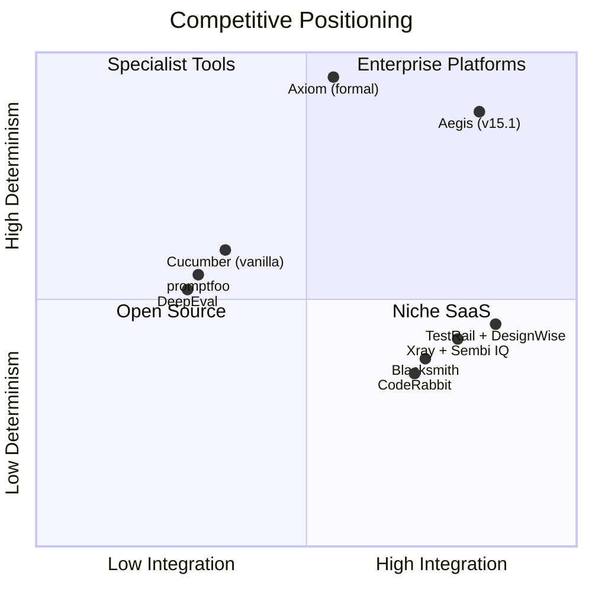

### 1.4 Architectural Principle: Reuse-First

**We assemble infrastructure. We build governance.**

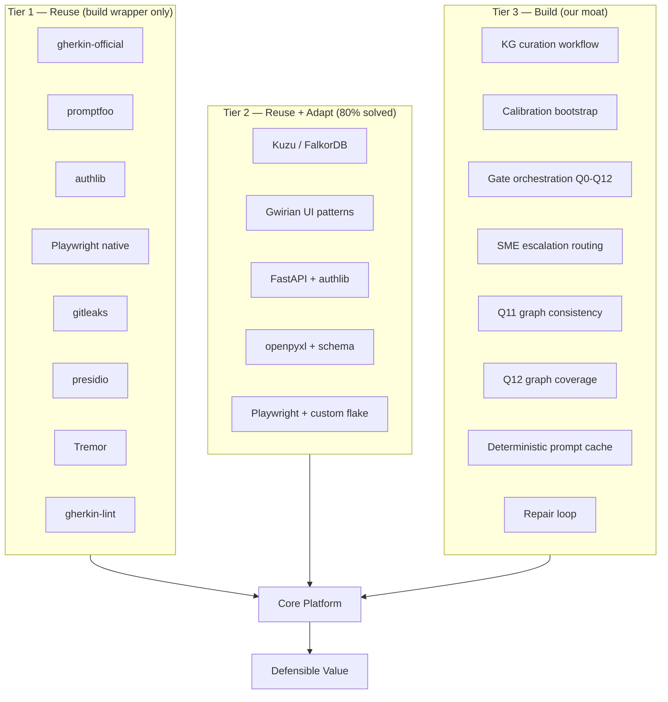

### 1.5 Prior-Review Reconciliation (v15.1 — FINAL)

**v15.1 closes all items from the v15 review. This is the freeze version.**

| v15 review item | v15.1 status | Section |
|---|---|---|
| **Critical 1.** §8 shows 17 phase rows vs 16 claimed | **Fixed** — P12.a/P12.b merged into one row | §8 |
| **Critical 2.** §1.5.2 not on its own propagation checklist | **Fixed** — added to §1.5.1 and §17 | §1.5.1, §17 |
| **Critical 3.** Resolved risk in risk register | **Fixed** — removed; retained in §24.17 | §16 |
| **Medium 4.** Track load table does not reconcile to 101 | **Fixed** — relabeled and reconciled | §8 |
| **Medium 5.** ECE waiver has no owner | **Fixed** — QA Architect owns; Release Manager verifies | §15.4 |
| **Medium 6.** "1.5.0-BDD-only" as public version string | **Fixed** — internal "1.5.0 (BDD-only)"; public "1.5.0" | §15.0 |
| **Minor 7.** `docs/KNOWLEDGE_GRAPH.md` unowned | **Fixed** — P12.a-T06 owns | §13 |

**No prior-review items are dropped in v15.1.**

### 1.5.1 Conditional Propagation Rule

**Rule:** Any change that makes a section conditional must include a propagation pass over:

- §1.5.2 (audit table)
- §12 (roles and permissions)
- §15 (release criteria)
- §18 (status tracking)
- §22.11 (positioning variants)
- §23 (key metrics)

**Enforcement:** The agent must include the propagation pass in the plan for any task introducing a conditional. The reviewer must verify the pass before approving.

### 1.5.2 Conditional Dependency Audit (FINAL)

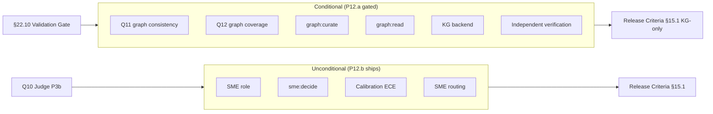

**Authoritative table:**

| Conditional | Gate | Dependents | Status |
|---|---|---|---|
| Q11 (graph consistency) | P12.a | §15.1 (P0 for 2.0.0 only); §22.11 (Variant A) | Conditional |
| Q12 (graph coverage) | P12.a | §15.1 (P0 for 2.0.0 only); §22.11 (Variant A) | Conditional |
| `graph:curate` permission | P12.a | §12 (SME role capability) | Conditional |
| `graph:read` permission | P12.a | §12 (all roles) | Conditional |
| KG backend (Kuzu/FalkorDB) | P12.a | §20 (KG integration) | Conditional |
| Independent verification positioning | P12.a | §22.11 (Variant A only) | Conditional |
| SME role | Unconditional | §13 (P12.b T02); §15.1 (P0 both profiles) | Unconditional |
| `sme:decide` permission | Unconditional | §12 (SME role); §21 (escalation) | Unconditional |
| Calibration (ECE) | P12.b | §15.1 (P0 both profiles, waiver path); §22.11 (both variants) | Unconditional |
| SME routing (low-confidence) | P12.b | §15.1 (P0 both profiles) | Unconditional |

**This table is authoritative.** If any section disagrees, this table wins.

---

## 2. Decision

**We will extend Antinode Norma into Aegis using a discovery-first, parallel-track, gate-verified platform with a Knowledge Graph–anchored verification layer, calibrated confidence scoring, and a reuse-first architecture — delivered as one of two release profiles depending on validation outcome.**

1. **No fork.** Work directly on our repository.
2. **Discovery-first tasks.**
3. **Single product.** One package (`norma`), one CLI (`anorm`), one config, one test suite.
4. **Walking skeleton at P4 (week 5).**
5. **Two half-day spikes at P4-T07, P4-T08 (week 5.5).**
6. **Split gates.** Hard gates (Q0–Q5, Q11) before the agent; soft gates (Q6–Q10, Q12) after.
7. **Four parallel tracks after P4:** A1 (Quality Core), A2 (Governance/KG), B (Execution), C (User-facing).
8. **Operational foundations first (P0).**
9. **Independent verification via Knowledge Graph** assembled from open-source engines, gated on validation.
10. **Calibrated confidence and SME escalation** ship unconditionally (P12.b).
11. **Reuse-first sourcing.**
12. **Scope: 101 tasks across 16 phases.** P12 is delivered as sub-phases P12.a and P12.b.
13. **Duration: 12–14 weeks (3 reviewers), 14–15 (2), 15–18 (1).**
14. **Release: 1.5.0 or 2.0.0** (§15.0).

---

## 3. Consequences

*(Unchanged from v15.)*

---

## 4. Alternatives Considered

*(Unchanged from v15.)*

---

## 5. Operational Foundations

### 5.1 Secrets

- `.env` git-ignored; `.env.example` committed.
- Missing required secret → fail-fast with pointer to `.env.example`.
- CI secrets in GitHub Actions. No secrets in committed files, logs, or errors.
- `gitleaks` on every PR and on `main`.
- Quarterly rotation, tracked in `docs/SECRETS.md`.

**`.env.example` keys:**

```text
# LLM providers
OPENAI_API_KEY=
ANTHROPIC_API_KEY=

# Knowledge Graph backend
NORMA_KG_BACKEND=kuzu        # kuzu | falkordb | graphiti | jena | trikedb | postgres
NORMA_KG_KUZU_PATH=build/kg.db
FALKORDB_HOST=
FALKORDB_PORT=
FALKORDB_USER=
FALKORDB_PASSWORD=
JENA_FUSEKI_URL=
JENA_FUSEKI_USER=
JENA_FUSEKI_PASSWORD=

# Judge framework
NORMA_JUDGE_BACKEND=promptfoo  # promptfoo | deepeval | ragas | custom

# Delivery
TESTRAIL_URL=
TESTRAIL_USER=
TESTRAIL_PASSWORD=
TESTRAIL_PROJECT_ID=
XRAY_BASE_URL=
XRAY_TOKEN=
XRAY_PROJECT_KEY=

# Notifications
SLACK_WEBHOOK_URL=
TEAMS_WEBHOOK_URL=

# Runtime overrides
NORMA_LLM_PROVIDER=openai
NORMA_LLM_MODEL=gpt-4o-mini
NORMA_CACHE_PATH=build/llm_cache.json
NORMA_LOG_PROMPTS=false
```

### 5.2 Cost Model

| Item | Value |
|---|---|
| Cost per run (2 attempts + judge) | ~$0.003 |
| Cost per eval cycle (N=10) | ~$0.03 |
| Cost with 70% cache hit | ~$0.001/run |

**Cost gate:** eval fails if `cost_per_run > $0.02`. Every LLM call logged to `build/llm_cost.jsonl`.

### 5.3 Git Workflow

```
main                    ← stable, tagged releases
  └── norma-bdd         ← long-lived integration branch
        ├── task/P0-T01-secrets-strategy
        └── task/P4-T03-repair-loop
```

- One branch per task: `task/<PHASE>-<TASK-ID>-<slug>`.
- One PR per task, target `norma-bdd`, squash-merge.
- Required checks: lint, unit, integration, contracts, gitleaks, cost gate (P6+).
- Commit convention: `<type>(<scope>): <subject>` + `Task:`, `Phase:`, `Track:` trailers.
- Tags on `main` only, annotated, format `v<major>.<minor>.<patch>`.

### 5.4 Rollback and Feature Flags

```yaml
features:
  unified_agent: false
  cache_exact: false
  cache_semantic: false
  governance_audit: false
  governance_approval: false
  auth_saml: false
  execution_cloud: false
  edge_discovery: false
  knowledge_graph: false
  confidence_scoring: false
```

Resolution: default → config → env (`NORMA_FEATURE_<NAME>`) → CLI.

### 5.5 Escalation Policy

| Trigger | Action |
|---|---|
| Plan rejected twice | Stop. Require human decision. |
| Verification fails twice | Stop. Require human approval. |
| Task already done | Report with evidence. Propose closure. |
| Assumptions don't hold | Report mismatch. Wait for re-scoping. |
| External API down during eval | Skip eval. Mark `degraded`. Notify. |
| Cost exceeds threshold | Fail eval. Require prompt review. |
| Secret missing (required) | Fail-fast. |
| Secret missing (optional) | Skip feature. Log warning. |
| Security issue detected | Stop immediately. Open security issue. |
| Low-confidence judge score | Route to SME review queue. |
| KG unavailable (Q11, production) | Fail-closed. Block. Escalate. |
| KG unavailable (Q11, dev mode) | Fail-open. Warn. Continue. |
| KG unavailable (Q12) | Fail-open always. Warn. Continue. |
| Reuse candidate abandoned upstream | Evaluate adapter replacement; flag as Tier 1 risk. |
| Agent believes Tier 3 should be Tier 2 | Stop. Produce evidence. Escalate to track lead. |

### 5.6 Persistence

- SQLite (single-node) or PostgreSQL (multi-node).
- Alembic migrations; every migration reversible.
- Domains: `users`, `roles`, `sessions`, `features`, `scenarios`, `approvals`, `comments`, `executions`, `artifacts`, `audit_events`, `confidence_scores`.

### 5.7 Frontend Stack

- React 18 + TypeScript + Vite + Tailwind + React Query.
- Tremor for dashboard charts.
- Prism.js for Gherkin syntax highlighting.
- OIDC Authorization Code + PKCE; tokens in memory.
- WCAG 2.1 AA; Lighthouse ≥ 90.

### 5.8 Plugin Security

- Plugins trusted once installed. No sandbox.
- `plugin.yaml` declares permissions.
- Capability object passed to hooks.
- Curated registry with CI scanning (`bandit`, `pip-audit`, `gitleaks`).

### 5.9 Track Coordination

| Track | Lead | Owns |
|---|---|---|
| **A1 — Quality Core** | QA Architect | `gates/` (Q0–Q12), `evaluate/`, `cache/`, `core/prompts.py`, `core/agent.py`, `core/types.py` |
| **A2 — Governance & KG** | Second senior engineer | `governance/`, `knowledge_graph/`, `hybrid/`, `delivery/`, `server/mcp_server.py` |
| **B — Execution** | Engineering Lead | `execution/`, `codegen/`, `core/runner.py` |
| **C — User-facing** | UX Lead | `ui/`, `server/api.py`, `server/routes/`, `server/auth/`, `collaboration/`, `analytics/` |

### 5.10 Component Sourcing Strategy

#### 5.10.1 Verification-first discipline

`docs/COMPONENT_SOURCING.md` scaffolded in P0-T01 (empty table); populated by P0-T07.

#### 5.10.2 Candidate list

| Component | Candidate(s) | Verified? |
|---|---|---|
| Gherkin parsing | `gherkin-official` | Verified |
| LLM eval framework | `promptfoo`, `deepeval`, `ragas` | Verify in P0-T07 |
| Audit trail | `audit-trail`, `auditchain`, TBD | Verify in P0-T07 |
| OIDC | `authlib` | Verified |
| Execution | Playwright native | Verified |
| Secret scanning | `gitleaks` | Verified |
| PII detection & redaction | `presidio` | Verified |
| Dependency audit | `pip-audit` | Verified |
| Static analysis | `ruff`, `mypy`, `bandit` | Verified |
| Gherkin linting | `gherkin-lint` or `gherklin` | Verify in P0-T07 |
| Feature flags | Candidates TBD | Verify in P0-T07 |
| Test management UI | Gwirian | Verify in P0-T07 |
| Notifications | Candidates TBD | Verify in P0-T07 |
| Dashboard charts | Tremor | Verified |
| KG backend | Kuzu (dev), FalkorDB (prod) | Verified |

#### 5.10.3 Tier classification

| Tier | Meaning | Team effort |
|---|---|---|
| Tier 1 — Reuse | Build thin wrapper only | 20–40% of naive |
| Tier 2 — Reuse + Adapt | 80% solved; build domain-specific 20% | 50–70% of naive |
| Tier 3 — Build | No good equivalent; moat | 100% of naive |

#### 5.10.4 Savings estimate (HYPOTHESIS)

| Task | Naive | Reuse-first | Saving |
|---|---|---|---|
| Q10 semantic judge | 5 d | 3.5 d | 1.5 d |
| Q1, Q3–Q5 parsing | 4 d | 2.5 d | 1.5 d |
| Audit trail | 4 d | 3 d | 1 d |
| OIDC | 3 d | 2 d | 1 d |
| Execution runner | 8 d | 5 d | 3 d |
| Notifications | 2 d | 1.5 d | 0.5 d |
| Dashboard | 4 d | 2.5 d | 1.5 d |
| **Total** | **30 d** | **20 d** | **10 d (33%)** |

**Re-baselined after P3a and P5.** Any delta beyond ±30% triggers a plan review.

### 5.11 Data Retention, PII, and Redaction

**Retention windows:**

| Data class | Default | Rationale |
|---|---|---|
| Generated features | 24 months | Audit window |
| Verdicts and gate scores | 24 months | Audit window |
| Audit events | 7 years | Exceeds SOC 2 (1y) and HIPAA (6y) |
| KG facts | Indefinite | Domain knowledge |
| KG supersessions | Indefinite | Audit trail |
| Confidence scores | 24 months | Calibration |
| Execution results | 12 months | Debugging |
| Artifacts | 90 days | Storage cost |
| Comments | 24 months | Collaboration |
| Sessions | 30 days post-expiry | Security |

**PII handling:**
- Minimize: no PII in features, verdicts, or KG facts.
- Presidio redaction at ingest (ML-based NER).
- Gitleaks for secrets; Presidio for PII (separate concerns).
- Legal-hold exception for right-to-erasure.

**Compliance mapping:**

| Regulation | Requirement | How met |
|---|---|---|
| GDPR | Right to erasure; data minimization | Purge path; Presidio |
| SOC 2 | 1-year audit retention | 7-year default exceeds |
| HIPAA | Access controls; audit logs | RBAC; 7-year retention |
| ISO/IEC 42001 | AI management system | `docs/AI_GOVERNANCE.md` |
| EU AI Act | High-risk AI obligations | `docs/AI_GOVERNANCE.md` |

**EU AI Act phases:** Feb 2025 (prohibited), Aug 2025 (GPAI), Aug 2026 (high-risk Annex III), Aug 2027 (legacy). Annex III applicability validated per customer.

---

## 6. Agent Workflow Contract

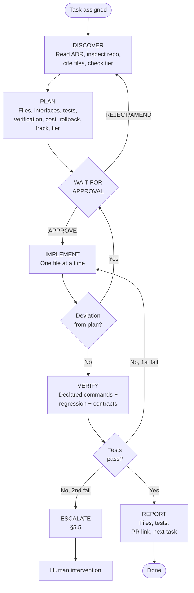

**Rules:**
- Never skip DISCOVER.
- Never implement without explicit APPROVE.
- Conditional propagation pass required for any conditional (includes §1.5.2).
- Tier 3 tasks may not be outsourced.

---

## 7. Target Repository Structure

```text
antinode-norma/
├── core/                          # extended
│   ├── quality.py                 # Norma: INVEST
│   ├── gherkin_generator.py       # + cache wiring
│   ├── validator.py               # becomes Q0
│   ├── parser.py, schemas.py, runner.py
│   ├── config.py                  # extended
│   ├── agent.py                   # NEW: unified pipeline
│   ├── normalize.py               # NEW
│   ├── types.py                   # NEW: IR
│   ├── prompts.py                 # NEW
│   ├── model_loader.py            # NEW
│   └── features.py                # NEW: flag resolver
├── gates/                         # Q0-Q12
│   ├── types.py, aggregate.py, norma_validator.py
│   ├── syntax.py, rspec_guard.py, traceability.py, duplicates.py
│   ├── declarative.py, reuse.py, outline.py, state.py
│   ├── semantic.py, prompts.py, runner.py
│   ├── graph_consistency.py       # Q11
│   └── graph_coverage.py          # Q12
├── knowledge_graph/               # P12.a
│   ├── backend.py                 # abstract interface
│   ├── kuzu.py, falkordb.py, graphiti.py, jena.py, trikedb.py
│   ├── loader.py, query.py, validators.py, sync.py
│   ├── confidence.py              # P12.b calibration
│   └── facts/                     # curated YAML/JSON
├── ingest_structured/             # csv, xlsx, story
├── cache/                         # exact, semantic
├── governance/                    # audit, approval, trace
├── hybrid/                        # discovery, review
├── delivery/                      # testrail, xray
├── evaluate/                      # metrics, cost, calibration
├── execution/                     # parallel, retry, artifacts, reporters, cloud, flake
├── ui/                            # React app
├── ecosystem/                     # plugins, sdk, marketplace
├── collaboration/                 # comments, notifications
├── analytics/                     # trends, coverage, dashboards
├── server/
│   ├── mcp_server.py
│   ├── api.py
│   ├── auth/
│   ├── routes/
│   └── schemas.py
├── codegen/, connectors/          # unchanged
├── tests/
│   ├── unit/, integration/, contracts/
│   ├── ui/, auth/, execution/, plugins/, graph/
│   └── eval/
├── cli.py, model.yaml, norma.config.yml, .env.example
├── docker-compose.yml, Dockerfile.api, Dockerfile.ui
├── pyproject.toml
└── docs/
    ├── adr/ADR-001-aegis-platform.md   ← this file
    ├── AI_GOVERNANCE.md
    ├── COMPONENT_SOURCING.md
    ├── DATA_RESIDENCY.md, DATA_RETENTION.md
    ├── EXECUTION.md, RELEASE_CHECKLIST.md
    ├── KNOWLEDGE_GRAPH.md, CONFIDENCE_SCORING.md
    ├── MARKET_POSITION.md, COMPETITIVE_WEDGES.md
    ├── VALIDATION_PLAN.md
    └── CHANGELOG.md
```

---

## 8. Phased Implementation Plan

**16 phases. 101 tasks. 12–14 weeks (3 reviewers); 14–15 (2); 15–18 (1).**

| Phase | Track | Tasks | Duration | Purpose |
|---|---|---|---|---|
| P0 | — | 8 | Week 1 | Foundations + UI spike + reuse verification + AI governance docs |
| P1 | — | 7 | Week 1–2 | Baseline, IR, contracts |
| P2 | — | 6 | Week 2 | Structured ingest |
| P3a | — | 5 | Week 3–4 | Hard gates Q0–Q5 |
| P4 | — | 8 | Week 5 | Walking skeleton + two half-day spikes |
| P5 | A1 | 7 | Week 6 | Eval + cache + cost |
| P6 | A1 | 3 | Week 6 | MCP tools |
| P3b | A1 | 5 | Week 7 | Soft gates Q6–Q9 + Q10 |
| P7 | A1 | 6 | Week 8 | Quality Integration |
| P8 | A2 | 6 | Week 6–8 | Governance + delivery |
| P9 | B | 7 | Week 7–9 | Execution maturity |
| P10 | C | 8 | Week 7–10 | Web UI |
| P11 | C | 6 | Week 9–10 | SSO + RBAC |
| **P12 — KG + Calibration** | A2 | **8** | Week 9–12 | KG (gated) + Calibration/SME (unconditional) |
| P13 | A1+A2+B+C | 7 | Week 10–12 | Ecosystem + collaboration |
| P14 | — | 4 | Week 13–14 | Analytics + release |

**Task count:** `8+7+6+5+8+7+3+5+6+6+7+8+6+8+7+4 = 101` ✓
**Phase count:** 16 ✓

### Timeline

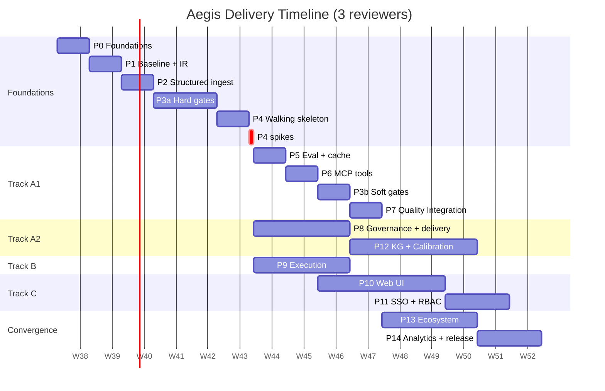

### Track load (Track-assigned tasks only)

| Track | Tasks owned |
|---|---|
| A1 (P5, P6, P3b, P7) | 21 |
| A2 (P8, P12) | 14 |
| B (P9) | 7 |
| C (P10, P11) | 14 |
| **Subtotal** | **56** |
| Shared (P13) | 7 |
| Unattributed (P0, P1, P2, P3a, P4, P14) | 38 |
| **Total** | **101** ✓ |

---

## 9. Phase Dependencies

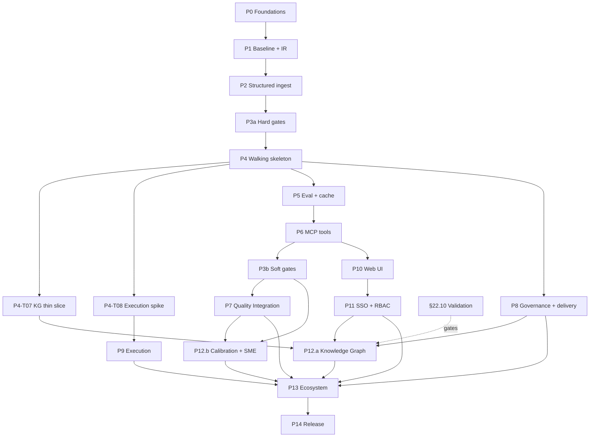

---

## 10. Quality Gate Thresholds

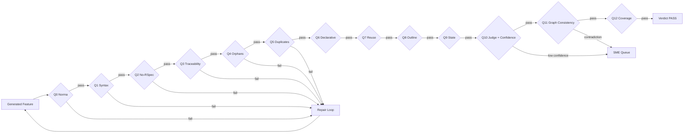

**Hard gates:** Q0, Q1, Q2, Q3, Q4, Q5, Q11
**Soft gates:** Q6 (≥0.90), Q7 (≥0.90), Q8 (≥1.00), Q9 (≥1.00), Q10 (≥0.85 + confidence ≥0.70), Q12 (≥0.60)

**Aggregate:** `hard_pass = true`; `soft_score ≥ 0.85`; `sem_score ≥ 0.85`; `avg_confidence ≥ 0.70`.

**Eval:** pass_rate ≥ 0.95; first_attempt_syntax ≥ 0.90; avg_attempts ≤ 1.50; determinism ≥ 0.80; ecr_at_1 ≥ 0.80; avg_sem ≥ 0.85; avg_confidence ≥ 0.70; ece ≤ 0.10; cost_per_run ≤ $0.02.

---

## 11. LLM Provider Strategy

```python
class LLMClient(Protocol):
    def complete(self, prompt: str, system: str = "") -> str: ...
```

| Provider | Module | Use case |
|---|---|---|
| OpenAI | `llm/openai.py` | Default cloud |
| Anthropic | `llm/anthropic.py` | Long-context alternative |
| OpenRouter | `llm/openrouter.py` | Multi-provider routing |
| Ollama | `llm/local.py` | Privacy-sensitive |
| Mock | `llm/mock.py` | Tests |

Default: `gpt-4o-mini`, temperature 0.2, cache on.

---

## 12. Authentication and Authorization

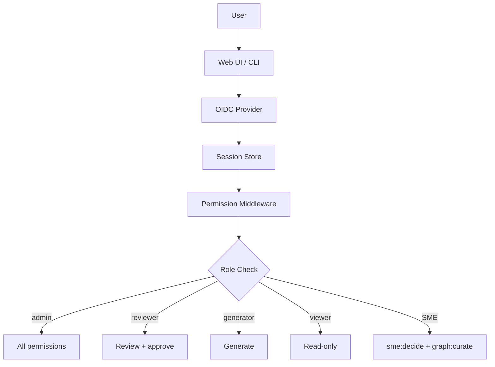

**Roles and permissions:**

| Permission | admin | reviewer | generator | viewer | SME |
|---|---|---|---|---|---|
| features:read | ✅ | ✅ | ✅ | ✅ | ✅ |
| features:generate | ✅ | ❌ | ✅ | ❌ | ❌ |
| features:approve | ✅ | ✅ | ❌ | ❌ | ✅ |
| features:reject | ✅ | ✅ | ❌ | ❌ | ✅ |
| comments:write | ✅ | ✅ | ✅ | ❌ | ✅ |
| executions:read | ✅ | ✅ | ✅ | ✅ | ✅ |
| executions:run | ✅ | ❌ | ✅ | ❌ | ❌ |
| audit:read | ✅ | ✅ | ❌ | ✅ | ✅ |
| users:manage | ✅ | ❌ | ❌ | ❌ | ❌ |
| settings:manage | ✅ | ❌ | ❌ | ❌ | ❌ |
| sme:decide | ✅ | ❌ | ❌ | ❌ | ✅ |
| **graph:read** | ✅ | ✅ | ✅ | ✅ | ✅ |
| **graph:curate** | ✅ | ❌ | ❌ | ❌ | ✅ |

**SME role is unconditional.** `sme:decide` is unconditional. `graph:curate` and `graph:read` are P12.a-conditional.

Permissions stored in `norma.config.yml` under `auth.permissions`, not in the database.

---

## 13. Phase Spikes and P12 Composition

### P4-T07 — KG thin slice

Half-day spike. 10 curated facts, one synthetic contradiction, one end-to-end Q11 pass. Go/no-go for P12.a.

### P4-T08 — Execution prep spike

Half-day spike. Playwright parallel execution on walking skeleton output. Go/no-go for P9.

### P12 composition

**P12.a — Knowledge Graph (6 tasks, gated on §22.10):**

| Task | Title | Tier |
|---|---|---|
| P12.a-T01 | KG fact schema design | 3 |
| P12.a-T02 | Abstract backend + Kuzu adapter + stubs | 2+3 |
| P12.a-T03 | Domain fact curation workflow | 3 |
| P12.a-T04 | Q11 graph consistency gate | 3 |
| P12.a-T05 | Q12 graph coverage gate | 3 |
| P12.a-T06 | KG UI integration + `docs/KNOWLEDGE_GRAPH.md` | 2 |

**P12.b — Calibration + SME routing (2 tasks, unconditional):**

| Task | Title | Tier |
|---|---|---|
| P12.b-T01 | Judge confidence calibration | 3 |
| P12.b-T02 | SME escalation routing | 3 |

---

## 14. Phase Dependencies and Capacity

**Capacity:**

| Reviewers | Tracks active | Timeline |
|---|---|---|
| 1 | A1+B+C sequential | 15–18 weeks |
| 2 | A1 merged with A2 + B + C | 14–15 weeks |
| 3 | A1 + A2 + B + C | 12–14 weeks |

**Track B:** Idle weeks 5–6 (no formal prep). Starts fresh week 7.
**Track C:** Dense weeks 7–10 (~21 days in 20). Feasible only if UX Lead has zero other work.

---

## 15. Release Acceptance Criteria

### 15.0 Release profiles

| Profile | When | Internal | Public |
|---|---|---|---|
| BDD-only | P12.a deferred/dropped | 1.5.0 (BDD-only) | **1.5.0** |
| With KG | P12.a cleared | 2.0.0 (with KG) | **2.0.0** |

**1.5.0 is substantive.** Delivers calibrated confidence, SME routing, full web UI, SSO/RBAC, execution maturity, compliance artifacts. Semver reflects no breaking changes.

Both profiles include P12.b.

### 15.1 Functional acceptance

**P0 — both profiles:** CSV/XLSX/story ingest; valid Gherkin; Q0–Q5 hard gates; Q6–Q10 soft gates; repair loop convergence; traceability; cost gate; determinism; MCP tools; OIDC auth; audit logging; **calibration ECE ≤ 0.10** (waiver path); **SME queue routes low-confidence**.

**P0 — 2.0.0 only:** Q11 enforced; Q12 enforced; KG curation workflow functional.

**P1:** UI reviewers approve in UI; Lighthouse ≥ 90; notifications fire.

### 15.2 Non-functional acceptance

**Per-module coverage:**

| Module | Target |
|---|---|
| core/ | ≥ 85% |
| gates/ | ≥ 85% |
| governance/ | ≥ 80% |
| knowledge_graph/ | ≥ 75% |
| execution/ | ≥ 70% |
| server/ | ≥ 75% |
| ui/ | ≥ 60% |
| **Overall** | **≥ 75%** |

**Latency, cost, lint:** eval pass ≥ 0.95; determinism ≥ 0.80; sem ≥ 0.85; ECE ≤ 0.10; cost ≤ $0.02/run; API p95 read ≤ 200ms; API p95 write ≤ 500ms; Gherkin lint 0 errors; gitleaks 0 findings; Presidio 0 unaddressed findings.

### 15.3 Release gate

Release proceeds only if all P0 criteria pass for the declared profile.

### 15.4 Owner and waiver process

**Owner:** Release Manager (typically Engineering Lead).

**Verification:** Release Manager runs `docs/RELEASE_CHECKLIST.md`.

**Waiver:** P0 criterion requires joint Engineering Lead + QA Architect sign-off. Max two P0 waivers per release.

**Calibration ECE waiver:** If ECE > 0.10 but ≤ 0.15:
- Owner: QA Architect.
- Ship with recalibration plan (≤ 60 days), ECE dashboard, SME threshold lowered to 0.65.
- Restoration: QA Architect re-runs calibration; Release Manager verifies; threshold re-raised to 0.70.
- If ECE > 0.15: calibration disabled, deferred to next minor.

**Profile declaration:** Release Manager declares at week 10.

---

## 16. Risk Register

| Risk | Likelihood | Impact | Mitigation |
|---|---|---|---|
| Soft gates late | Medium | Medium | P3b lands 3 weeks after P3a |
| UI blocked on API | Medium | High | API frozen at P6; contract tests |
| Track divergence | Low | Medium | Weekly sync; frozen shared files |
| Eval golden file staleness | Low | Low | Re-validate after gate addition |
| UI spike fails | Low | High | Fallback to CLI-only release |
| Reviewer capacity | High | Medium | Cap concurrent tracks |
| Cost overrun | Medium | Medium | Cost gate; cache |
| Plugin security incident | Low | High | Curated registry |
| DB migration breaks deploy | Low | High | Reversible migrations |
| KG fact conflicts | Medium | Medium | Curated PR workflow |
| KG staleness | High | Medium | `valid_until`; monthly review |
| Judge calibration drift | High | High | Recalibrate monthly; ECE dashboard |
| Hyperscaler price pressure | High | High | Differentiate on audit + governance |
| Formal verification competition | Medium | High | "Faster than formal" |
| Anchoring bias in judge | Medium | High | Never include prior scores |
| Self-verification trap | Low | High | Human-curated facts |
| KG structural independence unenforceable in small teams | High | Medium | Audit trail records overlap |
| Open-source eval frameworks commoditize judge | High | Medium | Shift value to workflow |
| Long enterprise sales cycles | High | High | Land on one release gate |
| KG backend abstraction over-engineered | Medium | Medium | Only one adapter; others stubs |
| Kuzu project abandoned | Low | High | Config change + focused task |
| Upstream reuse candidate abandoned | Medium | Medium | Adapter interface |
| Reuse license incompatibility | Low | High | License audit in P0-T02 |
| Reuse introduces opaque behavior | Medium | Medium | Contract tests around adapters |
| Track C overload | Medium | High | Pull forward P10-T01 |
| Track B idle weeks 5–6 | High | Low | P4-T08 spike |
| ISO 42001 / EU AI Act readiness | Medium | High | `docs/AI_GOVERNANCE.md` |
| P12.a/P12.b split confuses sales | Medium | Medium | Sales deck updated at P13 |
| Conditional propagation bug recurs | Low | High | §1.5.1 rule; §1.5.2 audit |
| P12.b ships but calibration underperforms | Low | Medium | ECE dashboard; recalibration trigger |

---

## 17. Definition of Done

A task is Done when:

- [ ] Discovery cited at least one file inspected, with paths
- [ ] Tier (1/2/3) declared in the plan
- [ ] For Tier 1/2: reuse candidate verified in `docs/COMPONENT_SOURCING.md`
- [ ] Track declared (A1 / A2 / B / C / cross-track)
- [ ] Cross-track files flagged
- [ ] Plan output before any implementation
- [ ] Plan included cost, UI impact, DB migration, rollback
- [ ] Prior-review items either applied or explicitly rejected in §1.5
- [ ] **If the task introduces a conditional, the propagation pass has been performed over §1.5.2, §12, §15, §18, §22.11, §23**
- [ ] Explicit APPROVE received
- [ ] All declared files created/modified
- [ ] All declared tests pass
- [ ] Verification commands run and output shown
- [ ] Norma's full regression suite passes
- [ ] Contract tests pass if public API, CLI, MCP, or UI routes touched
- [ ] No secret leaks introduced (gitleaks)
- [ ] PII audit run (Presidio audit mode); findings reviewed
- [ ] No deviations from plan, or deviations re-approved
- [ ] Docs updated per phase requirement
- [ ] Report output with next task ID and PR link

---

## 18. Status Tracking

| Phase | Track | Status | Tasks Done | Blocked By |
|---|---|---|---|---|
| P0 — Foundations | — | Not started | 0/8 | — |
| P1 — Baseline + IR | — | Not started | 0/7 | P0 |
| P2 — Structured ingest | — | Not started | 0/6 | P1 |
| P3a — Hard gates | — | Not started | 0/5 | P2 |
| P4 — Walking skeleton | — | Not started | 0/8 | P3a |
| P5 — Eval + cache | A1 | Not started | 0/7 | P4 |
| P6 — MCP tools | A1 | Not started | 0/3 | P5 |
| P3b — Soft gates | A1 | Not started | 0/5 | P6 |
| P7 — Quality Integration | A1 | Not started | 0/6 | P3b |
| P8 — Governance + delivery | A2 | Not started | 0/6 | P4 |
| P9 — Execution | B | Not started | 0/7 | P4 |
| P10 — Web UI | C | Not started | 0/8 | P6 |
| P11 — SSO + RBAC | C | Not started | 0/6 | P10 |
| P12 — KG + Calibration | A2 | Not started | 0/8 | P4-T07, P8, P11 (a); P3b, P7 (b) |
| P13 — Ecosystem + collaboration | A1+A2+B+C | Not started | 0/7 | P7, P8, P9, P11, P12 |
| P14 — Analytics + release | — | Not started | 0/4 | P13 |

---

## 19. Market Context and Verification Bottleneck

**Status:** Accepted.

**Context:** AI-assisted coding has shifted the bottleneck from code generation to verification. LLM-as-judge is fast but unreliable without independent grounding, calibration, and human escalation. High-stakes domains require audit trails, reproducibility, accountable sign-off.

**Decision:** Aegis is an **evidence and governance layer** for AI-generated software and AI systems. Defensibility comes from independent verification, domain grounding, calibrated confidence, SME escalation, auditability, release gating.

---

## 20. Knowledge Graph Integration

**Assemble, don't build.**

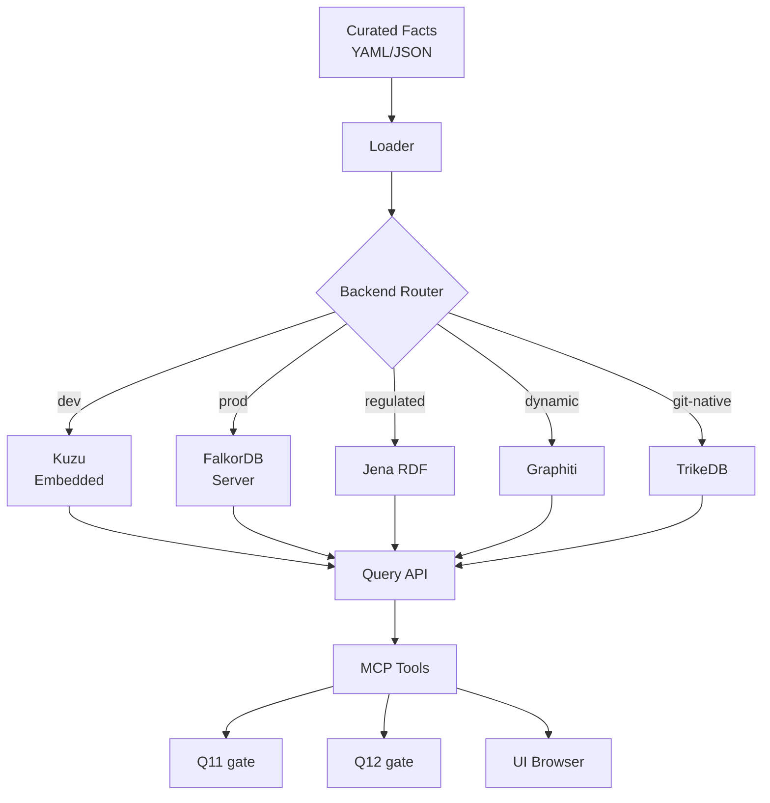

**Backend choice:** Kuzu default (dev); FalkorDB production; stubs for Graphiti, Jena, TrikeDB, Postgres property graph.

**Fact format:** backend-agnostic YAML/JSON under `knowledge_graph/facts/`.

**MCP as access layer.** Agent talks to KG via MCP tools, not direct DB drivers.

### 20.5 KG Fact Supersession and Rollback

Facts immutable. Corrections are new facts that supersede old ones.

```yaml
- id: fact_0001
  subject: account
  predicate: balance_gte
  object: 0
  source: "Regulatory spec X"
  curator: alice@example.com
  timestamp: 2026-09-01T00:00:00Z
  confidence: 0.95
  valid_until: null
  version: 1
  supersedes: null

- id: fact_0042
  subject: account
  predicate: balance_gte
  object: -100
  source: "Regulatory update 2026-Q3"
  curator: bob@example.com
  timestamp: 2026-09-15T00:00:00Z
  confidence: 0.98
  valid_until: null
  version: 2
  supersedes: fact_0001
```

Query layer resolves supersession chains. Re-evaluation job flags affected features after any supersession.

### Fail behavior

- Q11 (production): fail-closed.
- Q11 (dev mode): fail-open.
- Q12: fail-open always.

---

## 21. Calibrated Confidence for Q10

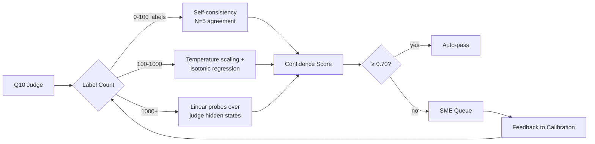

**Metrics:** ECE, MCE, Brier score.
**Recalibrate:** Monthly or after 100 new labels.
**Anchoring mitigation:** Never show prior scores to the judge.

---

## 22. Competitive Positioning and Validation

### 22.1 Positioning statement

> *Aegis is the evidence and governance layer that lets high-stakes teams ship AI-generated software with independent, auditable verification — faster than formal methods, more reliable than pure LLM-as-judge.*

### 22.2 Buyer

Head of AI Platform / VP Engineering; Head of QA/Evaluation; Compliance/Risk/Audit lead; Domain SME leads.

### 22.3 Alternatives

| Category | Tools |
|---|---|
| Bundled/free | GitHub Actions, Cursor, hyperscaler AI testing |
| AI code review | CodeRabbit, Greplite, Blacksmith |
| Test generation | Qodo, BotGauge, Testaify |
| Formal verification | Axiom, Pramaana Labs, Theorem |
| Open-source eval | promptfoo, DeepEval, Ragas, LangSmith, Braintrust |
| Manual | QA teams, SMEs |

### 22.4 Named wedges

| Competitor | Wedge |
|---|---|
| CodeRabbit / Greplite | We evaluate test artifacts and domain facts, not source diffs |
| Axiom / Pramaana / Theorem | Weeks to value, not quarters. No formal specs required |
| promptfoo / DeepEval | Provenance, calibration, SME routing on top |
| TestRail / Xray | Deterministic generation + quality gates + independent verification |
| GitHub Actions / hyperscalers | Audit-trail-first, no cloud lock-in, graph-anchored |
| Blacksmith / Qodo | Independent oracle; calibrated confidence; SME escalation |

### 22.5 Proof points

Lower false negatives; reduced SME time; reproducible audit artifacts; <1 day integration; production failure reduction.

### 22.6 Pricing

| Tier | Target | Price |
|---|---|---|
| Team | Single team, one domain | $1K–$5K/mo |
| Business | Multi-team, multi-domain | $10K–$50K/mo |
| Enterprise | Regulated, audit-required | $100K–$500K/yr |

### 22.7 Land-and-expand

| Stage | Scope | Trigger |
|---|---|---|
| Pilot | One release gate, one domain | N releases zero escapes |
| Team expansion | Adjacent teams | Repeatable playbook |
| Domain expansion | Adjacent domains | KG template reuse |
| Platform expansion | Org-wide | TMS integration |

### 22.8 Integration surface

GitHub Actions (workflow action); promptfoo (adapter); TestRail (trcli); Jira (webhook + MCP); Slack/Teams (webhooks).

### 22.9 Validation plan

| Item | Value |
|---|---|
| Budget | $10,000 |
| Calendar | 8–10 weeks |
| Target | 20 interviews, single segment first |
| Owner | Head of Product |
| Fallback | P12.a start slips by interview slippage |

**Questions (18 total, phased):**

**Phase 1 — Current workflow:**
1. How do you verify AI-generated code/outputs before release?
2. What happens today when verification misses a serious issue?
3. Where does verification slow you down most?

**Phase 2 — Trust:**
4. How much do you trust LLM-as-judge results? Why?
5. Have you seen AI write both code and tests, and the tests missed the problem?
6. What would have to be true for AI verification to be solved?

**Phase 3 — Audit and domain facts:**
7. What evidence do auditors/regulators ask for?
8. How do you handle domain facts the model may contradict?
9. How many SME hours per week go into reviewing AI outputs?

**Phase 4 — Decision-making:**
10. Who is accountable when AI-generated features fail?
11. How do you decide when a release is safe?
12. What tools do you use today?
13. What would make you replace or augment them?
14. If GitHub Actions added this for free, would you still buy it?

**Phase 5 — Reaction:**
15. Would a graph-anchored contradiction flagger change your review?
16. Do you have budget for verification/governance/audit? Who owns it?
17. What would a successful pilot look like?
18. Who else should we talk to?

### 22.10 Validation gate

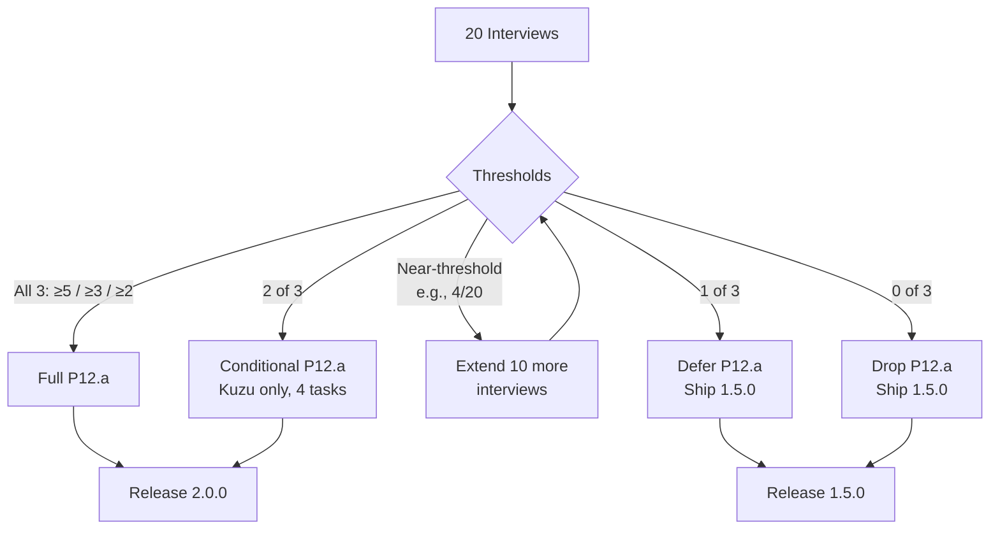

**P12.b is not gated.** Calibration and SME routing ship regardless.

### 22.11 Positioning variants

**Variant A — 2.0.0 (P12.a cleared):**
> *Aegis is the evidence and governance layer... independent, auditable verification — faster than formal methods, more reliable than pure LLM-as-judge.*

**Variant B — 1.5.0 (P12.a dropped):**
> *Aegis is a deterministic BDD platform with ten quality gates (Q1–Q10), a Norma validator (Q0), full traceability, calibrated confidence, SME escalation, and audit-ready releases.*

Q0 is a validator, not counted in ten gates. Q11/Q12 are P12.a-conditional.

---

## 23. Key Metrics

| Metric | Value |
|---|---|
| Total tasks | 101 |
| Total phases | 16 |
| Parallel tracks | 4 (A1, A2, B, C) |
| Walking skeleton | Week 5 |
| Spikes | Week 5.5 |
| MCP available | Week 6 |
| Execution runs | Week 9 |
| Calibration live | Week 10 (P12.b) |
| KG available | Week 12 (P12.a, if cleared) |
| UI live | Week 10 |
| Release | Week 13–14 (3 reviewers) |
| Release profiles | 1.5.0 / 2.0.0 |
| Release criteria | Binary, per-profile |
| Reuse candidates verified | P0-T07 |
| Savings | 33% hypothesis |

---

## 24. Decision Journal

### 24.1 Knowledge Graph Strategy

| Iteration | Position | Superseded by |
|---|---|---|
| v6 | No KG | Market analysis |
| v7 | KG as differentiator (Neo4j) | Backend ambiguity |
| v8 | Explicit backends (Postgres/Neo4j/RDF) | Build-vs-assemble |
| v9 | Assemble, don't build (Kuzu default) | Sourcing generalization |
| v10–v15.1 | Same as v9, formalized | **Current (frozen)** |

### 24.2 Delivery Model

| Iteration | Position |
|---|---|
| v1–v2 | Fork + wrapper |
| v3 | Discovery-first |
| v4 | Production-ready |
| v5 | Platform-ready |
| v6 | Walking skeleton + parallel tracks |
| v7 | Market-integrated |
| v8 | Competitively positioned |
| v9 | KG assembled |
| v10 | Reuse-first |
| v11–v15.1 | Structural debt closed; frozen |

### 24.3 Component Sourcing

| Iteration | Position |
|---|---|
| v1–v9 | Ad-hoc |
| v10 | Three-tier classification |
| v11+ | Verification-first discipline |
| **v15.1** | **Frozen** |

### 24.4 Confidence Calibration

| Iteration | Position |
|---|---|
| v8 | Linear probes only |
| v9+ | Three-phase bootstrap |
| **v15.1** | **Frozen** |

### 24.5 Fail Behavior

| Iteration | Position |
|---|---|
| v8 | Unspecified |
| v9+ | Q11 prod: fail-closed; dev: fail-open; Q12: fail-open |
| **v15.1** | **Frozen** |

### 24.6 Structural Debt

| Iteration | Position |
|---|---|
| v8 review | Seven items flagged |
| v9–v10 | Silent drops |
| v11 | All applied |
| v12–v15 | Consistency fixes |
| **v15.1** | **Frozen** |

### 24.7–24.15

*(Reuse verification, track structure, internal consistency, compliance frameworks, conditional release, task index discipline, P12 split, release versioning, drafting discipline — see v14.)*

### 24.16 Conditional Propagation

| Iteration | Position |
|---|---|
| v12–v14 | Three instances of conditional bugs |
| **v15+** | **§1.5.1 rule + §1.5.2 audit table** |

### 24.17 SME Role Semantics

| Iteration | Position |
|---|---|
| v14 | SME role P12a-conditional; contradicted P12b |
| **v15+** | **SME role unconditional; `sme:decide` unconditional; `graph:curate` P12a-conditional** |

---

## 25. Appendix — Agent Prompt

1. Read this ADR at `docs/adr/ADR-001-aegis-platform.md`.
2. Begin at Phase P0, Task P0-T01.
3. Follow the Discovery → Plan → Wait → Implement → Verify → Report cycle.
4. Never implement without explicit APPROVE.
5. Check §5.10 for tier; verify reuse candidate in `docs/COMPONENT_SOURCING.md` (Tier 1/2 only).
6. Tier 3 tasks may not be outsourced.
7. If a Tier 3 task should be Tier 2, escalate per §5.5.
8. Escalate per §5.5 after 2 failed attempts.
9. For every new version of this ADR, produce a §1.5 reconciliation.
10. Verify task count in status table sums to 101.
11. If `governance/` appears in an A1 plan, reject and escalate.
12. Before any release task, check `docs/RELEASE_CHECKLIST.md` for the declared release profile.
13. If a task depends on P12 outcomes and P12 is dropped, escalate.
14. P12.a is validation-gated. P12.b is not.
15. Release profile is declared by Release Manager at week 10. Agent does not choose.
16. If a task introduces a conditional, perform propagation pass over §1.5.2, §12, §15, §18, §22.11, §23.
17. If a section contradicts §1.5.2, escalate. The audit table is authoritative.

---

## 26. Changelog

| Version | Date | Change |
|---|---|---|
| v1–v14 | 2026-09-12 to 09-15 | (see v14) |
| v15 | 2026-09-15 | SME role contradiction fixed; conditional propagation rule; conditional dependency audit |
| **v15.1** | **2026-09-15** | **Errata: phase row merge; propagation checklist; resolved risk removed; track load reconciled; ECE waiver owner; KNOWLEDGE_GRAPH.md assigned. FROZEN.** |

**v15.1 amendments applied:**
1. §8 phase table: P12.a/P12.b merged into one P12 row (16 phases).
2. §1.5.1 propagation checklist includes §1.5.2.
3. §16 risk register: resolved SME row removed; retained in §24.17.
4. §8 track load table relabeled "Track-assigned tasks only"; reconciled to 101.
5. §15.4 ECE waiver: QA Architect owns; Release Manager verifies.
6. §13 P12.a-T06 owns `docs/KNOWLEDGE_GRAPH.md`.
7. §15.0 public version strings "1.5.0" and "2.0.0"; profile designations internal.

---

**End of ADR-001 v15.1.**

**FROZEN.**

**Total tasks: 101.**
**Total phases: 16.**
**Duration: 12–14 weeks (3 reviewers).**
**Release: 1.5.0 or 2.0.0.**
**Reuse: verified before inclusion.**
**KG: gated on validation. Calibration + SME: unconditional.**
**Compliance: GDPR, SOC 2, HIPAA, ISO 42001, EU AI Act.**

**Execution begins at P0-T01.**