# ADR-003: NORMA-BDD / Aegis — Platform Extension and Market Positioning

**Single-file architecture decision record. Version 15.2 (FROZEN). Renamed from ADR-001 for the ADR index.**

---

## Metadata

| Field | Value |
|---|---|
| **ADR ID** | ADR-003 |
| **Title** | Extend Antinode Norma into an evidence-and-governance layer for high-stakes AI verification |
| **Status** | **FROZEN** |
| **Date** | 2026-09-21 |
| **Deciders** | Engineering Lead, QA Architect, Product Owner, Security Lead, UX Lead, Market Strategy, Compliance Lead |
| **Supersedes** | ADR-001 v1–v15.1 |
| **Related** | ADR-002 (Quality Gate Thresholds), ADR-004 (Secrets), ADR-005 (Git Workflow), ADR-006 (Rollback), ADR-007 (Escalation), ADR-008 (Cost), ADR-009 (Frontend), ADR-010 (Auth), ADR-011 (Plugin Security), ADR-012 (Track Coordination) |
| **Target Duration** | 12–14 weeks (3 reviewers), 14–15 (2), 15–18 (1) |
| **Total tasks** | 101 |
| **Total phases** | 16 |
| **Release profiles** | **1.5.0** (BDD-only) or **2.0.0** (with KG) |

---

## Current Implementation Boundary

ADR-003 is the approved target-state architecture and market direction for
Aegis. It is not a claim that every Aegis component is present in the current
repository. The active implementation is the Norma BDD generation and
governance foundation described in
`docs/GENERATION_WORKFLOW_PLAN.md`.

The current release candidate is **Norma BDD generation workflow**, not Aegis
1.5.0 or Aegis 2.0.0. The Aegis release profiles remain future milestones and
must not be used in release or marketing material until their acceptance
criteria are independently evidenced.

### Current repository status

| Capability | Current evidence | Status |
|---|---|---|
| CSV/XLSX ingestion and worksheet selection | `antinode_norma/server/routes/imports.py`, import API tests | Implemented |
| Header mapping and row validation | Import routes/storage, validation tests | Implemented |
| Async generation, progress, SSE, retry, cancellation, recovery | `antinode_norma/server/generation_worker.py`, generation tests | Implemented |
| Artifacts, ZIP download, approval, and source traceability | Import routes, approval model, UI/browser tests | Implemented |
| Authentication, tenant isolation, rate limits, retention, audit, metrics | Auth middleware, storage, observability, Phase 4 tests | Implemented for the current workflow |
| Provider timeout, retry, circuit breaker, and redaction | `llm_factory.py`, generation resilience tests | Implemented for the current workflow |
| Responsive UI, accessibility, functional browser coverage | `ui/`, Playwright quality suite | Implemented for supported local flows |
| `antinode_aegis` commercial package | No package currently present | Not started |
| Formal Q0–Q10 Aegis gate orchestration | Current Norma quality/gate components only; no complete Aegis runner | Partial |
| Q11 graph consistency and Q12 graph coverage | No KG implementation or graph gates currently present | Not started |
| KG backends and curation workflow | No `antinode_aegis/knowledge_graph` implementation currently present | Not started |
| Confidence calibration, ECE reporting, and SME routing | No production calibration/SME queue implementation currently present | Not started |
| Presidio ingest redaction and formal PII scan | Not evidenced in the current workflow release | Not started |
| Formal compliance certification | Architecture and control mapping only | Not a certification claim |

The status terms above are release-scoped. “Implemented” means implemented and
covered for the current Norma workflow; it does not imply that the complete
Aegis profile acceptance criteria are satisfied.

### Recommended implementation stack

The following stack is the default recommendation for future Aegis work. A
different component may be selected only when its license, maintenance,
security, operational, and adapter-test evidence is recorded in
`docs/COMPONENT_SOURCING.md`.

| Concern | Recommended technology | Alternatives | Selection rule |
|---|---|---|---|
| API and contracts | FastAPI, Pydantic v2, OpenAPI | Litestar | Preserve typed contracts and generated client/test schemas |
| Durable relational state | PostgreSQL, SQLAlchemy 2, Alembic | SQLite for single-node development | PostgreSQL is required for multi-process production |
| Background execution | Redis + Dramatiq or Celery | Temporal for long-running workflows | Use a durable queue; keep worker state in PostgreSQL |
| Authentication | Authlib OIDC Authorization Code + PKCE | Keycloak, Auth0, cloud IdP | Tokens remain server-side or in memory; no localStorage tokens |
| Authorization | Casbin or typed application policy layer | Oso | Enforce tenant, role, resource, and action checks in API and service layers |
| Frontend | React 18, TypeScript, Vite, Tailwind | Next.js | Keep the current SPA contract unless SSR is justified |
| UI data and state | TanStack Query, Zod | Redux Toolkit | Validate API payloads at the boundary and cache server state |
| Browser verification | Playwright | Cypress | Playwright remains the required functional/accessibility runner |
| Gherkin | `gherkin-official`, `gherkin-lint` | `gherklin` | Use parser/linter contract tests before custom gates |
| Evaluation | Promptfoo for matrix execution; custom evaluator adapters | DeepEval, Ragas | Store prompts, model IDs, datasets, scores, and hashes as evidence |
| Calibration | scikit-learn calibration, NumPy, pandas | MAPIE for intervals | Version datasets and calibration models; report ECE, MCE, and Brier |
| Knowledge graph | Kuzu for development; FalkorDB for production | Apache Jena for RDF domains | Access only through the repository adapter and MCP/query contract |
| MCP | Official MCP Python SDK | HTTP tool gateway | Version tool schemas and run MCP contract tests |
| Audit and telemetry | OpenTelemetry, Prometheus, Grafana | Vendor OTEL backend | Do not place prompts, generated content, secrets, or raw PII in telemetry |
| Secrets and dependency security | gitleaks, pip-audit, npm audit, Bandit, Ruff | Trivy for images | Required CI checks with reviewed findings |
| PII detection | Microsoft Presidio with custom recognizers | Cloud DLP service | Audit mode first; redaction policy must be domain-reviewed |
| Delivery | OCI containers, nginx, Kubernetes only when required | systemd/Docker Compose for small deployments | Document topology, backup, restore, RPO/RTO, and rollback |

These are recommendations, not current implementation claims. Versions must be
pinned in lockfiles and reverified during dependency review.

### Product-surface architecture

Every customer-visible capability must be implemented once in a domain service
and exposed through the surfaces that apply to its audience:

```text
Domain service and policy layer
        |
        +-- REST/OpenAPI + SSE API
        +-- CLI commands
        +-- MCP tools/resources
        +-- React/TypeScript UI
```

The API is the canonical application contract. UI, CLI, and MCP adapters must
consume the same domain operations, authorization checks, validation rules, and
error categories; they must not reimplement business policy independently.
For example, one `validate_requirement()` operation may have an API endpoint,
CLI command, MCP tool, and UI workflow, but all four return the same gate
decision and evidence identifiers.

#### Surface parity contract

The evidence matrix must record surface coverage for each applicable
requirement. Each surface is classified as `required`, `supported`,
`not_applicable`, `planned`, or `blocked`.

```yaml
surfaces:
  ui:
    status: required
    route_or_component: ui/src/components/Generation.tsx
    test_paths:
      - ui/e2e/app.spec.ts
  api:
    status: required
    endpoint_or_schema: POST /v1/generation-jobs
    test_paths:
      - tests/unit/test_import_api.py
  cli:
    status: planned
    command: norma generate --profile norma-workflow
    test_paths: []
  mcp:
    status: planned
    tool_or_resource: generate_scenarios
    test_paths: []
```

CI must reject a release-profile requirement when a required surface has no
contract, implementation reference, and test evidence. A capability may be
`not_applicable` only with an owner-approved rationale. Future capabilities
must render an explicit unavailable/disabled state in the UI and return a
stable `capability_unavailable` error through API, CLI, and MCP rather than
silently falling back.

#### Surface responsibilities

| Surface | Primary audience | Required behavior |
|---|---|---|
| UI | Reviewers, SMEs, release managers, operators | Guided workflows, progress, traceability, confidence, evidence, approvals, and accessible unavailable/error states |
| API | Integrations and the UI | Typed OpenAPI schemas, async job resources, SSE/polling, stable error codes, idempotency, tenant/role enforcement |
| CLI | CI/CD and batch operators | Non-interactive commands, stable exit codes, JSON/table output, `--profile`, `--dry-run`, `--wait`, timeout, and machine-readable errors |
| MCP | Governed agents | Narrow tools/resources, read-only default, explicit mutation approval, size limits, tenant/role context, redaction, and invocation audit |

At minimum, each release profile must expose the following capability families
consistently: import/preview, validation gates, generation and job status,
traceability, approval, evidence retrieval, and release readiness. Calibration,
SME routing, and knowledge-graph capabilities become required only when the
declared profile includes them.

### Release-profile acceptance matrix

| Profile | Included scope | Required evidence | Current status |
|---|---|---|---|
| Norma workflow candidate | Structured import, validation, async generation, progress, recovery, artifacts, approval, traceability, auth, audit, retention, resilience, UI | `docs/GENERATION_WORKFLOW_PLAN.md`, backend suite, UI quality suite | Current release candidate |
| Aegis 1.5.0 BDD-only | Norma scope plus Q0–Q10, repair loop, cost/determinism/eval gates, MCP, OIDC/RBAC, calibration/ECE, SME routing, compliance evidence | Aegis integration suite, evaluation reports, calibration report, security/compliance evidence | Future; not release-approved |
| Aegis 2.0.0 with KG | Aegis 1.5.0 plus Q11/Q12, KG curation, provenance, supersession, and graph fail behavior | KG integration suite, provenance fixtures, Q11/Q12 reports, release-manager declaration | Future; validation-gated |

No profile may be declared from prose alone. The Release Manager must link the
profile to passing CI artifacts and record waivers, owners, expiry dates, and
remediation plans.

### ADR-to-code evidence contract

Every task and acceptance criterion must have a machine-readable traceability
record with these fields:

```text
requirement_id, release_profile, phase, task_id, owner,
code_paths, test_paths, fixture_or_dataset, command,
expected_result, artifact_path, surfaces, status, last_verified
```

The canonical record should live in `docs/adr/evidence-matrix.yml` and be
validated in CI. CI must fail when a required P0 requirement has no test,
command, owner, or evidence artifact. The matrix must classify each item as
`implemented`, `partial`, `planned`, `deferred`, `waived`, or `not_applicable`.
For each applicable surface, `surfaces.<name>` must include a status and an
implementation reference (`route_or_component`, `endpoint_or_schema`,
`command`, or `tool_or_resource`) plus test evidence.

### Objective evidence requirements

Thresholds in this ADR are not satisfied until a reproducible command and
versioned artifact exist. At minimum, evidence must cover:

- Coverage by module and overall target.
- API read/write p95 latency under a documented load profile.
- Cost per run, evaluation pass rate, determinism, and semantic score.
- ECE, MCE, Brier score, calibration dataset size, and model version.
- Gherkin lint, gitleaks, dependency audit, Bandit, and PII audit results.
- Backup/restore, retention, right-to-erasure, queue recovery, and rollback.

Reports must include commit SHA, dependency lockfile hash, configuration
profile, dataset/fixture version, timestamp, and pass/fail status.

---

## 1. Context

### 1.1 Product Context

Antinode Norma is our own repository — a BDD agent that transforms user stories into Gherkin and executable tests, with INVEST input gates, MCP-native integration, codegen for Playwright/Cypress/Selenium, and a pure-core design.

We are extending it into **Aegis**: an evidence and governance layer for AI-generated software and AI systems in high-stakes domains. The technical core is NORMA-BDD (deterministic BDD generation). The market layer is independent verification, calibrated confidence, SME escalation, and audit.

The extension is delivered as an **open-core monorepo**: `antinode_norma` remains free and MIT-licensed; `antinode_aegis` is the commercial layer that imports Norma.

### 1.2 Market Context

The verification bottleneck created by AI code generation is real, growing, and expensive. Three independent markets confirm the trend:

| Market | 2025 | 2031 | CAGR |
|---|---|---|---|
| AI-powered software testing & QA | $9.32B | $39.43B | 26.88% |
| LLM evaluation as a service | $1.73B | $6.31B | 29.50% |
| AI evaluation platforms | — | $16.54B (2035) | 30.02% |

**Why the market exists:**

- AI-generated code carries ~1.7× more defects than human-written code (CodeRabbit, 2025).
- ~45% of AI-generated code samples introduce OWASP Top 10 vulnerabilities (Veracode, 2025).
- Logic and correctness issues rose 75% in AI-generated pull requests.
- Blacksmith CEO: *"Validating code is still a bottleneck, and it's an even bigger bottleneck because people are writing even more."*

**Why pure LLM-as-judge is not enough:**

- **Anchoring bias:** prior scores can block up to 48% of error corrections and flip correct judgments.
- **Self-verification failure:** the same model generating code and tests shares blind spots (ICML 2026 "VOUCH" paper).
- **Calibration drift:** LLM self-reported confidence is systematically overconfident.
- **No external oracle:** the judge agrees with itself, not with reality.

### 1.3 Strategic Position

Aegis occupies the middle ground between pure LLM-as-judge (fast but unreliable) and formal verification (reliable but slow and expensive).

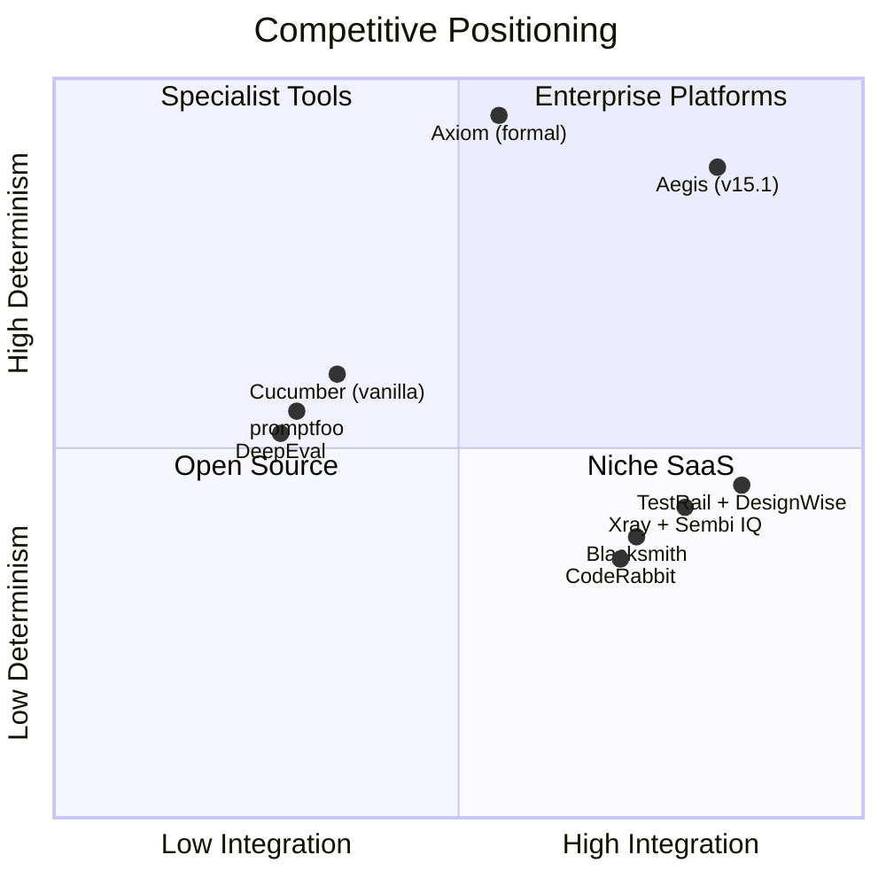

Defensibility comes from **independent verification, domain grounding, calibrated confidence, SME escalation, auditability, and release gating** — not from raw generation speed.

### 1.4 Architectural Principle: Reuse-First

**We assemble infrastructure. We build governance.**

The open-source ecosystem already offers mature solutions for parsing, LLM evaluation, authentication, audit trails, execution, notifications, and dashboards. Building these from scratch is not our differentiator. Our value is the **curation workflow, calibrated confidence, gate orchestration, and SME escalation** that sit on top of these engines.

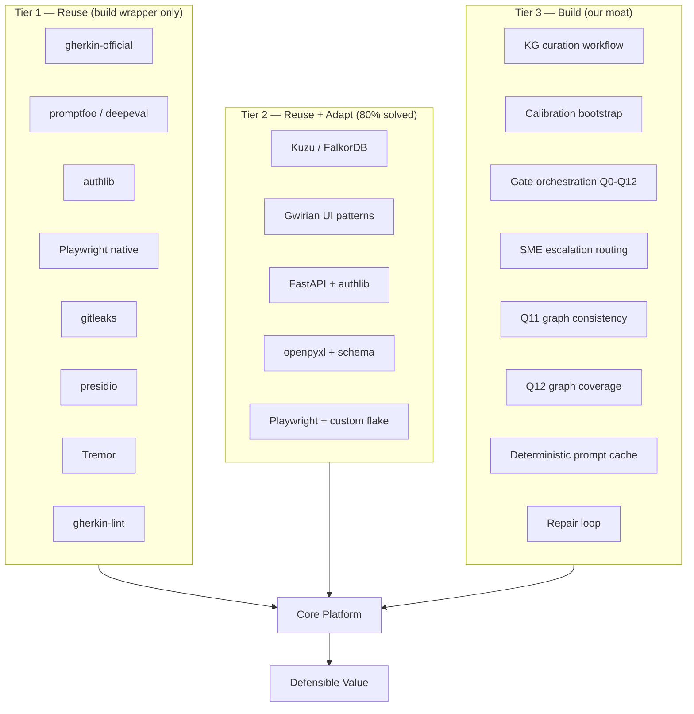

**Three tiers:**

| Tier | Meaning | Team effort |
|---|---|---|
| **Tier 1 — Reuse** | Mature open-source exists; build thin wrapper only | 20–40% of naive effort |
| **Tier 2 — Reuse + Adapt** | 80% solved; build the domain-specific 20% | 50–70% of naive effort |
| **Tier 3 — Build** | No good equivalent; this is our moat | 100% of naive effort |

Tier classification is by **task effort**, not by which library the task touches.

### 1.5 Prior-Review Reconciliation

This version closes all items from the v15 review. No prior-review items are dropped.

| v15 review item | v15.1 status | Section |
|---|---|---|
| §8 shows 17 phase rows vs 16 claimed | Fixed — P12.a/P12.b merged into one row | §8 |
| §1.5.2 not on its own propagation checklist | Fixed — added to §1.5.1 and §17 | §1.5.1, §17 |
| Resolved risk in risk register | Fixed — removed; retained in §24.17 | §16 |
| Track load table does not reconcile to 101 | Fixed — relabeled and reconciled | §8 |
| ECE waiver has no owner | Fixed — QA Architect owns; Release Manager verifies | §15.4 |
| "1.5.0-BDD-only" as public version string | Fixed — internal "1.5.0 (BDD-only)"; public "1.5.0" | §15.0 |
| `docs/KNOWLEDGE_GRAPH.md` unowned | Fixed — P12.a-T06 owns | §13 |

### 1.5.1 Conditional Propagation Rule

**Rule:** Any change that makes a section conditional must include a propagation pass over:

- §1.5.2 (audit table)
- §12 (roles and permissions)
- §15 (release criteria)
- §18 (status tracking)
- §22.11 (positioning variants)
- §23 (key metrics)

**Enforcement:** The agent must include the propagation pass in the plan for any task introducing a conditional. The reviewer must verify the pass before approving.

### 1.5.2 Conditional Dependency Audit

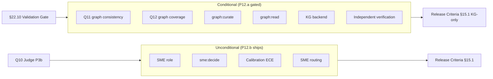

| Conditional | Gate | Dependents | Status |
|---|---|---|---|
| Q11 (graph consistency) | P12.a | §15.1 (P0 for 2.0.0 only); §22.11 (Variant A) | Conditional |
| Q12 (graph coverage) | P12.a | §15.1 (P0 for 2.0.0 only); §22.11 (Variant A) | Conditional |
| `graph:curate` permission | P12.a | §12 (SME role capability) | Conditional |
| `graph:read` permission | P12.a | §12 (all roles) | Conditional |
| KG backend (Kuzu/FalkorDB) | P12.a | §20 (KG integration) | Conditional |
| Independent verification positioning | P12.a | §22.11 (Variant A only) | Conditional |
| SME role | Unconditional | §13 (P12.b T02); §15.1 (P0 both profiles) | Unconditional |
| `sme:decide` permission | Unconditional | §12 (SME role); §21 (escalation) | Unconditional |
| Calibration (ECE) | P12.b | §15.1 (P0 both profiles, waiver path); §22.11 (both variants) | Unconditional |
| SME routing (low-confidence) | P12.b | §15.1 (P0 both profiles) | Unconditional |

**This table is authoritative.** If any section disagrees, this table wins.

---

## 2. Decision

**We will extend Antinode Norma into Aegis using a discovery-first, parallel-track, gate-verified platform with a Knowledge Graph–anchored verification layer, calibrated confidence scoring, and a reuse-first architecture — delivered as one of two release profiles depending on validation outcome.**

1. **No fork.** Work directly on our repository. Aegis is delivered as an extension of `antinode-norma`, not a separate repository. The free package remains `antinode_norma`; the commercial package is `antinode_aegis`. Aegis imports Norma; Norma does not import Aegis.
2. **Discovery-first tasks.** Every task defines *what* and *why*, never *how*.
3. **Two products, one repo.** `antinode_norma` (MIT, free) and `antinode_aegis` (commercial). Shared CI, shared tests, single git history.
4. **Walking skeleton at P4 (week 5).**
5. **Two half-day spikes at P4-T07, P4-T08 (week 5.5).**
6. **Split gates.** Hard gates (Q0–Q5, Q11) before the agent; soft gates (Q6–Q10, Q12) after.
7. **Four parallel tracks after P4:** A1 (Quality Core), A2 (Governance/KG), B (Execution), C (User-facing).
8. **Operational foundations first (P0).** Includes P0-T07 reuse verification, P0-T08 AI governance docs.
9. **Independent verification via Knowledge Graph** assembled from open-source engines, gated on validation.
10. **Calibrated confidence and SME escalation** ship unconditionally (P12.b), independent of the KG decision.
11. **Reuse-first sourcing** for every component (§5.10), with verification-first discipline.
12. **Scope: 101 tasks across 16 phases.** P12 is delivered as sub-phases P12.a and P12.b.
13. **Duration: 12–14 weeks (3 reviewers), 14–15 (2), 15–18 (1).**
14. **Release: 1.5.0 or 2.0.0** (§15.0).
15. **Evidence-based completion.** No phase is considered complete unless the code, documentation, operational evidence, and release checks are present. Documentation alone does not satisfy completion.
16. **Release gate.** Aegis is not releasable without passing CI, cost gate, security gate, evidence bundle export, audit trail, and SME-routing validation on representative risk scenarios.
17. **Score gate.** The current repo is a strategic platform proposal, not yet an implemented enterprise platform. The target for a credible completed Aegis release is **9.2 ± 0.1**; the present implementation-readiness baseline is **6.4 / 10** until the above evidence gates are shipped.

### Evidence-and-Score Gate

The strategic value of ADR-003 is only credibly executable if it produces evidence in code, not only in narrative.

Required exit evidence for a "score > 9" claim:
- end-to-end evidence bundle generated for a representative run
- confidence calibration pass + low-confidence escalation path validated
- graph consistency gate or explicit fail-closed policy validated
- plugin and API security controls enforced in CI
- release checklist signed off with operational proof
- audit log export and traceability complete for a sample release flow

When these gates are met, ADR-003 is a defensible enterprise platform proposal rather than an aspirational product narrative.

---

## 3. Consequences

### Positive

- Working system at week 5.
- Parallel tracks cut duration from 18 to 12–14 weeks.
- Reuse-first saves ~10 days of engineering effort (hypothesis, re-baselined at P3a/P5).
- Data-driven tuning: eval harness exists before soft gates land.
- Independent verification via Knowledge Graph.
- Calibrated confidence routes low-confidence cases to humans, not to auto-pass.
- Enterprise-ready: SSO, RBAC, audit, approval, rollback, cost gates.
- Defensible position between LLM-as-judge and formal verification.
- P12.b ships regardless of P12.a outcome — calibration value is preserved.
- Release version is deterministic (1.5.0 or 2.0.0), not decided at release time.
- Team focuses on governance moat, not infrastructure.

### Negative

- Requires 2–3 reviewers for parallel execution. Sequential reverts to 15–18 weeks.
- 16 phases, 101 tasks — coordination overhead.
- New surface area: frontend, auth, DB, plugin security, Knowledge Graph.
- Backend abstraction adds translation layers that must be maintained.
- Reuse introduces dependency on upstream projects.
- Knowledge Graph curation is ongoing work.
- Competitive pressure from free hyperscaler offerings and well-funded specialists.

### Neutral

- CLI remains the primary automation interface.
- Release: 1.5.0 (BDD-only) or 2.0.0 (with KG).

---

## 4. Alternatives Considered

| Alternative | Why rejected |
|---|---|
| Fork + wrapper | Unnecessary when we own the repo |
| Prescriptive code ADR | Stale; brittle to repo evolution |
| Discovery-first without ops | Under-specified secrets, cost, rollback |
| Sequential phases | Walking skeleton delayed |
| Build everything from scratch | Reinvents parsing, LLM eval, auth, audit |
| Build KG from scratch | Reinvents graph engines |
| Reuse everything, build nothing | Loses governance moat; becomes a thin wrapper |
| LLM-as-judge only | Anchoring bias, self-verification trap |
| Formal verification only | Too slow and expensive for most teams |
| No Knowledge Graph | Loses independent verification story |
| Separate repo (`antinode-aegis`) | Duplicates CI/tests/docs; adds coordination without removing coupling |
| Single brand (all-in-one) | Loses open-core positioning; buyer overlap is low |

---

## 5. Operational Foundations

These apply to every phase and are prerequisites, not tasks.

### 5.1 Secrets

- `.env` git-ignored; `.env.example` committed.
- `python-dotenv` loads at CLI startup.
- Missing required secret → fail-fast with pointer to `.env.example`.
- CI secrets in GitHub Actions. No secrets in committed files, logs, or errors.
- `gitleaks` on every PR and on `main`.
- Quarterly rotation, tracked in `docs/SECRETS.md`.

**`.env.example` keys:**

```text
# LLM providers
OPENAI_API_KEY=
ANTHROPIC_API_KEY=

# Knowledge Graph backend
NORMA_KG_BACKEND=kuzu        # kuzu | falkordb | graphiti | jena | trikedb | postgres
NORMA_KG_KUZU_PATH=build/kg.db
FALKORDB_HOST=
FALKORDB_PORT=
FALKORDB_USER=
FALKORDB_PASSWORD=
JENA_FUSEKI_URL=
JENA_FUSEKI_USER=
JENA_FUSEKI_PASSWORD=

# Judge framework
NORMA_JUDGE_BACKEND=promptfoo  # promptfoo | deepeval | ragas | custom

# Delivery
TESTRAIL_URL=
TESTRAIL_USER=
TESTRAIL_PASSWORD=
TESTRAIL_PROJECT_ID=
XRAY_BASE_URL=
XRAY_TOKEN=
XRAY_PROJECT_KEY=

# Notifications
SLACK_WEBHOOK_URL=
TEAMS_WEBHOOK_URL=

# Runtime overrides
NORMA_LLM_PROVIDER=openai
NORMA_LLM_MODEL=gpt-4o-mini
NORMA_CACHE_PATH=build/llm_cache.json
NORMA_LOG_PROMPTS=false
```

### 5.2 Cost Model

| Item | Value |
|---|---|
| Avg generation prompt | 2,000 in / 1,500 out tokens |
| Avg judge prompt | 3,000 in / 500 out tokens |
| Model | gpt-4o-mini |
| Cost per run (2 attempts + judge) | ~$0.003 |
| Cost per eval cycle (N=10) | ~$0.03 |
| Cost with 70% cache hit | ~$0.001/run |

**Cost gate:** eval fails if `cost_per_run > $0.02`. Every LLM call logged to `build/llm_cost.jsonl`.

### 5.3 Git Workflow

```
main                    ← stable, tagged releases
  └── norma-bdd         ← long-lived integration branch
        ├── task/P0-T01-secrets-strategy
        └── task/P4-T03-repair-loop
```

- One branch per task: `task/<PHASE>-<TASK-ID>-<slug>`.
- One PR per task, target `norma-bdd`, squash-merge.
- Required checks: lint, unit, integration, contracts, gitleaks, cost gate (P6+).
- Commit convention: `<type>(<scope>): <subject>` + `Task:`, `Phase:`, `Track:` trailers.
- Merge freeze during phase exit gate validation.
- Tags on `main` only, annotated, format `v<major>.<minor>.<patch>`.

### 5.4 Rollback and Feature Flags

All high-risk changes gated by flags in `norma.config.yml`:

```yaml
features:
  unified_agent: false
  cache_exact: false
  cache_semantic: false
  governance_audit: false
  governance_approval: false
  auth_saml: false
  execution_cloud: false
  edge_discovery: false
  knowledge_graph: false
  confidence_scoring: false
```

Resolution order: default → config → env (`NORMA_FEATURE_<NAME>`) → CLI.

**Lifecycle:** Introduce (flag off) → Soak (5 days on in non-prod) → Default-on → Retire (after 2 releases).

Every high-risk task includes a soak plan. Every PR is revertible with `git revert <sha>`.

### 5.5 Escalation Policy

| Trigger | Action |
|---|---|
| Plan rejected twice | Stop. Require human decision. |
| Verification fails twice | Stop. Require human approval. |
| Task already done | Report with evidence. Propose closure. |
| Assumptions don't hold | Report mismatch. Wait for re-scoping. |
| External API down during eval | Skip eval. Mark `degraded`. Notify. |
| Cost exceeds threshold | Fail eval. Require prompt review. |
| Secret missing (required) | Fail-fast with pointer to `.env.example`. |
| Secret missing (optional) | Skip feature. Log warning. |
| Security issue detected | Stop immediately. Open security issue. |
| Low-confidence judge score | Route to SME review queue. |
| KG unavailable (Q11, production) | Fail-closed. Block. Escalate. |
| KG unavailable (Q11, dev mode) | Fail-open. Warn. Continue. |
| KG unavailable (Q12) | Fail-open always. Warn. Continue. |
| Reuse candidate abandoned upstream | Evaluate adapter replacement; flag as Tier 1 risk. |
| Agent believes Tier 3 should be Tier 2 | Stop. Produce evidence. Escalate to track lead. |

Escalations produce `build/escalation.json` and a GitHub issue.

### 5.6 Persistence

- SQLite (single-node) or PostgreSQL (multi-node).
- Alembic migrations; every migration reversible.
- Domains: `users`, `roles`, `sessions`, `features`, `scenarios`, `approvals`, `comments`, `executions`, `artifacts`, `audit_events`, `confidence_scores`.
- When `features.database` is off, platform runs in file-based mode.

### 5.7 Frontend Stack

- React 18 + TypeScript + Vite + Tailwind + React Query.
- **Tremor** for dashboard charts.
- **Prism.js** for Gherkin syntax highlighting.
- Deployed as static build served by FastAPI or nginx.
- OIDC Authorization Code + PKCE; tokens in memory (not `localStorage`).
- WCAG 2.1 AA; Lighthouse ≥ 90.

### 5.8 Plugin Security

- Plugins trusted once installed. No sandbox.
- `plugin.yaml` declares name, version, author, permissions, hooks.
- Permissions: `read:features`, `write:gates`, `network:external`, `read:secrets`, `write:delivery`, `read:graph`.
- Capability object passed to hooks.
- Curated registry with CI scanning (`bandit`, `pip-audit`, `gitleaks`).
- Load failure → skip. Hook failure → logged, non-fatal. Hook timeout 5s → killed.

### 5.9 Track Coordination

| Track | Lead | Owns |
|---|---|---|
| **A1 — Quality Core** | QA Architect | `gates/` (Q0–Q12), `evaluate/`, `cache/`, `core/prompts.py`, `core/agent.py`, `core/types.py` |
| **A2 — Governance & KG** | Second senior engineer | `governance/`, `knowledge_graph/`, `hybrid/`, `delivery/`, `server/mcp_server.py` |
| **B — Execution** | Engineering Lead | `execution/`, `codegen/`, `core/runner.py` |
| **C — User-facing** | UX Lead | `ui/`, `server/api.py`, `server/routes/`, `server/auth/`, `collaboration/`, `analytics/` |

Cross-track rule: A1 does not modify files in `governance/`. A2 does not modify files in `gates/` or `core/agent.py`. Integration is via interfaces (defined in P1-T03) and PR reviews.

**Frozen shared files:**

| File | Frozen after | Owner |
|---|---|---|
| `core/agent.py` | P4 | A1 |
| `core/types.py` | P3b | A1 |
| `cli.py` | P6 | cross-track |
| `server/api.py` | P9-T02 | C |
| `knowledge_graph/backend.py` | P12.a-T02 | A2 |

**Weekly sync:** 30 minutes every Monday. Agenda: blockers, shared-file conflicts, convergence approaching, cost + eval status. Minutes in `docs/TRACKS.md`.

### 5.10 Component Sourcing Strategy

#### 5.10.1 Verification-first discipline

`docs/COMPONENT_SOURCING.md` is scaffolded in P0-T01 (empty verified-candidates table); populated by P0-T07.

Workflow:
1. **P0-T01** creates the file with the candidate table structure and empty "Verified?" column.
2. **P0-T07** populates the "Verified?" column, adds new candidates, demotes unverified ones.
3. All Tier 1/2 tasks after P0-T07 check the file before proceeding.

**Verification criteria (per candidate):**
- Exists on PyPI / npm / GitHub
- Last commit within 12 months
- Issue tracker active (issues responded to within 30 days)
- License compatible (MIT, Apache-2.0, BSD-3-Clause)
- Python 3.12 support declared
- API fit documented

#### 5.10.2 Candidate list

| Component | Candidate(s) | Verified? |
|---|---|---|
| Gherkin parsing | `gherkin-official` | **Verified** (Cucumber team, active, MIT-style) |
| LLM eval framework | `promptfoo`, `deepeval`, `ragas` | **Verify in P0-T07** |
| Audit trail | Candidates TBD in P0-T07 | **Verify in P0-T07** |
| OIDC | `authlib` | **Verified** (active, BSD-3-Clause) |
| Execution | Playwright native | **Verified** (Microsoft, active, Apache-2.0) |
| Secret scanning | `gitleaks` | **Verified** |
| PII detection & redaction | `presidio` (Microsoft) | **Verified** (MIT, active) |
| Dependency audit | `pip-audit` | **Verified** |
| Static analysis | `ruff`, `mypy`, `bandit` | **Verified** |
| Gherkin linting | `gherkin-lint` or `gherklin` | **Verify in P0-T07** |
| Feature flags | Candidates TBD | **Verify in P0-T07** |
| Test management UI | Gwirian | **Verify in P0-T07** |
| Notifications | Candidates TBD | **Verify in P0-T07** |
| Dashboard charts | Tremor | **Verified** (React, active, Apache-2.0) |
| KG backend | Kuzu (dev), FalkorDB (prod) | **Verified** (both active) |

#### 5.10.3 Tier classification

| Tier | Meaning | Team effort |
|---|---|---|
| Tier 1 — Reuse | Build thin wrapper only | 20–40% of naive |
| Tier 2 — Reuse + Adapt | 80% solved; build domain-specific 20% | 50–70% of naive |
| Tier 3 — Build | No good equivalent; moat | 100% of naive |

#### 5.10.4 Tier assignments

| Task | Tier | Rationale |
|---|---|---|
| P3a-T02 Q1 syntax | 1 | Wrap `gherkin-official`; gate logic is thin |
| P3a-T03 Q3/Q4 traceability | 2 | Parsing wrapped; traceability logic custom |
| P3a-T04 Q5 duplicates | 1 | Wrap parser; simple set logic |
| P3b-T05 Q10 semantic judge | 2+3 | Judge execution wrapped; calibration + escalation custom |
| P7-T01 Audit trail | 2 or 3 | Depends on P0-T07 |
| P7-T05 TestRail | 1 | `trcli` is a CLI wrapper |
| P7-T06 Xray | 1 | REST API wrapper |
| P8-T01–T04 Execution | 1 | Playwright native |
| P9-T01 API foundation | 1 | FastAPI scaffold |
| P9-T03 Frontend scaffold | 1 | Vite + React scaffold |
| P9-T04 Feature review page | 2 | Page is custom; Prism is one import |
| P9-T07 Dashboard | 2 | Charts via Tremor; data + views custom |
| P10-T02 OIDC | 2 | Library handles flow; role mapping + session custom |
| P10-T05 User action audit | 2 | Overlaps P7-T01 |
| P11-T05 Notifications | 2 or 3 | Depends on P0-T07 |
| P12.a-T02 KG backend | 2+3 | Kuzu wrapped; abstraction custom |

#### 5.10.5 Savings estimate (HYPOTHESIS)

The savings table is marked as a hypothesis, not a commitment. It will be re-baselined after P3a and P5 complete.

| Task | Naive | Reuse-first | Hypothesized saving |
|---|---|---|---|
| Q10 semantic judge | 5 d | 3.5 d | 1.5 d |
| Q1, Q3–Q5 parsing | 4 d | 2.5 d | 1.5 d |
| Audit trail | 4 d | 3 d | 1 d |
| OIDC | 3 d | 2 d | 1 d |
| Execution runner | 8 d | 5 d | 3 d |
| Notifications | 2 d | 1.5 d | 0.5 d |
| Dashboard | 4 d | 2.5 d | 1.5 d |
| **Total** | **30 d** | **20 d** | **10 d (33%)** |

**Post-P3a re-baseline:** The actual savings will be measured and reported in `docs/COMPONENT_SOURCING.md`. Any delta beyond ±30% triggers a plan review.

#### 5.10.6 Rules for agents

1. Before implementing any Tier 1 or Tier 2 task, the agent must verify the reuse candidate exists in `docs/COMPONENT_SOURCING.md` with a checkmark.
2. Tier 3 tasks may not be outsourced. They are the moat.
3. All reuse is behind an adapter interface so it can be replaced.
4. Contract tests protect the boundary.
5. If a Tier 3 task should be Tier 2 (agent's judgment), the agent must escalate per §5.5 with evidence.
6. If a Tier 1/2 candidate is unverified, the agent must escalate before implementation.

### 5.11 Data Retention, PII, and Redaction

**Retention windows:**

| Data class | Default | Rationale |
|---|---|---|
| Generated features | 24 months | Audit window |
| Verdicts and gate scores | 24 months | Audit window |
| Audit events | **7 years** | Exceeds SOC 2 (1y) and HIPAA (6y) intentionally |
| KG facts | Indefinite (versioned) | Domain knowledge |
| KG fact supersessions | Indefinite | Audit trail for corrections |
| Confidence scores | 24 months | Calibration re-baseline |
| Execution results | 12 months | Debugging window |
| Artifacts (screenshots, video, traces) | 90 days | Storage cost |
| Comments | 24 months | Collaboration history |
| Sessions | 30 days after expiry | Security |

**PII handling:**
- **Minimize:** no PII in features, verdicts, or KG facts by policy.
- **Redaction boundaries:** ML-based redaction for common PII patterns at the ingest layer.
- **KG facts:** only domain facts, not customer data. SME curation policy forbids PII in facts.
- **Audit events:** user ID (email) retained; IP address retained for 90 days then hashed.

**Redaction engine:**

| Concern | Tool | Rationale |
|---|---|---|
| Secrets detection | `gitleaks` | Specialized for API keys, tokens, credentials |
| PII detection & redaction | `presidio` | ML-based NER for names, emails, phones, SSN, credit cards, IBAN |

The target Aegis ingest layer will use Presidio with custom recognizers for
domain-specific PII (e.g., account numbers). This is not a current Norma
workflow capability until its implementation and audit evidence are complete.

**Right-to-erasure path:**
- Data subject request → admin initiates purge.
- All data keyed by user ID deleted across tables.
- Audit events anonymized (user ID replaced with `redacted`), not deleted (retention requirement).
- **Legal-hold exception:** if a data subject is under legal hold or active litigation, purge is suspended; the request is logged and the hold is documented.

**Compliance mapping:**

| Regulation | Requirement | How met |
|---|---|---|
| GDPR | Right to erasure; data minimization | Purge path (§5.11.5); Presidio redaction |
| GDPR | Data residency | §5.11.7 |
| SOC 2 | 1-year audit retention | 7-year default exceeds |
| HIPAA | Access controls; audit logs | RBAC (§12); 7-year retention |
| ISO/IEC 42001 | AI management system — documented controls, risk assessment, incident response | `docs/AI_GOVERNANCE.md` (P0-T08); audit events; risk register (§16) |
| EU AI Act | High-risk AI system obligations — technical documentation, logging, human oversight, post-market monitoring | `docs/AI_GOVERNANCE.md`; SME escalation (§21); release gates (§15) |

**EU AI Act phased application:**
- **Feb 2025:** Prohibited practices (Art. 5).
- **Aug 2025:** General-purpose AI obligations (Art. 51–56).
- **Aug 2026:** High-risk systems (Annex III) — most relevant for Aegis customers.
- **Aug 2027:** Legacy systems already on market.

`docs/AI_GOVERNANCE.md` maps Aegis controls to Annex III obligations (risk management, data governance, technical documentation, record-keeping, transparency, human oversight, accuracy, robustness, cybersecurity). Annex III applicability is customer-dependent; the specific category is validated per customer during onboarding.

**Data residency:**
- Default: single-region (customer choice).
- Multi-region: future scope.
- Documented in `docs/DATA_RESIDENCY.md` (created in P0-T05).

**Enforcement:**
- The target deployment runs a nightly retention job and expires data past the
  configured window.
- The target Aegis ingest layer performs redaction with Presidio.
- CI must run secret scanning with gitleaks.
- CI must run Presidio in audit mode on generated features.

These are target controls. They are not certification evidence until the
corresponding implementation, test, and report are linked in the evidence
matrix.

---

## 6. Agent Workflow Contract

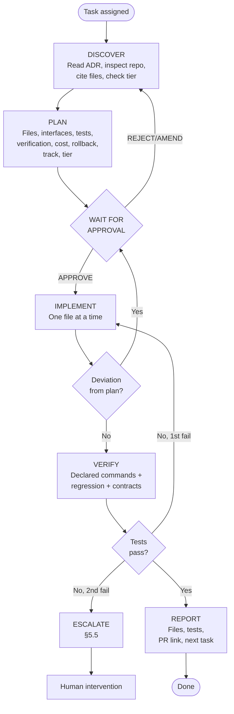

**Rules:**
- Never skip DISCOVER.
- Never implement without explicit APPROVE.
- Conditional propagation pass required for any conditional (includes §1.5.2).
- Tier 3 tasks may not be outsourced.

---

## 7. Target Repository Structure

```text
antinode-norma/
├── antinode_norma/                    # package 1 — free, MIT
│   ├── core/                          # BDD generation (existing)
│   │   ├── quality.py                 # Norma: INVEST
│   │   ├── gherkin_generator.py       # + cache wiring
│   │   ├── validator.py               # becomes Q0
│   │   ├── parser.py, schemas.py, runner.py
│   │   ├── config.py                  # extended
│   │   ├── agent.py                   # unified pipeline
│   │   ├── normalize.py               # Story | CSV | XLSX → TestCase
│   │   ├── types.py                   # TestCase, DomainModel, GateResult, Verdict
│   │   ├── prompts.py                 # generate + repair prompt builders
│   │   ├── model_loader.py            # model.yaml → DomainModel
│   │   └── features.py                # flag resolver
│   ├── codegen/                       # unchanged
│   ├── server/                        # MCP server (existing + extended)
│   └── connectors/                    # JIRA, TestRail, Slack (existing)
│
├── antinode_aegis/                    # package 2 — commercial
│   ├── gates/                         # Q0-Q12
│   │   ├── types.py, aggregate.py, norma_validator.py
│   │   ├── syntax.py, rspec_guard.py, traceability.py, duplicates.py
│   │   ├── declarative.py, reuse.py, outline.py, state.py
│   │   ├── semantic.py, prompts.py, runner.py
│   │   ├── graph_consistency.py       # Q11
│   │   └── graph_coverage.py          # Q12
│   ├── knowledge_graph/               # P12.a
│   │   ├── backend.py                 # abstract interface
│   │   ├── kuzu.py, falkordb.py, graphiti.py, jena.py, trikedb.py
│   │   ├── loader.py, query.py, validators.py, sync.py
│   │   ├── confidence.py              # P12.b calibration
│   │   └── facts/                     # curated YAML/JSON
│   ├── ingest_structured/             # csv, xlsx, story
│   ├── cache/                         # exact, semantic
│   ├── governance/                    # audit, approval, trace
│   ├── hybrid/                        # discovery, review
│   ├── delivery/                      # testrail, xray
│   ├── evaluate/                      # metrics, cost, calibration
│   ├── execution/                     # parallel, retry, artifacts, reporters, cloud, flake
│   ├── ui/                            # React app
│   ├── ecosystem/                     # plugins, sdk, marketplace
│   ├── collaboration/                 # comments, notifications
│   ├── analytics/                     # trends, coverage, dashboards
│   └── server/                        # extended MCP + API
│       ├── mcp_server.py
│       ├── api.py
│       ├── auth/                      # oidc, saml, session, roles, middleware
│       ├── routes/
│       └── schemas.py
│
├── tests/
│   ├── norma/                         # Norma tests
│   └── aegis/                         # Aegis tests
│       ├── unit/, integration/, contracts/
│       ├── ui/, auth/, execution/, plugins/, graph/
│       └── eval/                      # golden dataset + metrics
│
├── docs/
│   ├── adr/ADR-003-aegis-platform.md
│   ├── AI_GOVERNANCE.md
│   ├── COMPONENT_SOURCING.md
│   ├── DATA_RESIDENCY.md, DATA_RETENTION.md
│   ├── EXECUTION.md, RELEASE_CHECKLIST.md
│   ├── KNOWLEDGE_GRAPH.md, CONFIDENCE_SCORING.md
│   ├── MARKET_POSITION.md, COMPETITIVE_WEDGES.md
│   ├── VALIDATION_PLAN.md
│   └── CHANGELOG.md
│
├── cli.py, model.yaml, norma.config.yml, .env.example
├── docker-compose.yml, Dockerfile.api, Dockerfile.ui
├── pyproject.toml
└── LICENSE                            # MIT for Norma; commercial for Aegis
```

---

## 8. Phased Implementation Plan

**16 phases. 101 tasks. 12–14 weeks (3 reviewers); 14–15 (2); 15–18 (1).**

| Phase | Track | Tasks | Duration | Purpose |
|---|---|---|---|---|
| P0 | — | 8 | Week 1 | Foundations + UI spike + reuse verification + AI governance docs |
| P1 | — | 7 | Week 1–2 | Baseline, IR, contracts |
| P2 | — | 6 | Week 2 | Structured ingest |
| P3a | — | 5 | Week 3–4 | Hard gates Q0–Q5 |
| P4 | — | 8 | Week 5 | Walking skeleton + two half-day spikes |
| P5 | A1 | 7 | Week 6 | Eval + cache + cost |
| P6 | A1 | 3 | Week 6 | MCP tools |
| P3b | A1 | 5 | Week 7 | Soft gates Q6–Q9 + Q10 |
| P7 | A1 | 6 | Week 8 | Quality Integration |
| P8 | A2 | 6 | Week 6–8 | Governance + delivery |
| P9 | B | 7 | Week 7–9 | Execution maturity |
| P10 | C | 8 | Week 7–10 | Web UI |
| P11 | C | 6 | Week 9–10 | SSO + RBAC |
| **P12 — KG + Calibration** | A2 | **8** | Week 9–12 | KG (gated) + Calibration/SME (unconditional) |
| P13 | A1+A2+B+C | 7 | Week 10–12 | Ecosystem + collaboration |
| P14 | — | 4 | Week 13–14 | Analytics + release |

**Task count:** `8+7+6+5+8+7+3+5+6+6+7+8+6+8+7+4 = 101` ✓
**Phase count:** 16 ✓

### Cross-surface phased delivery

The 16 phases remain the frozen implementation plan. The following gates are
cross-cutting obligations within those phases, not additional tasks and not a
claim that all surfaces exist today.

| Delivery stage | ADR phases | UI | API | CLI | MCP | Exit evidence |
|---|---|---|---|---|---|---|
| Contract foundation | P0–P1 | Capability/status model and route contracts | OpenAPI schemas, stable errors, idempotency rules | Command names, exit-code and JSON schemas | Tool/resource names, annotations, limits | Contract fixtures and surface entries in `evidence-matrix.yml` |
| Norma workflow parity | P2–P4 | Import, validation, generation, progress, results, approvals | Import/job/result/SSE/traceability endpoints | Import, validate, generate, watch, export, review | Import, validate, generate, status, traceability, review tools | Same fixture produces equivalent decisions and evidence IDs across surfaces |
| Evaluation and governance | P5–P8 | Gate findings, repair history, cost/eval, audit and evidence views | Gate/eval/cost/audit/evidence resources | `evaluate`, `evidence build`, `release check` | Read-only evaluation/evidence tools and approved mutations | Contract tests, evaluation reports, audit events, and denied-action tests |
| Identity and operational controls | P8–P11 | Tenant/role-aware navigation, queues, alerts, release readiness | OIDC/RBAC, policy enforcement, health/metrics/admin APIs | Non-interactive CI operation and diagnostics | Tenant/role context, approval annotations, invocation audit | Cross-surface authorization matrix, recovery and rollback drill |
| Calibration and SME routing | P12.b–P13 | Confidence explanation, ECE/MCE/Brier, SME queue, assignment and decisions | Calibration reports, thresholds, queue and decision APIs | `calibration evaluate`, `review list/assign/decide` | Read calibration/routing tools; explicit approval for decisions | Versioned calibration report, routing evidence, feedback audit |
| Knowledge graph and release | P12.a–P14 | Provenance, impact, supersession, Q11/Q12, profile status | Graph query/provenance/curation/release APIs | `graph validate`, `release check --profile` | Bounded graph query and evidence tools | P12.a gate, graph fail-closed test, profile-specific signed release evidence |

For every stage, the UI is developed alongside the domain/API contract rather
than deferred until the end. An incomplete surface must be visibly marked as
planned or unavailable and must not imply that the underlying release profile
is enabled.

### P4 composition

P4 is one phase with 8 tasks:
- P4-T01 through P4-T06: walking skeleton, week 5
- P4-T07: KG thin slice spike, week 5.5 (half-day)
- P4-T08: execution prep spike, week 5.5 (half-day)

### Timeline

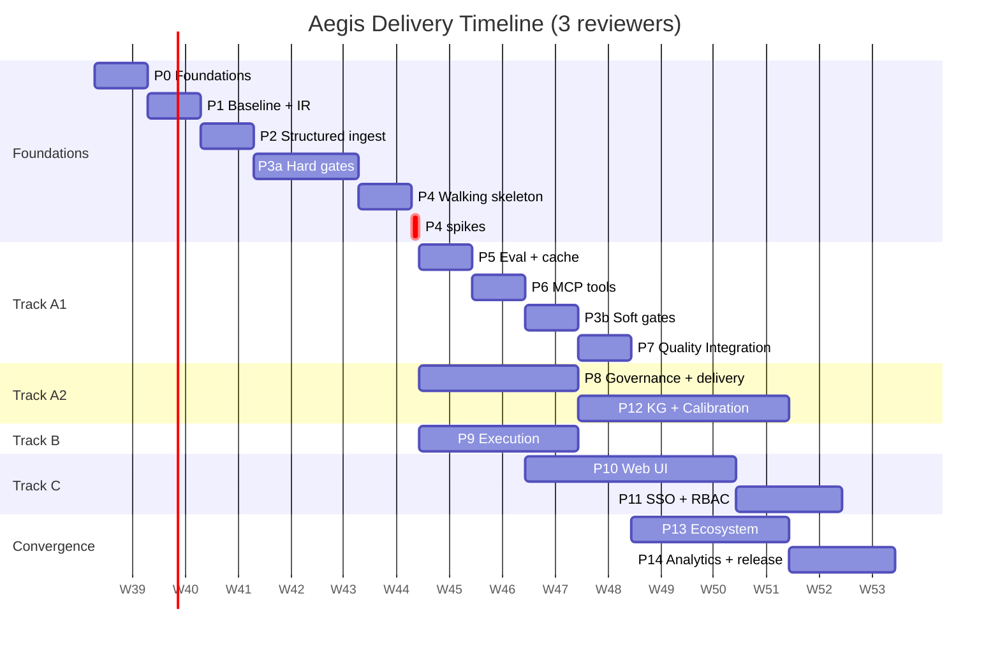

### Track load (Track-assigned tasks only)

| Track | Tasks owned |
|---|---|
| A1 (P5, P6, P3b, P7) | 21 |
| A2 (P8, P12) | 14 |
| B (P9) | 7 |
| C (P10, P11) | 14 |
| **Subtotal** | **56** |
| Shared (P13) | 7 |
| Unattributed (P0, P1, P2, P3a, P4, P14) | 38 |
| **Total** | **101** ✓ |

P13's 7 shared tasks are distributed across A1 (~2), A2 (~2), B (~1), C (~2) at execution time. A2's effective load is therefore ~16 tasks, not 14.

### Task Index

| Phase | Task | Title | Track | Tier | Approval |
|---|---|---|---|---|---|
| P0 | T01 | Secrets strategy | — | — | Yes |
| P0 | T02 | Cost model documentation | — | — | Yes |
| P0 | T03 | Git workflow documentation | — | — | Yes |
| P0 | T04 | Rollback and feature flags | — | 1 | Yes |
| P0 | T05 | Escalation policy | — | — | No |
| P0 | T06 | UI spike | — | — | Yes |
| P0 | T07 | Reuse candidate verification | — | — | Yes |
| P0 | T08 | AI governance documentation | — | — | Yes |
| P1 | T01 | Establish baseline | — | — | No |
| P1 | T02 | Public API contract tests | — | — | Yes |
| P1 | T03 | Shared IR | — | 3 | Yes |
| P1 | T04 | Domain model loader | — | 3 | Yes |
| P1 | T05 | Extend configuration schema | — | 2 | Yes |
| P1 | T06 | Header normalization module | — | 3 | No |
| P1 | T07 | Phase 1 checkpoint | — | — | No |
| P2 | T01 | CSV ingester | — | 2 | No |
| P2 | T02 | XLSX ingester | — | 1 | Conditional |
| P2 | T03 | Story adapter | — | 3 | No |
| P2 | T04 | Unified normalize | — | 3 | No |
| P2 | T05 | CLI subcommands | — | 2 | Yes |
| P2 | T06 | Phase 2 integration test | — | — | No |
| P3a | T01 | Gate types, aggregator, Q0 | — | 3 | No |
| P3a | T02 | Q1 syntax + Q2 no-RSpec | — | 1 | No |
| P3a | T03 | Q3/Q4 traceability | — | 1 | No |
| P3a | T04 | Q5 duplicates | — | 1 | No |
| P3a | T05 | Gate runner + validation | — | 3 | Yes |
| P4 | T01 | Prompt builders | — | 3 | Yes |
| P4 | T02 | Agent skeleton | — | 3 | Yes |
| P4 | T03 | Repair loop | — | 3 | Yes |
| P4 | T04 | Refactor Norma path (flagged) | — | 3 | Yes |
| P4 | T05 | Repair loop integration test | — | — | No |
| P4 | T06 | Phase 4 checkpoint | — | — | No |
| P4 | T07 | KG thin slice spike | — | 2+3 | Yes |
| P4 | T08 | Execution prep spike | — | 2 | Yes |
| P5 | T01 | Exact prompt cache | A1 | 3 | No |
| P5 | T02 | Wire cache (flagged) | A1 | 3 | Yes |
| P5 | T03 | Semantic cache (flagged) | A1 | 2 | Yes |
| P5 | T04 | Evaluation harness | A1 | 2 | Yes |
| P5 | T05 | Cost tracker | A1 | 3 | No |
| P5 | T06 | Eval CI job | A1 | 1 | Yes |
| P5 | T07 | Phase 5 checkpoint | A1 | — | No |
| P6 | T01 | MCP tools | A1 | 2 | No |
| P6 | T02 | MCP integration test | A1 | — | No |
| P6 | T03 | Phase 6 checkpoint | A1 | — | No |
| P3b | T01 | Q6 declarative style | A1 | 3 | Yes |
| P3b | T02 | Q7 reuse | A1 | 3 | No |
| P3b | T03 | Q8 outline | A1 | 3 | No |
| P3b | T04 | Q9 state model | A1 | 3 | No |
| P3b | T05 | Q10 semantic judge (wrap promptfoo) | A1 | 1+3 | Yes |
| P7 | T01 | Audit trail (wrap audit-trail) | A1 | 1 | No |
| P7 | T02 | Approval gate | A1 | 2 | No |
| P7 | T03 | Traceability renderer | A1 | 3 | No |
| P7 | T04 | Wire governance (flagged) | A1 | 3 | Yes |
| P7 | T05 | TestRail delivery (trcli) | A1 | 1 | No |
| P7 | T06 | Xray delivery (REST) | A1 | 1 | No |
| P8 | T01 | Governance core: audit schema | A2 | 3 | Yes |
| P8 | T02 | Governance core: approval workflow | A2 | 3 | Yes |
| P8 | T03 | Governance core: trace renderer | A2 | 3 | No |
| P8 | T04 | Wire governance into agent (flagged) | A2 | 3 | Yes |
| P8 | T05 | TestRail adapter | A2 | 1 | No |
| P8 | T06 | Xray adapter | A2 | 1 | No |
| P9 | T01 | Parallel execution (Playwright native) | B | 1 | No |
| P9 | T02 | Retry with backoff (Playwright native) | B | 1 | No |
| P9 | T03 | Artifact capture (Playwright native) | B | 1 | No |
| P9 | T04 | Reporters (JUnit, Allure, HTML) | B | 1 | No |
| P9 | T05 | Cloud runners (BrowserStack, Sauce, LambdaTest) | B | 2 | Yes |
| P9 | T06 | Flake detection | B | 3 | No |
| P9 | T07 | Execution history + docs | B | 2 | No |
| P10 | T01 | API foundation (FastAPI) | C | 1 | Yes |
| P10 | T02 | Feature viewer endpoint | C | 2 | No |
| P10 | T03 | Frontend scaffold (Vite + React) | C | 1 | Yes |
| P10 | T04 | Feature review page (Prism) | C | 1 | No |
| P10 | T05 | Approval queue page | C | 2 | Yes |
| P10 | T06 | Traceability + audit pages | C | 2 | No |
| P10 | T07 | Dashboard (Tremor) | C | 1 | No |
| P10 | T08 | UI deployment + docs | C | 2 | Yes |
| P11 | T01 | User and role model | C | 3 | Yes |
| P11 | T02 | OIDC integration (authlib) | C | 1+3 | Yes |
| P11 | T03 | SAML integration (flagged) | C | 2 | Yes |
| P11 | T04 | Permission middleware | C | 2 | Yes |
| P11 | T05 | User action audit | C | 1 | No |
| P11 | T06 | Admin settings + docs | C | 2 | Yes |
| P12 | T01 | KG fact schema design (backend-agnostic) | A2 | 3 | Yes |
| P12 | T02 | Abstract backend + Kuzu adapter + stubs | A2 | 2+3 | Yes |
| P12 | T03 | Domain fact curation workflow | A2 | 3 | Yes |
| P12 | T04 | Q11 graph consistency gate | A2 | 3 | No |
| P12 | T05 | Q12 graph coverage gate | A2 | 3 | No |
| P12 | T06 | Judge confidence calibration | A2 | 3 | Yes |
| P12 | T07 | SME escalation routing | A2 | 3 | No |
| P12 | T08 | KG integration with UI + `docs/KNOWLEDGE_GRAPH.md` | A2+C | 2 | Yes |
| P13 | T01 | Plugin manifest and registry | A1+A2+B+C | 3 | Yes |
| P13 | T02 | Plugin hooks and lifecycle | A1+A2+B+C | 3 | Yes |
| P13 | T03 | Plugin SDK package | A1+A2+B+C | 3 | Yes |
| P13 | T04 | Comments and mentions | A1+A2+B+C | 2 | No |
| P13 | T05 | Notifications | A1+A2+B+C | 1 | Yes |
| P13 | T06 | Analytics dashboard | A1+A2+B+C | 2 | No |
| P13 | T07 | Phase 13 docs and eval | A1+A2+B+C | — | Yes |
| P14 | T01 | Cross-track regression | — | — | No |
| P14 | T02 | Documentation consolidation | — | — | Yes |
| P14 | T03 | Analytics polish | — | 2 | No |
| P14 | T04 | Release | — | — | Yes |

---

## 9. Phase Dependencies

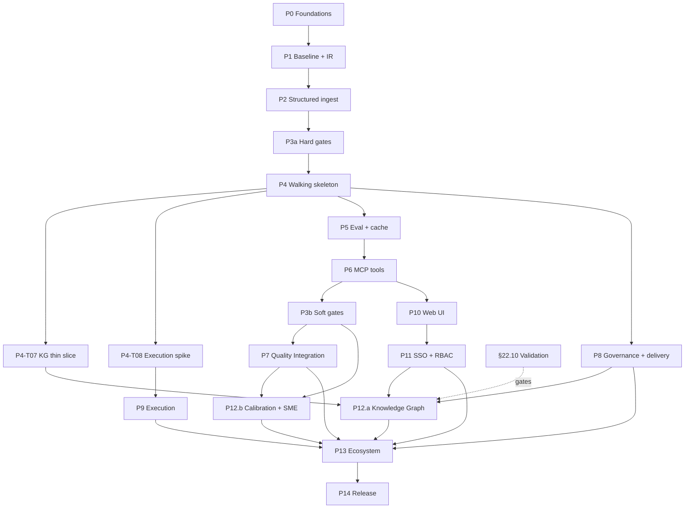

**Dependency notes:**

- **P10-T01 (API foundation) depends on P6-T01 (MCP tools)** — the API surfaces MCP tool results.
- **P12.a depends on P4-T07, P8, and P11.** P12.a-T03 needs `governance/approval.py` (P8). P12.a-T07 needs `sme:decide` role (P11).
- **P12.b depends on P3b (Q10) and P7 (Quality Integration).** It does not depend on P12.a.
- **Track B is idle weeks 5–6.** P4-T08 fills week 5.5. No formal prep is expected; B starts fresh week 7.

---

## 10. Quality Gate Thresholds

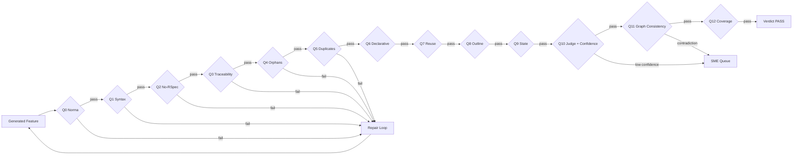

### Hard gates

| Gate | Description | Fail behavior |
|---|---|---|
| Q0 | Norma validator passes | Retry |
| Q1 | Valid Gherkin syntax (via `gherkin-official`) | Retry |
| Q2 | No RSpec tokens | Retry |
| Q3 | Every `TestCase.id` appears as `@`-tag | Retry |
| Q4 | No orphan tags | Retry |
| Q5 | No duplicate scenario names | Retry |
| Q11 | No contradiction with KG facts | Block + escalate (production); warn (dev) |

### Soft gates

| Gate | Threshold | Fail behavior |
|---|---|---|
| Q6 | Declarative style ≥ 0.90 | Retry |
| Q7 | Step reuse ≥ 0.90 | Retry |
| Q8 | Outline usage = 1.00 | Retry |
| Q9 | State keywords = 1.00 | Retry |
| Q10 | Semantic judge ≥ 0.85 **and confidence ≥ 0.70** | Retry if low score; SME queue if low confidence |
| Q12 | Graph coverage ≥ 0.60 | Warn; recommend SME review |

### Aggregate thresholds

| Metric | Threshold |
|---|---|
| `hard_pass` | true |
| `soft_score` | ≥ 0.85 |
| `sem_score` | ≥ 0.85 |
| `avg_confidence` | ≥ 0.70 |

### Eval thresholds

| Metric | Threshold |
|---|---|
| `pass_rate` | ≥ 0.95 |
| `first_attempt_syntax_rate` | ≥ 0.90 |
| `avg_attempts` | ≤ 1.50 |
| `determinism_score` | ≥ 0.80 |
| `ecr_at_1` | ≥ 0.80 |
| `avg_sem_score` | ≥ 0.85 |
| `avg_confidence` | ≥ 0.70 |
| `ece` | ≤ 0.10 |
| `cost_per_run` | ≤ $0.02 |

**Re-baselining:** After P5-T04 and P12-T06, thresholds re-validated. Any change requires an amendment.

### Gate ordering

`Q0 → Q1 → Q2 → Q3 → Q4 → Q5 → Q6 → Q7 → Q8 → Q9 → Q10 → Q11 → Q12`

Cheap gates first. Q10 (LLM judge) runs only after hard gates pass. Q11 (graph query, cheap) runs after Q10 passes. Q12 (coverage, cheap) runs last.

---

## 11. LLM Provider Strategy

### Protocol

```python
class LLMClient(Protocol):
    def complete(self, prompt: str, system: str = "") -> str: ...
```

### Implementations

| Provider | Module | Use case |
|---|---|---|
| OpenAI | `llm/openai.py` | Default cloud |
| Anthropic | `llm/anthropic.py` | Long-context alternative |
| OpenRouter | `llm/openrouter.py` | Multi-provider routing |
| Ollama | `llm/local.py` | Privacy-sensitive |
| Mock | `llm/mock.py` | Tests |

### Default config

```yaml
llm:
  provider: openai
  model: gpt-4o-mini
  temperature: 0.2
  cache: true
  cache_path: build/llm_cache.json
```

### Behavior

- Missing key for selected provider → fail-fast with pointer to `.env.example`.
- Provider error → retry once with backoff; escalate on second failure.
- Malformed JSON from judge → log; gate fails; retry.
- Cost logged per call to `build/llm_cost.jsonl`.
- Model versions pinned where provider supports it.
- Prompt logging off by default; `NORMA_LOG_PROMPTS=true` enables.
- Local Ollama option for privacy-sensitive environments.
- No prompt content logged by default; only token counts and hashes.

### Version pinning

- Model versions pinned in config where supported (e.g., `gpt-4o-2024-08-06`).
- Provider SDK versions pinned in `pyproject.toml`.
- Model deprecation tracked in `docs/COST.md` with migration plan.

---

## 12. Authentication and Authorization

### Authentication

- **Primary:** OIDC (Authorization Code + PKCE).
- **Secondary:** SAML 2.0 (feature-flagged, `features.auth_saml`).
- **Dev fallback:** local `admin` user when auth config absent; warning logged at startup.

### Session

- HttpOnly cookie, `Secure`, `SameSite=Lax`.
- Session lifetime: 8 hours.
- Refresh via silent OIDC refresh when token expires.
- Server-side session store (SQLite/Postgres).
- Logout clears session and revokes tokens.

### Roles and permissions

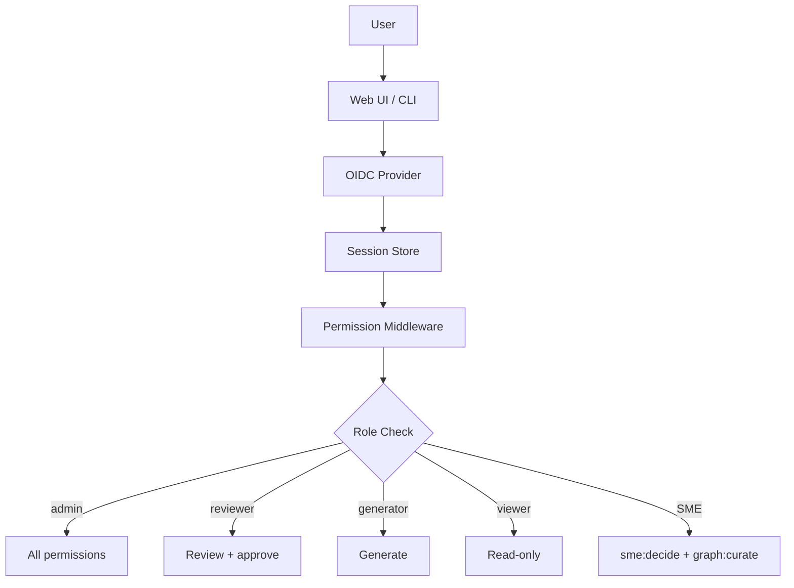

| Permission | admin | reviewer | generator | viewer | SME |
|---|---|---|---|---|---|
| `features:read` | ✅ | ✅ | ✅ | ✅ | ✅ |
| `features:generate` | ✅ | ❌ | ✅ | ❌ | ❌ |
| `features:approve` | ✅ | ✅ | ❌ | ❌ | ✅ |
| `features:reject` | ✅ | ✅ | ❌ | ❌ | ✅ |
| `comments:write` | ✅ | ✅ | ✅ | ❌ | ✅ |
| `executions:read` | ✅ | ✅ | ✅ | ✅ | ✅ |
| `executions:run` | ✅ | ❌ | ✅ | ❌ | ❌ |
| `audit:read` | ✅ | ✅ | ❌ | ✅ | ✅ |
| `users:manage` | ✅ | ❌ | ❌ | ❌ | ❌ |
| `settings:manage` | ✅ | ❌ | ❌ | ❌ | ❌ |
| `sme:decide` | ✅ | ❌ | ❌ | ❌ | ✅ |
| `graph:read` | ✅ | ✅ | ✅ | ✅ | ✅ |
| `graph:curate` | ✅ | ❌ | ❌ | ❌ | ✅ |

**Conditional semantics:**

- **SME role is unconditional.** It exists regardless of P12.a outcome.
- **`sme:decide` is unconditional.**
- **`graph:curate` and `graph:read` are P12.a-conditional.** If P12.a is dropped, they are omitted.

**Enforcement:**

- FastAPI middleware decorator: `@requires("permission_name")`.
- Missing permission → 403.
- Unauthenticated API call → 401.
- Unauthenticated UI route → redirect to OIDC login.

**Persistence of permissions:** Permissions stored in `norma.config.yml` under `auth.permissions`, not in the database. Adding or removing P12.a-conditional permissions is a config change, not a schema migration.

**Structural independence (KG):**

- Graph authors hold `graph:curate`.
- Release approvers hold `features:approve`.
- The two sets must not overlap for the same feature in production. Enforced by config and audited.
- For small teams where overlap is unavoidable, the audit trail records the overlap and flags it in the release report.

**Audit:** Every authenticated action written to `audit_events`:

```json
{
  "timestamp": "2026-09-15T10:00:00Z",
  "user_id": "u_123",
  "action": "feature.approve",
  "resource": "feature:AD-001",
  "result": "success",
  "ip": "10.0.0.1",
  "user_agent": "..."
}
```

---

## 13. Phase Spikes and P12 Composition

### P4-T07 — KG thin slice spike

**Objective:** Prove Q11 end-to-end with minimal investment before committing to full P12.a.

**Constraints:**
- 10 curated facts in a static YAML file.
- One synthetic contradiction test case.
- Kuzu backend.
- One end-to-end run: feature generated → Q11 query → contradiction detected → verdict fail.
- No P12.a infrastructure. No SME queue. No calibration.
- Feature-flagged.
- Time-boxed to half a day.

**Verification:** Two integration tests — one with a contradiction (fails Q11), one without (passes Q11). Go/no-go memo, not a PR.

### P4-T08 — Execution prep spike

**Objective:** Prove Playwright parallel execution on the walking skeleton's output, filling Track B's idle week.

**Constraints:**
- Take the `sample.csv`-generated feature, run it in parallel via Playwright (N=4 workers).
- No custom retry, no artifacts, no cloud runners — those are P9.
- Time-boxed to half a day.
- No code committed to `execution/` — this is a spike in `spike/exec/`.

**Verification:** Parallel execution completes. Report time savings vs sequential. Go/no-go for P9's parallel task framing.

**Output:** Spike memo written to `build/spike/exec.md`. `docs/EXECUTION.md` stub exists from P2-T06; P4-T08 appends findings.

### P12 composition

P12 is one phase with 8 tasks, delivered as two sub-phases.

**P12.a — Knowledge Graph (6 tasks, gated on §22.10 validation):**

| Task | Title | Tier |
|---|---|---|
| P12.a-T01 | KG fact schema design | 3 |
| P12.a-T02 | Abstract backend + Kuzu adapter + stubs | 2+3 |
| P12.a-T03 | Domain fact curation workflow | 3 |
| P12.a-T04 | Q11 graph consistency gate | 3 |
| P12.a-T05 | Q12 graph coverage gate | 3 |
| P12.a-T06 | KG UI integration + `docs/KNOWLEDGE_GRAPH.md` | 2 |

**P12.b — Calibration + SME routing (2 tasks, unconditional):**

| Task | Title | Tier |
|---|---|---|
| P12.b-T01 | Judge confidence calibration | 3 |
| P12.b-T02 | SME escalation routing | 3 |

**Rationale:** Calibration and SME routing depend on Q10 (P3b), not on the KG. Bundling them with KG meant a failed validation would drop calibration. Separate sub-phases preserve the value of P12.b in BDD-only mode.

---

## 14. Phase Dependencies and Capacity

### Capacity

| Reviewers | Tracks active | Timeline |
|---|---|---|
| 1 | A1+B+C sequential | 15–18 weeks |
| 2 | A1 merged with A2 + B + C | 14–15 weeks |
| 3 | A1 + A2 + B + C | **12–14 weeks** |

**Track B:** Idle weeks 5–6 (no formal prep). Starts fresh week 7 with P9-T01.

**Track C:** Dense weeks 7–10 (~21 days in 20 working days). Feasible only if UX Lead has zero other work. If UX Lead has other responsibilities, C extends to week 11–12 and shifts release to week 14–15. Mitigation: Track C may pull P10-T01 forward to week 6 **if P6-T01 (MCP tools) is complete by end of week 6**, since P10-T01 depends on P6-T01.

**Track A2:** ~16 tasks (14 owned + ~2 shared in P13). Steady weeks 6–12.

---

## 15. Release Acceptance Criteria

### 15.0 Release profiles

| Profile | When it applies | Internal name | Public version |
|---|---|---|---|
| **BDD-only** | P12.a deferred or dropped | 1.5.0 (BDD-only) | **1.5.0** |
| **With KG** | P12.a cleared (all 3 thresholds, or 2 of 3 with conditional scope) | 2.0.0 (with KG) | **2.0.0** |

**Public version strings** are "1.5.0" and "2.0.0". Profile designations are internal marketing shorthand only.

**1.5.0 is a substantive feature release.** It delivers calibrated confidence, SME routing, full web UI, SSO/RBAC, execution maturity, and compliance artifacts. Semver 1.5.0 reflects no breaking changes; the scope is significant.

Both profiles include P12.b.

The **Release Manager** declares the profile at week 10 and records it in `docs/RELEASE_CHECKLIST.md`.

### 15.1 Functional acceptance

#### Cross-surface acceptance

For every required capability in the declared profile:

| Surface | Minimum acceptance |
|---|---|
| UI | Guided workflow, accessible success/loading/error states, traceability/evidence display, and explicit unavailable state for disabled profile features |
| API | Typed OpenAPI contract, stable error code, authorization check, idempotency behavior where mutations are retried, and automated endpoint test |
| CLI | Non-interactive command, stable exit code, JSON output, timeout/wait behavior, and automated command test |
| MCP | Versioned tool/resource schema, bounded inputs/outputs, tenant/role enforcement, mutation approval where applicable, redaction, invocation audit, and contract test |

The same versioned fixture must be exercised through every required surface.
The resulting gate decision, resource identity, evidence identifiers, and
authorization outcome must be equivalent. Surface-specific presentation may
differ, but policy and domain results may not.

#### P0 — required for both profiles

| Criterion | Verification |
|---|---|
| CSV/XLSX/story ingest works end-to-end | Integration test |
| Agent generates valid Gherkin | E2E test |
| Hard gates (Q0–Q5) enforced | Gate runner test |
| Soft gates (Q6–Q10) enforced | Gate runner test |
| Repair loop converges within 3 attempts | E2E with scripted failures |
| Traceability complete | Traceability test |
| Cost gate at $0.02/run | Eval CI |
| Determinism: two runs, same hash (cache on) | Eval test |
| MCP tools callable | MCP integration test |
| Auth: OIDC login works; roles enforced | Auth integration test |
| Audit: every write action logged | Audit test |
| **Calibration (ECE ≤ 0.10)** | **Eval CI (waiver path §15.4)** |
| **SME queue routes low-confidence** | **Integration test** |
| Required UI/API/CLI/MCP surface contracts are present | Cross-surface contract suite |

#### P0 — required only for 2.0.0-with-KG

| Criterion | Verification |
|---|---|
| Q11 (graph consistency) enforced | KG integration test |
| Q12 (graph coverage) enforced | KG integration test |
| KG curation workflow functional | Integration test |

#### P1 — defer to next minor

| Criterion | Verification |
|---|---|
| UI: reviewers approve/reject in UI | Playwright test |
| Lighthouse ≥ 90 | Lighthouse CI |
| Notifications fire on escalation | Integration test |

### 15.2 Non-functional acceptance

#### Per-module coverage targets

| Module | Target |
|---|---|
| `core/` | ≥ 85% |
| `gates/` | ≥ 85% |
| `governance/` | ≥ 80% |
| `knowledge_graph/` (if P12.a) | ≥ 75% |
| `execution/` | ≥ 70% |
| `server/` | ≥ 75% |
| `ui/` | ≥ 60% |
| **Overall** | **≥ 75%** |

#### Latency, cost, and lint

| Criterion | Threshold |
|---|---|
| Eval pass rate | ≥ 0.95 |
| Eval determinism | ≥ 0.80 |
| Eval semantic score | ≥ 0.85 |
| Eval calibration (ECE) | ≤ 0.10 |
| Cost per run | ≤ $0.02 |
| API p95 latency (read) | ≤ 200 ms |
| API p95 latency (write) | ≤ 500 ms |
| Gherkin lint | 0 errors |
| Secret scan (gitleaks) | 0 findings |
| PII scan (Presidio, audit mode) | 0 unaddressed findings in features |

#### Lighthouse — P1

Lighthouse ≥ 90 is P1. If UI ships in this release, Lighthouse gates. If UI slips, Lighthouse gates the next release.

### 15.3 Release gate

Release proceeds only if all P0 criteria pass for the declared profile.

### 15.4 Owner and waiver process

**Owner:** Release Manager (named at project start; typically Engineering Lead).

**Verification:** Release Manager runs the checklist in `docs/RELEASE_CHECKLIST.md`. Every P0 criterion is executed and logged.

**Waiver process:**
- A failing P0 criterion may be waived only by joint sign-off from Engineering Lead and QA Architect.
- Waiver is documented in the release notes with rationale and remediation plan.
- P1 criteria may be waived by Release Manager alone.
- **No more than two P0 waivers per release.** Rationale: beyond two, the release is not 2.0.0-quality; consider shipping as a patch and rescheduling.

**Calibration ECE waiver:**

If ECE > 0.10 but ≤ 0.15:
- **Owner:** QA Architect.
- **Actions:** (1) Documented recalibration plan with target date ≤ 60 days post-release; (2) ECE dashboard in UI showing degraded state; (3) SME queue threshold temporarily lowered to 0.65 to compensate.
- **Restoration:** After recalibration, QA Architect re-runs calibration and reports new ECE. Release Manager verifies restoration and re-raises SME threshold to 0.70.

If ECE > 0.15: calibration is disabled entirely and deferred to next minor.

**Profile declaration:** Release Manager declares the profile at week 10 and records it in `docs/RELEASE_CHECKLIST.md`.

---

## 16. Risk Register

| Risk | Likelihood | Impact | Mitigation |
|---|---|---|---|
| Soft gates late; hard gates miss issues | Medium | Medium | P3b lands 3 weeks after P3a |
| UI blocked on API instability | Medium | High | API frozen at P6; contract tests |
| Track divergence | Low | Medium | Weekly sync; frozen shared files |
| Eval golden file staleness | Low | Low | Re-validate after each gate addition |
| UI spike fails | Low | High | Fallback to CLI-only release |
| Reviewer capacity | High | Medium | Cap concurrent tracks at reviewer count |
| Cost overrun | Medium | Medium | Cost gate; cache; prompt review |
| Plugin security incident | Low | High | Curated registry; capability enforcement |
| DB migration breaks deploy | Low | High | Every migration reversible; CI tests |
| KG fact conflicts | Medium | Medium | Curated PR workflow; SME approval |
| KG staleness | High | Medium | `valid_until` on facts; monthly review |
| Judge calibration drift | High | High | Recalibrate monthly; ECE dashboard; auto-escalate on drift > 0.15 |
| Hyperscaler price pressure | High | High | Differentiate on audit + governance + independent verification |
| Formal verification competition | Medium | High | "Faster than formal, more reliable than pure LLM" |
| Anchoring bias in judge | Medium | High | Never include prior scores in judge prompt |
| Self-verification trap | Low | High | Graph facts human-curated, not AI-generated |
| KG structural independence unenforceable in small teams | High | Medium | Audit trail records overlap |
| Open-source eval frameworks commoditize judge | High | Medium | Shift value to workflow, evidence, domain graphs, SME networks |
| Long enterprise sales cycles | High | High | Land on one high-risk release gate |
| KG backend abstraction over-engineered | Medium | Medium | Only one adapter implemented; others stubs |
| Kuzu project abandoned | Low | High | Backend swap is config change + focused task |
| Upstream reuse candidate abandoned | Medium | Medium | Adapter interface allows replacement; contract tests |
| Reuse license incompatibility | Low | High | License audit in P0-T02; verified list |
| Reuse introduces opaque behavior | Medium | Medium | Contract tests around every adapter |
| Track C overload | Medium | High | Pull forward P10-T01; extend to week 14–15 |
| Track B idle weeks 5–6 | High | Low | P4-T08 spike; B starts week 7 |
| ISO 42001 / EU AI Act readiness | Medium | High | `docs/AI_GOVERNANCE.md` in P0-T08 |
| P12.a/P12.b split confuses sales/marketing | Medium | Medium | Sales deck updated at P13 |
| Conditional propagation bug recurs | Low | High | §1.5.1 rule; §1.5.2 audit table; reviewer verification |
| P12.b ships but calibration underperforms | Low | Medium | ECE dashboard; recalibration trigger at ECE > 0.15 |
| Named reuse candidate doesn't exist | High | Medium | P0-T07 verifies before inclusion |
| Track A2 understaffed | High | High | Escalate at weekly sync; merge A1/A2 if needed (14–15 weeks) |
| KG thin slice fails | Medium | High | P4-T07 is go/no-go; P12.a re-scoped if failed |
| Validation plan produces weak signal | Medium | High | P12.a gated on §22.10 threshold |

---

## 16.1 Phase entry and exit gates

Every phase requires a recorded go/no-go decision. The phase owner supplies
the evidence; the Release Manager or delegated reviewer approves the exit.

| Gate | Entry criteria | Required exit evidence |
|---|---|---|
| Phase entry | Dependencies complete, scope and owner recorded, risks reviewed, rollback identified | Approved task plan and linked evidence IDs |
| Implementation | Contract and migration plan reviewed, reuse candidate verified, feature flag defined where needed | Code, unit/contract tests, docs, and migration rollback test |
| Security | Threat model updated for changed boundaries | Authz, secret, dependency, PII, and abuse-case results |
| Operations | Deployment topology and resource assumptions documented | Health checks, metrics, alerts, backup/restore, recovery, and rollback evidence |
| Release profile | All required profile criteria mapped in `evidence-matrix.yml` | Passing CI artifacts, signed waivers, and declared profile |

P12.a has an additional validation gate: the Release Manager must record the
sample size, dataset version, three threshold results, reviewer, and decision
before enabling Q11/Q12 or marketing the 2.0.0 profile. If the gate fails,
P12.a remains deferred and the BDD-only profile is used.

---

## 17. Definition of Done

A task is Done when:

- [ ] Discovery cited at least one file inspected, with paths
- [ ] Tier (1/2/3) declared in the plan
- [ ] For Tier 1/2: reuse candidate verified in `docs/COMPONENT_SOURCING.md` (which must be scaffolded before execution)
- [ ] Monorepo package structure reconciled (`antinode_aegis/` commercial layer created or namespace mapped to `antinode_norma/`)
- [ ] Track declared (A1 / A2 / B / C / cross-track)
- [ ] Cross-track files flagged; no edits to another track's owned files without flag
- [ ] Plan output before any implementation
- [ ] Plan included cost, UI impact, DB migration (if applicable), rollback plan (if high-risk)
- [ ] Prior-review items either applied or explicitly rejected in §1.5
- [ ] **If the task introduces a conditional, the conditional propagation pass has been performed over §1.5.2, §12, §15, §18, §22.11, §23**
- [ ] Explicit APPROVE received (or "No" gate respected)
- [ ] All declared files created/modified
- [ ] All declared tests pass
- [ ] Verification commands run and output shown
- [ ] Norma's full regression suite passes
- [ ] Contract tests pass if public API, CLI, MCP, or UI routes touched
- [ ] No secret leaks introduced (gitleaks)
- [ ] PII audit run (Presidio in audit mode); findings reviewed and addressed or documented as acceptable
- [ ] No deviations from plan, or deviations re-approved
- [ ] Docs updated per phase requirement
- [ ] Report output with next task ID and PR link

---

## 18. Status Tracking

| Phase | Track | Status | Tasks Done | Blocked By |
|---|---|---|---|---|
| P0 — Foundations | — | Not started | 0/8 | — |
| P1 — Baseline + IR | — | Not started | 0/7 | P0 |
| P2 — Structured ingest | — | Not started | 0/6 | P1 |
| P3a — Hard gates | — | Not started | 0/5 | P2 |
| P4 — Walking skeleton | — | Not started | 0/8 | P3a |
| P5 — Eval + cache | A1 | Not started | 0/7 | P4 |
| P6 — MCP tools | A1 | Not started | 0/3 | P5 |
| P3b — Soft gates | A1 | Not started | 0/5 | P6 |
| P7 — Quality Integration | A1 | Not started | 0/6 | P3b |
| P8 — Governance + delivery | A2 | Not started | 0/6 | P4 |
| P9 — Execution | B | Not started | 0/7 | P4 |
| P10 — Web UI | C | Not started | 0/8 | P6 |
| P11 — SSO + RBAC | C | Not started | 0/6 | P10 |
| P12 — KG + Calibration | A2 | Not started | 0/8 | P4-T07, P8, P11 (a); P3b, P7 (b) |
| P13 — Ecosystem + collaboration | A1+A2+B+C | Not started | 0/7 | P7, P8, P9, P11, P12 |
| P14 — Analytics + release | — | Not started | 0/4 | P13 |

**Total tasks:** 101. **Total phases:** 16.

---

## 19. Market Context and Verification Bottleneck

**Status:** Accepted.

**Context:** AI-assisted coding has shifted the bottleneck from code generation to verification. AI-generated code increases volume and defect surface area, while traditional QA and manual test authoring cannot scale at the same rate. LLM-as-judge approaches are fast but unreliable without independent grounding, calibration, and human escalation. High-stakes domains — BFSI, healthcare, critical infrastructure — require audit trails, reproducibility, and accountable sign-off.

**Decision:** Aegis is not positioned as a test-case generator. It is an **evidence and governance layer** for AI-generated software and AI systems. Defensibility comes from independent verification, domain grounding, calibrated confidence, SME escalation, auditability, and release gating — not from raw generation speed.

**Consequences:**
- Invest in Knowledge Graph integration, judge calibration, audit ledger, and SME routing.
- Avoid competing on raw test generation or code review alone.
- Treat CI/CD integration and governance artifacts as first-class product surfaces.
- Position against both free/bundled hyperscaler tooling and expensive formal verification.

**Unresolved questions (to be answered by validation plan, §22.9):**
- Who is the buyer (platform lead vs compliance vs QA)?
- Is "evidence layer" a standalone category or a capability sold into an existing budget?
- Can structural independence of the KG be enforced in small teams?
- What happens when LLM judges become reliable?

---

## 20. Knowledge Graph Integration

**Status:** Proposed (Phase P12.a).

**Context:** LLM judges share blind spots with the models they evaluate. A Knowledge Graph can act as an external, versioned source of domain facts, but only if it is kept independent from the generation loop and governed properly.

**Critical insight:** The open-source ecosystem already offers mature, agent-integrated graph engines. Building a graph database from scratch is not our differentiator. Our value is the **curation workflow, SME approval process, and Q11/Q12 gates** that sit on top of an existing graph engine.

### Decision

**Assemble, don't build.** Define a stable abstract backend interface (`knowledge_graph/backend.py`). Implement one adapter (Kuzu) and stub the rest. Facts are stored in a backend-agnostic format. The agent codes against the abstract interface, not against a specific graph engine.

### The abstraction layer

The real deliverable is `backend.py`, which defines:

```python
class KnowledgeGraphBackend(ABC):
    @abstractmethod
    def load(self, facts: list[Fact]) -> None: ...
    @abstractmethod
    def facts_for(self, entity: Entity) -> list[Fact]: ...
    @abstractmethod
    def invariants_for(self, action: Action) -> list[Invariant]: ...
    @abstractmethod
    def validate(self, fact: Fact) -> ValidationResult: ...
    @abstractmethod
    def query(self, pattern: dict) -> list[Fact]: ...
    @abstractmethod
    def health(self) -> BackendStatus: ...
```

This interface is the contract. Backends are pluggable. The agent never imports a specific graph driver.

### Backend options (ordered by integration effort)

| Option | Type | Agent-Native Integration | License | Best For |
|---|---|---|---|---|
| **Kuzu** (default for dev) | Embedded property graph | LangChain integration; runs in-process, zero infrastructure | MIT | Local dev, testing, small deployments |
| **FalkorDB** (default for prod) | Property graph server | MCP server, LangChain, LangGraph, AG2 | Apache 2.0 | Production; low migration effort from Neo4j-style models |
| **Graphiti** | Temporal KG framework | Designed for dynamic agent memory; powers Zep | Open source | If KG grows from agent interactions |
| **Apache Jena + Fuseki** | RDF/SPARQL server | MCP server (`jena-mcp`) | Apache 2.0 | Regulated domains with existing OWL/RDF ontologies |
| **TrikeDB** | Single-file YAML graph | MCP server; every change is a git diff | Open source | Git-native facts; curation-first |
| **PostgreSQL property graph** | Relational graph | No dedicated MCP server | PostgreSQL | Teams that already run Postgres |

### Implementation plan

1. **Implement Kuzu first.** Embedded, MIT-licensed, zero infrastructure. Validates the Q11/Q12 loop end-to-end.
2. **Stub the rest.** `falkordb.py`, `graphiti.py`, `jena.py`, `trikedb.py`, `postgres.py` ship as stubs with docstrings describing query translation. The agent fills them in only when a deployment requires it.
3. **Backend configurable via `NORMA_KG_BACKEND`.** Default `kuzu` for dev; `falkordb` recommended for production.
4. **Facts are backend-agnostic.** YAML/JSON files under `knowledge_graph/facts/`. The loader translates. Switching backends does not require re-curating facts.
5. **MCP as the access layer.** The agent talks to the KG via MCP tools (`kg.facts_for`, `kg.invariants_for`, `kg.validate`), not direct DB drivers.

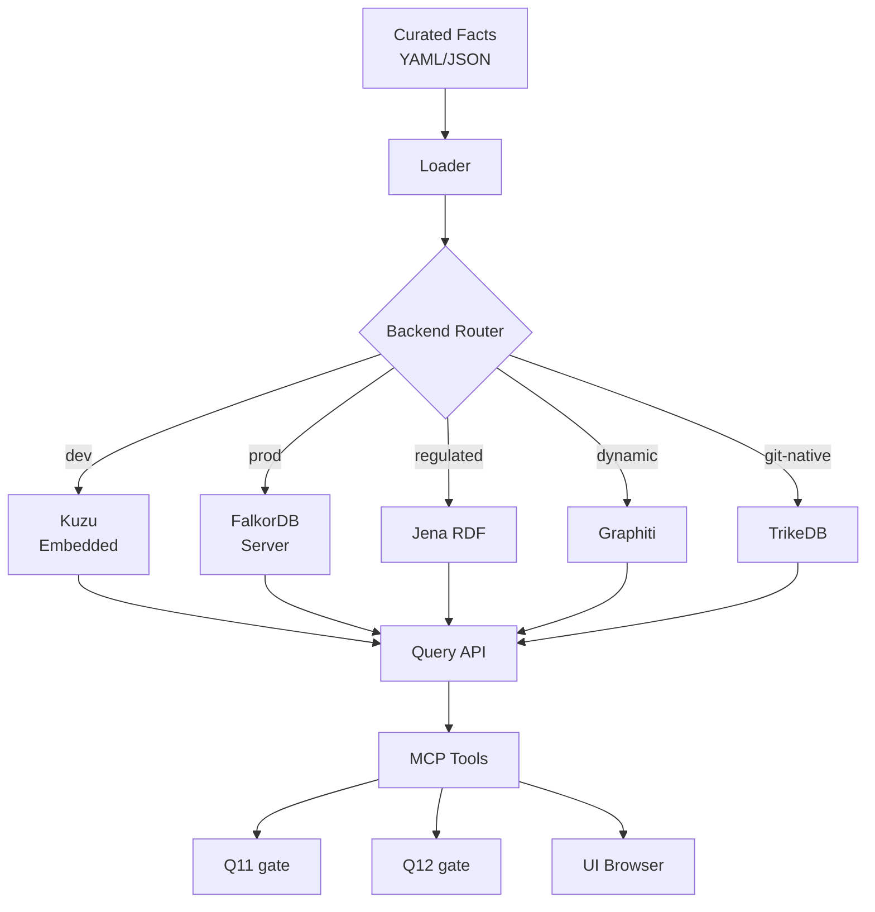

### Components

- Fact ingestion from regulatory documents, domain ontologies, SME-validated assertions.
- Provenance for every fact: `source`, `curator`, `timestamp`, `confidence`, `valid_until`, `version`.
- Conflict resolution workflow for contradictory facts.
- Graph consistency gates: **Q11 (graph consistency)**, **Q12 (fact coverage)**.

### Independence requirements

- Graph authors must not be the same people who approve releases.
- Facts must be versioned and auditable.
- SME validation recorded in the Audit Ledger.
- Graph updates traceable to a source or review decision.
- For small teams where role separation is impossible, the overlap is recorded in the audit trail and flagged in the release report.

### Fail behavior

- **Q11 (production):** fail-closed. Graph unreachable → block, escalate.
- **Q11 (dev mode):** fail-open. Graph unreachable → warn, continue.
- **Q12:** fail-open always. Low coverage warns; does not block.

### Consequences

- Enables graph-anchored verification rather than self-referential LLM judging.
- Adds operational cost and domain-expert dependency.
- Requires clear separation between fact curation, model evaluation, and release approval.
- Assembling instead of building saves months of infrastructure work.
- Backend abstraction adds a translation layer that must be maintained.
- Scaling across verticals is expensive; each domain needs its own curation effort.

### KG Fact Supersession and Rollback

**Problem:** Treating the KG as append-only makes corrections require manual edits, breaking the audit trail.

**Design:**

- Facts are immutable once committed. Corrections are new facts that supersede old ones.
- Every fact has `supersedes: <fact_id>` (optional).
- Superseding fact carries its own provenance (who, when, why).
- Query layer resolves supersession chains: `facts_for(entity)` returns only active facts.
- Audit trail preserves the full chain.
- Re-evaluation job runs after any supersession: features that referenced the superseded fact are flagged for re-verification.
- SME approval required for supersession (same workflow as new facts).

**Rollback:**
- Reverting a supersession is a new fact superseding the correction. No deletes.
- Compliance officers can view the full chain.

**Schema:**

```yaml
- id: fact_0001
  type: invariant
  subject: account
  predicate: balance_gte
  object: 0
  source: "Regulatory spec X"
  curator: alice@example.com
  timestamp: 2026-09-01T00:00:00Z
  confidence: 0.95
  valid_until: null
  version: 1
  supersedes: null

- id: fact_0042
  type: invariant
  subject: account
  predicate: balance_gte
  object: -100
  source: "Regulatory update 2026-Q3"
  curator: bob@example.com
  timestamp: 2026-09-15T00:00:00Z
  confidence: 0.98
  valid_until: null
  version: 2
  supersedes: fact_0001
```

**Verification (P12-T03):** Supersession chain resolves correctly; re-evaluation flags affected features.

---

## 21. Calibrated Confidence for Q10

**Status:** Proposed (Phase P12.b).

**Context:** Binary pass/fail from an LLM judge hides uncertainty. A low-confidence pass may be as risky as a high-confidence fail. Anchoring bias and poor calibration are known failure modes.

### Decision

Q10 returns:
- verdict,
- confidence score,
- confidence interval where possible,
- rationale,
- supporting evidence and graph references.

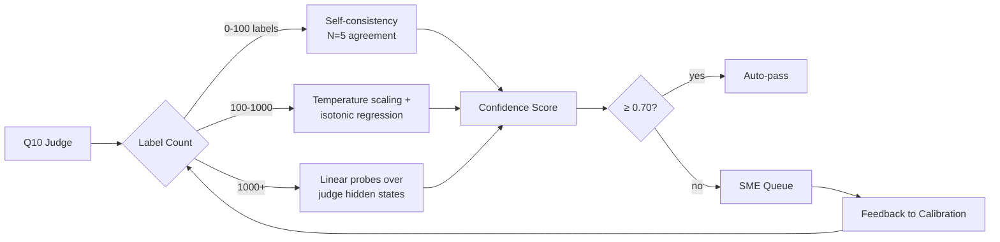

### Calibration bootstrap strategy

| Phase | Labels available | Method |
|---|---|---|
| Phase 1 | 0–100 | **Self-consistency sampling:** run judge N=5, measure agreement. Agreement is the confidence proxy. |
| Phase 2 | 100–1000 | **Temperature scaling + isotonic regression** on judge scores. |
| Phase 3 | 1000+ | **Linear probes** over judge hidden states (requires judge API access to hidden states). |

### Metrics tracked

- ECE (Expected Calibration Error)
- MCE (Maximum Calibration Error)
- Brier score

### Escalation rules

- Confidence < threshold (default 0.70; configurable per domain/risk tier) → SME queue.
- Domain risk is high → SME queue regardless of confidence.
- Graph contradiction exists → block + SME queue.

### Anchoring mitigation

- Never show prior scores to the judge as context metadata.
- Fresh context per judge call.
- If A/B testing anchoring, do so in a labeled experiment, not production.

### Consequences

- Reduces false confidence.
- Increases SME workload unless thresholds are tuned.
- Creates a feedback loop for judge improvement.
- Depends on SME labels; labeling cost is real.

---

## 22. Competitive Positioning and Validation

### 22.1 Positioning statement

> *Aegis is the evidence and governance layer that lets high-stakes teams ship AI-generated software with independent, auditable verification — faster than formal methods, more reliable than pure LLM-as-judge.*

### 22.2 Buyer

- Head of AI Platform / VP Engineering
- Head of Quality / QA / Evaluation
- Compliance, Risk, or Audit lead
- Domain SME leads in regulated environments

*Note: buyer may differ from user. Compliance may buy; platform engineer uses. Plan for both.*

### 22.3 Alternatives

| Category | Tools |
|---|---|
| Bundled/free | GitHub Actions, Cursor Automations, hyperscaler AI testing |
| AI code review | CodeRabbit, Greptile, Blacksmith |
| Test generation / QA | Qodo, BotGauge, Testaify |
| Formal verification | Axiom, Pramaana Labs, Theorem |
| Open-source eval | promptfoo, DeepEval, Ragas, LangSmith, Braintrust |
| Manual | QA teams, SMEs, release sign-off |

### 22.4 Named competitive wedges

| Competitor | Wedge |
|---|---|
| **CodeRabbit / Greptile** | We evaluate test artifacts and domain facts, not source diffs. |
| **Axiom / Pramaana Labs / Theorem** | Weeks to value, not quarters. No formal specifications required. |
| **promptfoo / DeepEval / Ragas** | We add provenance, calibration, and SME routing on top of your existing eval framework. |
| **TestRail / Xray** | Deterministic generation + quality gates + independent verification, not just storage. |
| **GitHub Actions / Cursor / hyperscalers** | Audit-trail-first, no cloud lock-in, domain-graph-anchored. |
| **Blacksmith / Qodo** | Independent oracle; calibrated confidence; SME escalation; graph-anchored. |

### 22.5 Proof points to build

- Lower false negatives on domain-specific contradictions.
- Reduced SME review time per release.
- Reproducible audit artifact accepted by compliance.
- Integration with existing CI/CD in under one day.
- Measurable reduction in production failures after gate adoption.

### 22.6 Pricing direction

| Tier | Target | Price band |
|---|---|---|
| Team | Single team, one domain | $1K–$5K/month |
| Business | Multi-team, multi-domain | $10K–$50K/month |
| Enterprise | Regulated, audit-required, custom KG | $100K–$500K/year |

*Exact pricing validated by pilot conversations.*

### 22.7 Land-and-expand GTM

| Stage | Scope | Expansion trigger |
|---|---|---|
| Pilot | One release gate, one domain, one team | N releases with zero escapes |
| Team expansion | Adjacent teams in same domain | Repeatable pilot playbook |
| Domain expansion | Adjacent domains (e.g., BFSI → insurance) | KG curation template reuse |
| Platform expansion | Org-wide evaluation layer | Integration with existing test management |

### 22.8 Integration surface

| Tool | Integration mechanism |
|---|---|
| GitHub Actions | Workflow action; PR comment with gate results |
| promptfoo | Adapter plugin; import/export eval configs |
| TestRail | `trcli` import_gherkin + custom fields |
| Jira | Webhook + MCP tool |
| Slack / Teams | Webhook notifications |

### 22.9 Validation Plan

**Goal:** Test whether the verification bottleneck, independent-oracle problem, and governance need are real enough to pay for.

**Target segments:** AI platform engineering leads; quality/QA/evaluation leaders; compliance, risk, domain SMEs.

**Approach:** 20 interviews in **one segment first** (pick BFSI or healthcare), then expand. Segment-level depth beats segment-level breadth.

| Item | Value |
|---|---|
| **Interview budget** | **$10,000** (SME/compliance lead scheduling, incentive, travel) |
| **Calendar** | **8–10 weeks**, starting week 1 |
| **Target count** | 20 (single segment first) |
| **Owner** | **Head of Product** (responsible); Market Strategy advisor (support); QA Architect does NOT participate (bandwidth) |
| **Scheduling** | Recruiter support for BFSI/healthcare; expect 3–5 weeks to fill 20 slots |
| **Interview length** | 45 min each |
| **Analysis time** | 1 week post-interviews |

**Fallback if interviews slip:** P12.a start slips by the same number of weeks. P13 (Ecosystem) can proceed in parallel since it doesn't depend on P12.a.

**Interview questions (18 total):**

*Phase 1 — Current workflow and pain:*
1. How do you currently verify AI-generated code or AI-generated outputs before release?
2. What happens today when verification misses a serious issue?
3. Where does verification slow you down most — code review, testing, evals, or sign-off?

*Phase 2 — Trust in current verification:*
4. How much do you trust LLM-as-judge or automated evaluation results? Why?
5. Have you seen a case where the AI wrote both the code and the tests, and the tests missed the real problem?
6. What would have to be true for you to conclude AI verification is already solved? *(disconfirmation)*

*Phase 3 — Audit and domain-fact handling:*
7. What evidence do auditors, regulators, or customers ask for when you ship AI features?
8. How do you handle domain facts the model may not know or may contradict?
9. How many SME hours per week go into reviewing AI outputs? Is that a bottleneck? *(SME bottleneck)*

*Phase 4 — Decision-making and existing tooling:*
10. Who is accountable when an AI-generated feature fails in production?
11. How do you decide when a release is safe enough to ship?
12. What tools are you using today for testing, evals, and release gates?
13. What would make you replace or augment those tools?
14. If GitHub Actions added this capability for free, would you still buy it? *(counter-positioning)*

*Phase 5 — Reaction to concept, budget, pilot:*
15. If a system could independently flag contradictions using a domain knowledge graph, would that change your review process?
16. Do you have budget for verification, governance, or audit tooling? Who owns it?
17. What would a successful pilot look like? What would make you reject it?
18. Who else should we talk to?

**Success signals:**
- They describe the verification bottleneck unprompted.
- They have audit or compliance pain.
- They distrust pure LLM judges.
- They can name a budget owner.
- They would pilot on a real release gate.
- They ask about graph provenance, SME routing, or audit artifacts.

**Failure signals:**
- "GitHub Actions is enough."
- No audit requirement.
- No willingness to change workflow.
- No budget or unclear owner.
- They only want faster test generation.

### 22.10 Validation gate

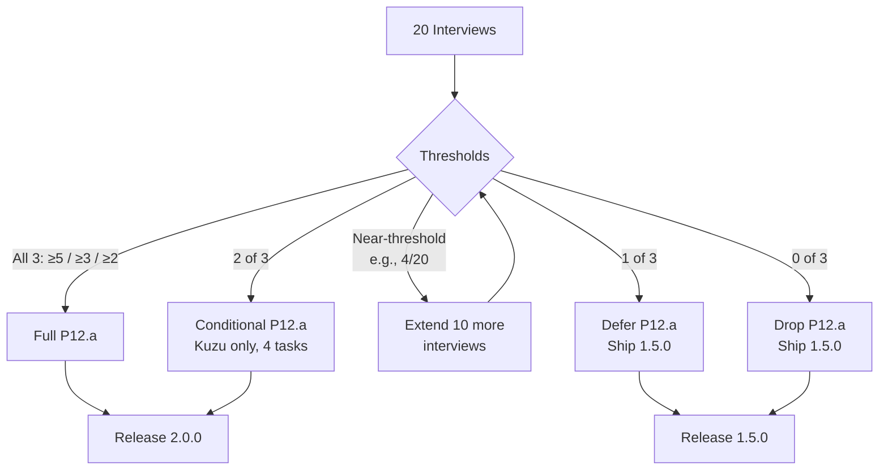

| Thresholds met | Decision |
|---|---|
| All 3 (≥5, ≥3, ≥2) | **Full P12.a proceeds.** |
| 2 of 3 | **Conditional P12.a:** proceed with reduced scope (Kuzu only, no FalkorDB production path; 4 KG tasks instead of 6). |
| Near-threshold (e.g., 4/20 on independent-oracle, but ≥3/20 and ≥2/20 on others) | **Conditional defer:** run 10 more interviews in the same segment. If 2+ additional describe the problem, upgrade to 2-of-3. If not, downgrade to 1-of-3. |
| 1 of 3 | **Defer P12.a.** Ship 1.5.0-BDD-only. Re-validate after 6 months. |
| 0 of 3 | **Drop P12.a.** Ship 1.5.0-BDD-only. Revisit positioning. |

**P12.b is not gated.** Calibration and SME routing ship regardless of validation outcome.

### 22.11 Positioning variants

#### Variant A — 2.0.0 (P12.a cleared)

> *Aegis is the evidence and governance layer that lets high-stakes teams ship AI-generated software with independent, auditable verification — faster than formal methods, more reliable than pure LLM-as-judge.*

#### Variant B — 1.5.0 (P12.a dropped)

> *Aegis is a deterministic BDD platform with ten quality gates (Q1–Q10), a Norma validator (Q0), full traceability, calibrated confidence, SME escalation, and audit-ready releases — for teams that need verifiable test generation with human-in-the-loop quality control.*

**Q0 is a validator, not counted in the ten gates.** Q1–Q10 are the ten quality gates. Q11 and Q12 are P12.a-conditional.

**Marketing collateral must state which variant applies.** Sales must not claim independent verification (graph-anchored) if P12.a is dropped.

---

## 23. Key Metrics

| Metric | Value |
|---|---|
| Total tasks | **101** |
| Total phases | **16** (P12 as two sub-phases) |
| Parallel tracks | 4 (A1, A2, B, C) |
| Walking skeleton | Week 5 |
| Spikes (KG + execution) | Week 5.5 |
| MCP available | Week 6 |
| Execution runs | Week 9 |
| Calibration live | Week 10 (P12.b) |
| KG available | Week 12 (P12.a, if cleared) |
| UI live | Week 10 |
| Release | Week 13–14 (3 reviewers) |
| **Release profiles** | **1.5.0 / 2.0.0** |
| **Release criteria** | **Binary, per-profile (§15)** |
| **Reuse candidates verified** | **P0-T07** |
| **Savings** | **33% hypothesis, re-baselined after P3a/P5** |

---

## 24. Decision Journal

### 24.1 Knowledge Graph Strategy

| Iteration | Position | Superseded by |
|---|---|---|
| v6 | No KG. Gates Q0–Q10 only. | Market analysis |
| v7 | KG as differentiator. Neo4j or equivalent. | Backend ambiguity |
| v8 | KG with explicit backends: Postgres (default), Neo4j (upgrade), RDF (regulated). | Build-vs-assemble insight |
| v9 | Assemble, don't build. Abstract backend + Kuzu (dev) + FalkorDB (prod) + stubs. | Component sourcing generalization |
| v10–v15.1 | Same as v9, formalized. | **Current (frozen)** |

### 24.2 Delivery Model

| Iteration | Position | Superseded by |
|---|---|---|
| v1–v2 | Fork + wrapper | Direct development |
| v3 | Discovery-first | Operational gaps |
| v4 | Production-ready | Platform scope |
| v5 | Platform-ready | Walking skeleton |
| v6 | Walking skeleton + parallel tracks | Market integration |
| v7 | Market-integrated | Competitive rigor |
| v8 | Competitively positioned + validation-ready | KG backend reassessment |
| v9 | KG assembled from open source | Component sourcing generalization |
| v10 | Reuse-first across all tiers; effort savings documented | Structural debt from reviews |
| v11–v15.1 | Structural debt closed; frozen. | **Current (frozen)** |

### 24.3 Component Sourcing

| Iteration | Position | Superseded by |
|---|---|---|
| v1–v9 | Build vs reuse discussed ad-hoc per component | Systematic classification |
| v10 | Three-tier classification is authoritative; effort savings measured | Verification-first discipline |
| v11+ | P0-T07 verifies reuse candidates; savings hypothesis re-baselined | **Current (frozen)** |

### 24.4 Confidence Calibration

| Iteration | Position | Superseded by |
|---|---|---|
| v8 | Linear probes only | Bootstrap reality |
| v9 | Three-phase bootstrap: self-consistency → temperature scaling → linear probes | Unchanged |
| **v15.1** | **Same as v9.** | **Current (frozen)** |

### 24.5 Fail Behavior

| Iteration | Position | Superseded by |
|---|---|---|
| v8 | Unspecified per gate | Operational reality |
| v9 | Q11 production: fail-closed. Q11 dev: fail-open. Q12: fail-open always. | Unchanged |
| **v15.1** | **Same as v9.** | **Current (frozen)** |

### 24.6 Structural Debt

| Iteration | Position | Superseded by |
|---|---|---|
| v8 review | Seven items flagged | v9, v10 dropped them |
| v10 review | Same seven items re-flagged, plus four new | v11 |
| v11 | All items applied; §1.5 reconciliation required per version | Consistency fixes |
| v12–v15 | Consistency fixes | **v15.1 freeze** |

### 24.7 Reuse Verification

| Iteration | Position | Superseded by |
|---|---|---|
| v10 | Named candidates without verification | Reviewer flagged risk |
| **v11+** | **P0-T07 verifies; only verified candidates count toward savings** | **Current (frozen)** |

### 24.8 Track Structure

| Iteration | Position | Superseded by |
|---|---|---|
| v6–v10 | 3 tracks (A, B, C) | Track A overloaded |
| **v11+** | **4 tracks (A1, A2, B, C)** | **Current (frozen)** |

### 24.9 Internal Consistency

| Iteration | Position | Superseded by |
|---|---|---|
| v11 | Task count inconsistent (95 vs 99); A1/A2 ownership conflict | Reviewer flagged |
| v12 | Task count = 99 everywhere; governance ownership = A2 only; P7 renamed Quality Integration | Reviewer flagged |
| **v15.1** | **Task count = 101; phase count = 16; P12 as two sub-phases** | **Current (frozen)** |

### 24.10 Compliance Frameworks

| Iteration | Position | Superseded by |
|---|---|---|
| v11 | GDPR, SOC 2, HIPAA only | Reviewer flagged gap |
| **v12+** | **Added ISO 42001 and EU AI Act; Presidio as PII engine; gitleaks as secrets engine** | **Current (frozen)** |

### 24.11 Conditional Release

| Iteration | Position | Superseded by |
|---|---|---|
| v12 | §15 P0 criteria assumed full build; contradicted §22.10 | Reviewer flagged |
| **v13+** | **Two release profiles: 1.5.0 and 2.0.0; profile declared at week 10** | **Current (frozen)** |

### 24.12 Task Index Discipline

| Iteration | Position | Superseded by |
|---|---|---|
| v12 | `docs/AI_GOVERNANCE.md` assigned to P0-T05 (conflict); Track B backfill informal | Reviewer flagged |
| **v13+** | **New task P0-T08 (AI governance docs); Track B backfill promoted to P4-T08; task count 101** | **Current (frozen)** |

### 24.13 P12 Split

| Iteration | Position | Superseded by |
|---|---|---|
| v13 | P12 all-or-nothing; calibration bundled with KG | Reviewer flagged independence |
| **v14+** | **P12.a (KG, gated) + P12.b (Calibration + SME, unconditional)** | **Current (frozen)** |

### 24.14 Release Versioning

| Iteration | Position | Superseded by |
|---|---|---|
| v13 | BDD-only = `2.0.0` with `-nog` tag or `1.5.0` decided at release | Reviewer flagged indecision |
| **v14+** | **BDD-only = 1.5.0; with-KG = 2.0.0** | **Current (frozen)** |

### 24.15 Drafting Discipline

| Iteration | Position | Superseded by |
|---|---|---|
| v13 | Drafting notes visible in §8 | Reviewer flagged credibility defect |
| **v14+** | **Drafting notes removed; ADR is freeze-ready** | **Current (frozen)** |

### 24.16 Conditional Propagation

| Iteration | Position | Superseded by |
|---|---|---|
| v12–v14 | Three instances of "conditional X required by unconditional Y" | Reviewer flagged pattern |
| **v15+** | **§1.5.1 propagation rule + §1.5.2 audit table** | **Current (frozen)** |

### 24.17 SME Role Semantics

| Iteration | Position | Superseded by |
|---|---|---|
| v14 | SME role P12.a-conditional; contradicted P12.b | Reviewer flagged |
| **v15+** | **SME role unconditional; `sme:decide` unconditional; `graph:curate` P12.a-conditional** | **Current (frozen)** |

---

## 25. Appendix — Agent Prompt

The prompt to start execution lives at `docs/adr/AGENT_PROMPT.md`. It instructs the agent to:

1. Read this ADR at `docs/adr/ADR-003-AEGIS.md`.
2. Begin at Phase P0, Task P0-T01.
3. Follow the Discovery → Plan → Wait → Implement → Verify → Report cycle.
4. Never implement without explicit APPROVE.
5. Check §5.10 for tier; verify reuse candidate in `docs/COMPONENT_SOURCING.md` (Tier 1/2 only).
6. Tier 3 tasks may not be outsourced.
7. If a Tier 3 task should be Tier 2, escalate per §5.5.
8. Escalate per §5.5 after 2 failed attempts.
9. For every new version of this ADR, produce a §1.5 reconciliation.
10. Verify task count in status table sums to 101.
11. If `governance/` appears in an A1 plan, reject and escalate.
12. Before any release task, check `docs/RELEASE_CHECKLIST.md` for the declared release profile.
13. If a task depends on P12.a outcomes and P12.a is dropped, escalate.
14. P12.a is validation-gated. P12.b is not.
15. Release profile is declared by Release Manager at week 10. Agent does not choose.
16. If a task introduces a conditional, perform propagation pass over §1.5.2, §12, §15, §18, §22.11, §23.
17. If a section contradicts §1.5.2, escalate. The audit table is authoritative.

---

## 26. Changelog

| Version | Date | Change |
|---|---|---|
| v1–v10 | 2026-09-12 to 09-15 | (see v10 changelog) |
| v11 | 2026-09-15 | Closed v8 items; verified reuse; binary release criteria; data retention; KG supersession; KG thin slice; Track A split; validation gate |
| v12 | 2026-09-15 | Internal consistency fixes; compliance completeness |
| v13 | 2026-09-15 | Conditional release profiles; task-index closure (99 → 101) |
| v14 | 2026-09-15 | P12 split (P12.a/P12.b); drafting notes removed; release versions decided |
| v15 | 2026-09-15 | SME role contradiction fixed; conditional propagation rule; conditional dependency audit |
| v15.1 | 2026-09-15 | Errata: phase row merge; propagation checklist; resolved risk removed; track load reconciled; ECE waiver owner; `KNOWLEDGE_GRAPH.md` assigned. FROZEN. |
| **v15.1 (ADR-003)** | **2026-09-21** | **Renamed from ADR-001 to ADR-003. All "unchanged from" sections replaced with actual content. Full self-contained version for the ADR index.** |
| **v15.2 (ADR-003)** | **2026-09-23** | **Added the current implementation boundary, release-profile declaration, repository capability status matrix, product-surface parity contract, and cross-surface phased delivery gates. Corrected the agent prompt path.** |

**Amendments applied in v15.1 (carried into ADR-003):**
1. §8 phase table: P12.a/P12.b merged into one P12 row (16 phases).
2. §1.5.1 propagation checklist includes §1.5.2.
3. §16 risk register: resolved SME row removed; retained in §24.17.
4. §8 track load table relabeled "Track-assigned tasks only"; reconciled to 101.
5. §15.4 ECE waiver: QA Architect owns; Release Manager verifies.
6. §13 P12.a-T06 owns `docs/KNOWLEDGE_GRAPH.md`.
7. §15.0 public version strings "1.5.0" and "2.0.0"; profile designations internal.

---

**End of ADR-003.**

**FROZEN.**
**Total tasks: 101.**
**Total phases: 16.**
**Duration: 12–14 weeks (3 reviewers).**
**Release: 1.5.0 or 2.0.0.**
**Reuse: verified before inclusion.**
**KG: gated on validation. Calibration + SME: unconditional.**
**Compliance: GDPR, SOC 2, HIPAA, ISO 42001, EU AI Act.**

**Aegis execution begins at P0-T01 after the current Norma workflow release
candidate is accepted or a separate Aegis workstream is approved.**

## 27. Post-Norma implementation roadmap

The frozen 101-task plan above is the Aegis target plan. The following delivery
gates make the evidence, technology, and operational recommendations executable
without changing the frozen task count:

| Workstream | Scope | Exit gate | Profile |
|---|---|---|---|
| AEGIS-0 | Package boundary, component sourcing, evidence matrix, owners, and requirement/task traceability | Matrix schema and CI validator pass; all required tasks have evidence fields | All |
| AEGIS-1 | Q0–Q10, repair loop, deterministic cache, cost/evaluation reports, MCP contracts | Gate/repair contract tests and objective eval artifacts pass | 1.5.0 |
| AEGIS-2 | PostgreSQL/Alembic, durable queue, OIDC/RBAC, audit, backup/restore, telemetry, deployment and rollback | Security, migration, recovery, RPO/RTO, and observability drills pass | 1.5.0 |
| AEGIS-3 | Confidence calibration, ECE/MCE/Brier reporting, SME routing and feedback | Versioned calibration dataset/model/report meets threshold and routing is audited | 1.5.0 |
| AEGIS-4 | Kuzu/FalkorDB adapter, provenance, supersession, Q11/Q12, curation | P12.a validation dataset and graph fail-closed production drill pass | 2.0.0 |
| AEGIS-5 | Presidio, gitleaks, dependency/security scans, latency/coverage/load evidence, residency and erasure controls | Required scans and non-functional thresholds pass; release decision is signed | All |

The detailed execution sequence, stack mapping, evidence artifact convention,
and CI expectations are maintained in
`docs/GENERATION_WORKFLOW_PLAN.md` under **Aegis Implementation Roadmap**.
These workstreams are release gates, not completion claims. Aegis 1.5.0 or
2.0.0 remains unavailable until its profile-specific evidence is linked from
`docs/adr/evidence-matrix.yml`.