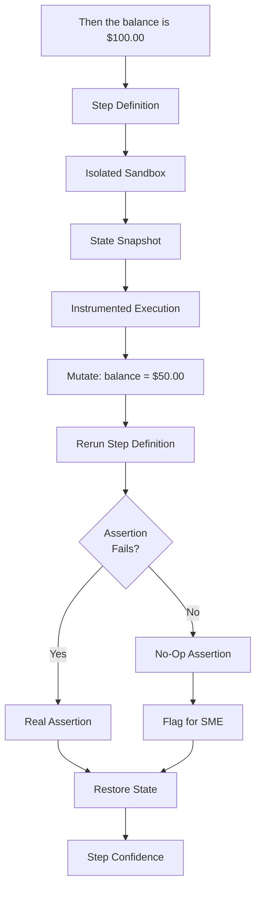
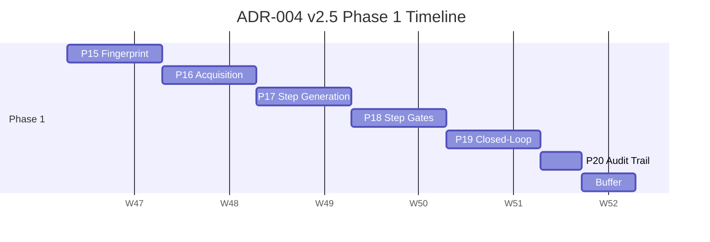

# ADR-004 v2.5: Closed-Loop Step Definition Verification

**Single-file architecture decision record. Version 2.5. FINAL.**

---

## Metadata

| Field | Value |
|---|---|
| **ADR ID** | ADR-004 |
| **Version** | v2.5 |
| **Title** | Closed-loop step definition verification for Aegis/Norma |
| **Status** | **FINAL — FROZEN** |
| **Date** | 2026-09-27 |
| **Deciders** | Engineering Lead, QA Architect, Product Owner |
| **Extends** | ADR-003 (Aegis Platform), ADR-005 (Context Contract) |
| **Supersedes** | ADR-004 v1.0 (47 tasks), v2.0–v2.4 (drafts) |
| **Target Duration** | 4 weeks Phase 1 (parallel to ADR-003) |
| **Phase 1 tasks** | **18** |
| **Phase 1 phases** | **5** (P15–P19) |
| **Phase 2 tasks** | **2** (test mining, triggered) |
| **Deferred tasks** | 27 (arithmetic reconciled) |

---

## 1. Context

ADR-003 automates Gherkin generation and partially automates step definition generation. It does not close the fundamental gap: **no tool verifies that a step definition actually executes the Gherkin's intent.**

A step definition can pass while asserting nothing. It can pass while performing the wrong action. It can pass while testing a different behavior than the Gherkin describes. Standard BDD tooling cannot detect any of these — the step definition executes, returns success, and the test passes.

This is the "passes but does nothing" problem. Every BDD automation tool today suffers from it.

ADR-004 v1.0 proposed 47 tasks to solve it, plus a multi-model database, a self-healing engine, a cross-application pattern library, and a production telemetry miner. **v2.5 cuts the scope to what actually solves the problem**, keeps the innovation (closed-loop verification), and defers the speculative work with explicit, signal-based revisit triggers.

---

## 2. Four-Lens Review Summary

The scope was shaped by four lenses. The review is documented because it explains why the scope is what it is.

### 2.1 The Four Lenses

| Lens | Question | Scope effect |
|---|---|---|
| **Hickey (shape)** | Simplest thing that could work? | Rejected multi-model DB, ten gates, unified confidence formula |
| **Fowler (evolution)** | Smallest vertical slice? | Deferred pattern library, multi-framework, telemetry, unified confidence |
| **Enumerator (completeness)** | What could go wrong? | Generated full v1.0 scope; cut back by the other three |
| **Antinode (signal over noise)** | What changes for the user? | Deferred unified confidence; sharpened triggers; flagged SD3 as duplicative |

### 2.2 The Core User Problem

**A QA engineer cannot tell whether a passing test actually verifies what the Gherkin describes, until a defect escapes.**

### 2.3 Where All Four Lenses Agree

- **Application Fingerprint.** Versioned, hashed, human-reviewable. Data, not code. Grounds step generation in reality. **Signal: 5/5.**
- **Closed-loop verification.** The only piece no competitor has. Proving the test tests is the actual work. **Signal: 5/5.**
- **Audit trail.** Required noise, named honestly. **Signal: 2/5, classified required noise.**
- **Hypothesis framing.** Novel techniques need validation plans, not confidence. **Signal: 4/5.**

### 2.4 Scope Cut Rationale

| Cut | Reason |
|---|---|
| Multi-model DB | Fingerprint graph is bounded. Postgres CTEs handle it. |
| Ten SD gates → six | SD4–SD7, SD9 are metrics, not gates. |
| Self-healing engine | Build after failure distribution is known. |
| Production telemetry | Adds observability stack to test an untested hypothesis. |
| Pattern library | Audience of one. |
| Multi-framework emitters | Playwright is already in the stack. |
| AI discovery agent | Test mining captures more knowledge at zero runtime cost. |
| **Unified confidence formula** | **Formula for a decision that is already binary. Deferred (§9).** |
| **Test mining (Phase 1)** | **Page objects + OpenAPI cover most cases. Deferred to Phase 2 (§10).** |

---

## 3. Decision

**We will extend Aegis/Norma with an Application Fingerprint, a bounded step definition generator, six step definition gates, and closed-loop verification via mutation testing.**

1. **Application Fingerprint** — versioned, hashed, human-reviewable artifact.
2. **Bounded acquisition (Phase 1)** — two sources: page objects and OpenAPI specs. Test mining is Phase 2.
3. **Storage: PostgreSQL only.** YAML in git as source of truth; Postgres as query index. Recursive CTEs for graph.
4. **Step definition generation** — deterministic from the Fingerprint. Playwright only.
5. **Six step definition gates** — SD0, SD1, SD2, SD3 (conditional), SD8 (two-threshold), SD10.
6. **Closed-loop verification** — mutation testing for assertions, shipped as a hypothesis (§7.9), 10% sampling.
7. **Three separate confidence scores** — Gherkin, step, execution. No unified formula in Phase 1.
8. **Extended audit trail** — every layer hashed and traceable.
9. **Contract tests** for every external dependency.
10. **Everything else deferred** — §11 with signal-based triggers.

---

## 4. Consequences

### Positive

- **Category-defining capability.** No Playwright-based tool verifies step definitions through mutation testing.
- **Directly answers "how do we trust it?"** — with the same rigor at every layer.
- **Smaller, sharper scope.** 18 Phase 1 tasks instead of 47. 4 weeks instead of 8–10.
- **Postgres only.** No new database to operate.
- **Fully reversible.** Every phase is feature-flagged.
- **No formula pretending to be a decision.** Three scores instead of one weighted score.

### Negative

- **Self-healing deferred.** Manual intervention for selector drift.
- **Test mining deferred to Phase 2.** Lower Fingerprint coverage in Phase 1; flagged by `coverage_boost`.
- **Playwright only.** Cucumber/Behave teams must wait.
- **Pattern library is a folder.**

### Neutral

- Fingerprint requires SME review.
- Closed-loop verification adds runtime cost; feature-flagged and sampled.

### Consequences of Deferral

| Deferred item | Cost of not having it | Source |
|---|---|---|
| Self-healing | Manual selector fixes; ~2–4 hours/week (estimated) | Pilot estimate |
| Test mining (Phase 2) | Lower Fingerprint coverage in Phase 1 | Qualitative |
| Production telemetry | No real-user-flow visibility | Qualitative |
| AI discovery | New modules have no Fingerprint coverage | Qualitative |
| Pattern library | Cross-team reuse is copy-paste | Qualitative |
| Multi-framework | Cucumber/Behave teams blocked | Qualitative |
| pgvector | Linear matching only; fine for <100 patterns | Qualitative |
| Unified confidence | Three separate scores shown instead | Qualitative |

### SME Review Budget

| Item | Estimate |
|---|---|
| Review time per module | ~2 hours initial, ~1 hour quarterly |
| Loaded SME cost | ~$150/hour |
| Annual cost per module | ~$900 |
| Modules per client | 5–15 |
| Annual client cost | ~$4,500–$13,500 |

Included in enterprise pricing (ADR-003 §22.6).

---

## 5. Alternatives Considered

| Alternative | Why rejected |
|---|---|
| ADR-004 v1.0 as written | 47 tasks. Speculative work. |
| No Fingerprint; use page objects directly | Page objects are UI-only. |
| AI discovery only | Requires running app; fragile. |
| Multi-model DB (AGE, ArcadeDB) | Fingerprint graph is bounded. |
| Ten SD gates | Metrics masquerading as gates. |
| Self-healing now | Building before knowing failure distribution. |
| Pattern library now | Audience of one. |
| Unified confidence formula | Formula for a binary decision; the exact score is not acted on. |
| Test mining in Phase 1 | Page objects + OpenAPI cover most Phase 1 cases. |
| SD3 unconditional | Duplicates the repo's pre-commit hook in most cases. |

---

## 6. The Application Fingerprint

### 6.1 What It Is

A versioned, hashed, human-reviewable artifact describing the application's observable interface.

Contents: UI mapping, API mapping, auth model, data setup, behaviors, provenance.

### 6.2 Storage Model

**YAML files in git as source of truth. PostgreSQL as query index.**

| Layer | Storage | Purpose |
|---|---|---|
| Source of truth | `fingerprints/<app>/fingerprint.yaml` in git | Reviewable, hashable, diffable |
| Query index | PostgreSQL tables | Fast lookup during generation |
| Sync | Loader reads YAML, writes index | Deterministic; rerunnable |

If Postgres is unavailable, generation falls back to reading YAML directly.

### 6.3 Schema

```yaml
# fingerprints/retail_banking/fingerprint.yaml
schema_version: 1.0
application: retail-banking-app
fingerprint_hash: sha256:abc123...
derived_at: 2026-09-27T10:00:00Z
reviewed_by: alice@example.com

screens:
  AccountDetails:
    url_template: "/accounts/{account_id}"
    elements:
      balance:
        locator: "[data-test='balance']"
        type: text
      activity_period:
        locator: "[data-test='activity-period']"
        type: dropdown
        options: ["All", "Last 7 Days", "Last 30 Days"]
      go_button:
        locator: "[data-test='go-button']"
        type: button

api:
  base_url: "https://api.example.com/v1"
  endpoints:
    open_account: {method: POST, path: "/accounts"}
    transfer: {method: POST, path: "/accounts/{account_id}/transfers"}

auth:
  login_url: "/login"
  roles:
    customer: {credentials_env: TEST_CUSTOMER_CREDS}

behaviors:
  transfer_reduces_balance:
    given: ["new_funded_account"]
    when: {action: "UI.transfer", params: ["amount"]}
    then:
      assertions:
        - "UI.balance == initial_balance - amount"
        - "UI.available_balance == initial_balance - amount"

provenance:
  - element: AccountDetails.balance
    source: page_objects/account_details.yaml
    acquired: 2026-09-20
  - element: AccountDetails.activity_period
    source: page_objects/account_details.yaml
    acquired: 2026-09-25
    confidence: 0.92
```

### 6.4 Acquisition Sources

| Source | Phase | Captures | Confidence | Languages |
|---|---|---|---|---|
| Page objects | 1 | UI locators, actions | 1.00 | YAML/JSON |
| OpenAPI specs | 1 | Endpoints, payloads, auth | 1.00 | OpenAPI 2.0/3.0/3.1 |
| Test mining (via `codebase-memory-mcp`) | **2** | Selectors, API calls, patterns | 0.90–0.95 | 158 via tree-sitter |

**Phase 2 trigger for test mining:** Pilot measures Fingerprint coverage below 0.7 for a module, or a user reports missing capability that page objects and OpenAPI don't cover.

### 6.5 The `Fact` Type

```python
from dataclasses import dataclass
from datetime import datetime
from typing import Literal


FactType = Literal[
    "element", "action", "endpoint", "auth", "data_setup", "behavior",
]


@dataclass(frozen=True)
class Fact:
    """A single observation of application knowledge.

    A Fact is identified by (subject, predicate, object, source).
    Two sources observing the same s/p/o produce two Facts — they are
    two observations, not the same observation. The merge algorithm
    resolves them by confidence; the audit trail preserves both.
    """
    id: str                       # sha256(subject+predicate+object+source)[:16]
    type: FactType
    subject: str
    predicate: str
    object: str
    source: str
    acquired: datetime
    confidence: float
    version: int = 1
    supersedes: str | None = None
```

**Why source is part of the ID:** Two observations of the same fact are two facts. They are resolved by confidence during merge, both preserved in the audit trail. The previous version (v2.2) derived the ID from `(subject, predicate, object)` only, causing silent collisions when sources disagreed.

**Relationship to ADR-003's `TestCase`:**

- `TestCase` = input test case (from CSV/XLSX/story).
- `Fact` = application knowledge (from page objects, specs, mining).
- Different domains. The Fingerprint is composed of `Fact` objects.

### 6.6 Test Mining Integration (Phase 2)

```python
class TestMiner(Protocol):
    def mine(self, repo_path: str) -> list[Fact]: ...

class CodebaseMemoryMiner(TestMiner):
    def mine(self, repo_path: str) -> list[Fact]:
        try:
            return self._via_mcp(repo_path)
        except MCPUnavailable:
            return self._via_cli(repo_path)
```

**MCP fallback:** Some AI clients do not reliably invoke MCP tools. When MCP invocation fails, the wrapper falls back to CLI with structured JSON. Both paths produce identical `Fact` objects.

**Why wrapped:** Fingerprint logic never depends on the tool's query language. If `codebase-memory-mcp` is abandoned, the adapter is swapped.

### 6.7 Conflict Resolution: Fingerprint vs. Gherkin

| Conflict type | Detection | Resolution |
|---|---|---|
| Fingerprint lacks capability | No match | Emit skeleton (§7.8) |
| Fingerprint contradicts Gherkin | Semantics differ | SME review; do not auto-generate |
| Fingerprint and Gherkin agree | Compatible match | Generate step definition |
| Gherkin is ambiguous | Multiple matches | SME review |

**Do not auto-resolve conflicts.** Silent resolution is how tests drift from intent.

### 6.8 Fingerprint Schema Versioning

| Version | Action |
|---|---|
| Matches current | Load |
| Older but migratable | Run migration script; log; load |
| Older, not migratable | Refuse; error points to migration script |
| Newer than loader | Refuse; error points to upgrade path |

**No automatic migrations.** Every schema change is a deliberate PR with a migration script, tested in CI with sample Fingerprints.

---

## 7. Closed-Loop Verification

### 7.1 The Problem

A step definition can pass while asserting nothing.

### 7.2 The Solution

For each `Then` step, introduce mutations into application state. Verify the step definition's assertion fails. If the assertion survives, the step definition is not asserting.

### 7.3 Workflow



### 7.4 Instrumentation Method

| Layer | Instrumentation | Captures |
|---|---|---|
| UI state | Playwright trace + DOM snapshot | Element presence, text, attributes |
| Backend state | Database snapshot | Row-level changes |
| API state | Response interceptor | Request/response pairs |

Traces stored under `build/closed_loop/<run_id>/traces/`. Retained 90 days.

### 7.5 Isolation, Deployment, and Rollback

**Sandbox deployment target:** Ephemeral Docker container, isolated network, no production credentials, provisioned per run and torn down on completion. Runs on the same CI host as execution.

| Safeguard | Mechanism |
|---|---|
| Isolated environment | Docker sandbox |
| State snapshot | Before each mutation |
| Restore on completion | After mutation |
| Fail-safe on error | Abort and escalate if restore fails |
| Feature flag | `features.closed_loop: false` by default |
| Sampling | Configured separately (see below) |
| Cache | Results cached against step definition hash |

**Feature flag vs. sampling rate:**

| Config | Default | Purpose |
|---|---|---|
| `features.closed_loop` | `false` | Master enable/disable. When false, no mutation runs. |
| `closed_loop.sample_rate` | `0.10` (when enabled) | Fraction of tests that receive mutation testing |

The flag controls **whether the feature is on**. The sample rate controls **how much of the suite is tested when it is on**. §7.9's rollout sequence describes how the sample rate increases as the feature proves itself.

**Rollback procedure:**

```bash
export NORMA_FEATURE_CLOSED_LOOP=false
# Or: git revert <sha-of-P19-merge>
```

**Rollback triggers:**

| Trigger | Threshold | Response |
|---|---|---|
| State restore failure rate | > 1% of mutations | Disable; investigate |
| SME escalation rate | > 20% of mutations | Disable; see §7.9 |
| Cost per run | > $0.05 | Disable; review sampling |
| Sandbox provisioning failure rate | > 5% of runs | Disable; investigate infrastructure |

**Escalation response:** QA Architect reviews escalated mutations. SLA: 3 business days. Outcome: refine operators (if false positives) or reduce sample rate (if weak signal).

### 7.6 Mutation Operators

| Operator | Mutates | Purpose |
|---|---|---|
| Value substitution | `$100` → `$50` | Detect weak assertions |
| State inversion | `active` → `inactive` | Detect missing state checks |
| Boundary shift | `>= 0` → `> 0` | Detect off-by-one errors |
| Null injection | Value → null | Detect null-safety checks |

### 7.7 Cost Quantification

| Item | Value |
|---|---|
| LLM calls per mutation | 0 |
| Sandbox infrastructure | ~$0.0001 |
| Snapshot storage | ~$0.00005 |
| Compute | ~$0.0002 |
| **Per mutation** | **~$0.0003** |
| Mutations per test | ~4 |
| Sample rate | 10% |
| Mutations per run (100 tests) | 40 |
| **Per full run (100 tests)** | **~$0.012** |
| **Per year (365 nightly runs)** | **~$4.38** |
| **With 90% cache hit** | **~$0.44/year** |

**Cost scales linearly with test count.** A 10,000-test suite at 10% sampling: ~$1.20/run, ~$438/year.

### 7.8 Skeleton Output

When the Fingerprint lacks a capability for a Gherkin step, the generator emits a skeleton with structured hints.

```typescript
When('I transfer {amount} from the account', async ({ page }, amount: string) => {
  // TODO: implement
  // Fingerprint hint: no matching capability for 'transfer'
  // Near-matches found:
  //   - AccountDetails.elements.transfer_button (confidence 0.85)
  // Suggested action:
  //   - Add 'transfer' behavior to fingerprints/<app>/fingerprint.yaml
  throw new Error('Step not yet implemented');
});
```

**Skeletons fail loudly at runtime.** They do not silently no-op.

**Skeleton tracking and release gate:** Two complementary mechanisms:

- **Generation time:** Skeletons are logged to `build/skeletons.json`. The release pipeline reads this file and refuses to ship if it is non-empty. This is the primary gate.
- **Execution time:** Skeletons throw at runtime. This catches skeletons that escaped the generation-time log.

Together they ensure no skeleton reaches production, regardless of how it entered the suite.

### 7.9 Validation Plan for Closed-Loop Verification

Closed-loop verification for step definitions has **no prior art**. Mutation testing of source code is settled; mutation testing of step definitions is a hypothesis.

**Hypothesis:** For a step definition with a real assertion, ≥ 95% of mutations will be killed. For a step definition with no assertion, ≥ 90% of mutations will survive.

**Validation procedure:**

| Phase | Duration | Sample | Success criterion |
|---|---|---|---|
| Pilot | Week 1 | 20 step definitions | Mutation engine runs; results reviewable |
| Calibration | Weeks 2–4 | 100 step definitions | SME agreement with mutation verdict ≥ 90% |
| Production | Week 5+ | 10% sampling | Escalation rate < 5% sustained for 2 weeks |

**Who reviews:** QA Architect reviews the first 100 mutation results. Each result labeled: **True positive**, **False positive**, or **Ambiguous**.

**Target false-positive rate:** < 5%.

**Fallback if false-positive rate > 20% sustained:**

1. Disable `features.closed_loop`.
2. Collect data on why mutations are false-positive.
3. Refine mutation operators or add guards.
4. Re-enable at 5% sampling.
5. Re-measure.

**Rollout sequence** (sample rate when flag is on):

| Milestone | Sample rate | Gate |
|---|---|---|
| Internal pilot | 100% of pilot suite | Manual review of all results |
| Closed beta | 25% of beta suite | False-positive rate < 10% |
| Production | 10% of all tests | False-positive rate < 5% |
| Post-calibration | 25% (target) | Sustained < 5% for 2 weeks |

---

## 8. Step Definition Gates

| Gate | Type | Checks | Failure |
|---|---|---|---|
| SD0 | Hard | Step definition matches a Gherkin step | Reject |
| SD1 | Hard | Every Gherkin step has a definition | Reject |
| SD2 | Hard | Syntactically valid | Reject |
| SD3 | Conditional hard | No hardcoded credentials; enabled only when `NORMA_SKIP_PRECOMMIT=true` | Reject |
| SD8 | Soft at generation / hard at release | Assertion strength ≥ 0.90 (gen) / ≥ 0.85 (release) | Soft retry / Reject |
| SD10 | Soft | Executes in target framework | Reject |

**Ordering:** `SD0 → SD1 → SD2 → SD3 → SD8 → SD10`

**Implementation note on SD0+SD1:** These two checks run in a single pass and share work. The user sees six checkboxes; internally, SD0 and SD1 are one traversal producing two verdicts.

**On SD3 (conditional):** The repository almost always has a pre-commit hook running `gitleaks`. SD3 is enabled only when step definitions are generated in an environment where that hook does not run (`NORMA_SKIP_PRECOMMIT=true`). This avoids duplicate secret scanning.

**On SD8 (two thresholds):** Weak assertions are exactly the "passes but does nothing" problem this ADR exists to solve. Making it a pure soft gate would let the problem through. Two thresholds: 0.90 at generation time (soft, for early feedback), 0.85 at release (hard, for the actual gate).

**Promotion criteria for SD4–SD7, SD9:** Caught ≥ 3 defects that would have escaped; false-positive rate < 5%; runs in < 100ms per step definition.

---

## 9. Confidence Scores

**v2.5 change: Unified confidence formula deferred.** The earlier version proposed a single 0.0–1.0 score combining Gherkin, step, and execution confidence with provisional weights. The four-lens review found this was a formula for a decision that is already binary — the user acts on the 0.70/0.85 thresholds, not on the exact value. Three separate scores ship instead.

### 9.1 Three Scores

| Score | Source | Range |
|---|---|---|
| `gherkin_confidence` | ADR-003 Q10 judge + calibration | 0.0–1.0 |
| `step_confidence` | SD8 assertion strength + closed-loop survival rate | 0.0–1.0 |
| `execution_confidence` | Runtime results | 0.0–1.0 |

No formula. No weights. No re-baseline work. The user sees three scores and acts on each independently.

### 9.2 Adjustment Functions (Applied Per Score)

Two functions adjust the three scores before display:

```python
def coverage_boost(coverage: float) -> float:
    """0% coverage → 0.50 penalty; 100% → 1.0."""
    return 0.50 + 0.50 * coverage


def calibration_penalty(ece: float) -> float:
    """ECE ≤ 0.05 → no penalty; ≥ 0.15 → 15% penalty."""
    if ece <= 0.05:
        return 1.0
    if ece >= 0.15:
        return 0.85
    return 1.0 - (ece - 0.05) / 0.10 * 0.15
```

**On `coverage_boost(0.0) = 0.50`:** Zero Fingerprint coverage is a strong signal that a test is ungrounded. The previous version set this at 0.80, which was too generous. 0.50 is a candidate for re-derivation after the pilot.

### 9.3 Thresholds

| Score | Action |
|---|---|
| `gherkin_confidence` ≥ 0.85 | Auto-accept Gherkin |
| 0.70–0.85 | SME review of Gherkin |
| < 0.70 | Block; regenerate |
| `step_confidence` ≥ 0.85 | Auto-accept step definition |
| 0.70–0.85 | SME review of step definition |
| < 0.70 | Block; regenerate |
| `execution_confidence` ≥ 0.85 | Auto-deliver |
| 0.70–0.85 | SME review |
| < 0.70 | Block; investigate |

**Additional gate:** Any skeleton in `build/skeletons.json` blocks release.

### 9.4 Re-Baseline Trigger for Unified Score

If, after 6 months of real usage, the re-baseline analysis shows a strong correlation between a specific weight combination and end-to-end correctness, a unified score will be added as a supplementary display. Until then, three scores is the shape.

### 9.5 Extended Audit Trail

```json
{
  "run_id": "run_20260927_...",
  "gherkin": {"hash": "sha256:...", "confidence": 0.92},
  "fingerprint": {"hash": "sha256:...", "sources": ["page_objects", "openapi"]},
  "step_definitions": {"hash": "sha256:...", "confidence": 0.88},
  "closed_loop": {"mutation_survival_rate": 0.03, "sampled": true, "sample_rate": 0.10},
  "execution": {"status": "pass", "duration_ms": 4520, "confidence": 0.95},
  "skeletons": {"count": 0, "ids": []},
  "audit_chain": "sha256:..."
}
```

---

## 10. Implementation Plan

### Phase 1 — 18 tasks, 5 sub-phases, 4 weeks

| Sub-phase | Track | Tasks | Week | Purpose |
|---|---|---|---|---|
| P15 | A2 | 4 | 1 | Application Fingerprint |
| P16 | A2 | 2 | 1 | Bounded acquisition (page objects + OpenAPI) |
| P17 | A1 | 3 | 2 | Step definition generation |
| P18 | A1 | 3 | 2–3 | Step definition gates |
| P19 | A1+A2 | 4 | 3–4 | Closed-loop verification |
| P20 | A2+C | 2 | 4 | Audit trail |

**Task count:** `4+2+3+3+4+2 = 18` ✓

### P15 — Application Fingerprint (4 tasks)

| Task | Title | Tier | DoD |
|---|---|---|---|
| P15-T01 | Fingerprint schema design | 3 | Schema documented; `Fact` type with source-in-ID |
| P15-T02 | Fingerprint loader and validator | 3 | YAML loading; schema versioning per §6.8 |
| P15-T03 | Fingerprint versioning and hashing | 2 | Content-hashed; verified on load |
| P15-T04 | Fingerprint merge algorithm | 3 | Merges sources; preserves all observations |

### P16 — Bounded Acquisition (2 tasks)

| Task | Title | Tier | DoD |
|---|---|---|---|
| P16-T01 | Page object parser | 2 | Parses YAML/JSON; produces `Fact` objects |
| P16-T02 | OpenAPI spec parser | 1 | Parses OpenAPI 2.0/3.0/3.1; produces `Fact` objects |

**Phase 2 tasks (deferred):** P16-T03 (test mining wrapper), P16-T04 (`TestMiner` contract test suite). Trigger: pilot measures Fingerprint coverage below 0.7.

### P17 — Step Definition Generation (3 tasks)

| Task | Title | Tier | DoD |
|---|---|---|---|
| P17-T01 | Step pattern matcher | 3 | Conflict resolution per §6.7 |
| P17-T02 | Fingerprint-based generator | 3 | Emits skeletons per §7.8 |
| P17-T03 | Playwright emitter | 1 | TypeScript Playwright step definitions |

### P18 — Step Definition Gates (3 tasks)

| Task | Title | Tier | DoD |
|---|---|---|---|
| P18-T01 | SD0–SD2 structural gates | 3 | Match, coverage, syntax; SD0+SD1 in single pass |
| P18-T02 | SD3 conditional secret scan gate | 1 | Enabled only when `NORMA_SKIP_PRECOMMIT=true`; wraps `gitleaks` |
| P18-T03 | SD8 + SD10 gates | 3 | SD8 two thresholds (0.90 gen / 0.85 release); SD10 execution |

### P19 — Closed-Loop Verification (4 tasks)

| Task | Title | Tier | DoD |
|---|---|---|---|
| P19-T01 | Instrumented execution runner | 3 | Three-layer instrumentation; sandbox orchestration; snapshots |
| P19-T02 | State mutation engine | 3 | Four operators; state restore; meta-test verifying real state change |
| P19-T03 | Mutation result analysis | 3 | Survival rate; no-op flagging |
| P19-T04 | Step confidence computation | 3 | Combines survival rate with SD8; contributes to `step_confidence` |

**High-risk task:** P19-T02. Rollback per §7.5.

### P20 — Audit Trail (2 tasks)

| Task | Title | Tier | DoD |
|---|---|---|---|
| P20-T01 | Audit trail schema | 3 | Every layer hashed; three scores recorded; skeleton tracking |
| P20-T02 | Audit chain verifier | 3 | Chain verifiable; tamper detection |

### Timeline



---

## 11. Deferred Work

### 11.1 Reconciliation

| Version | Total tasks |
|---|---|
| v1.0 | 47 |
| v2.5 Phase 1 (kept) | 18 |
| Deferred items | 28 |
| Reserve (unallocated) | 1 |
| **Total accounted** | **47** |

### 11.2 Deferred Item Detail

| Deferred item | Tasks | Revisit trigger | ADR |
|---|---|---|---|
| Self-healing engine | 6 | ≥20% of failures are selector drift (measured, not time-based) | ADR-006 |
| Test mining (Phase 2) | 2 | Pilot measures Fingerprint coverage < 0.7 for a module | ADR-004 v2.6 |
| Production telemetry | 4 | Self-healing is greenlit | ADR-007 |
| AI discovery agent | 3 | Test mining exhausted | ADR-008 |
| Pattern library with registry | 5 | Team #2 requests reuse | ADR-009 |
| Multi-framework emitters | 3 | Cucumber/Behave team requests | ADR-010 |
| SD4–SD7, SD9 gates | 3 | Defect escapes that one would have caught | ADR-004 v3.0 |
| pgvector embeddings | 2 | Semantic search needed | ADR-011 |
| **Deferred subtotal** | **28** | | |
| **Reserve (unallocated)** | **1** | Held for unforeseen work | — |
| **Total** | **29** | | |

**Note:** 18 + 28 + 1 = 47 ✓

---

## 12. Risk Register

| Risk | Likelihood | Impact | Mitigation |
|---|---|---|---|
| Fingerprint becomes stale | High | Medium | Diff tooling; auto-refresh; SME review |
| Page objects + OpenAPI cover insufficient (Phase 1) | Medium | Medium | Phase 2 test mining triggered by pilot coverage data |
| `codebase-memory-mcp` abandoned (Phase 2) | Low | Medium | Wrapped behind `TestMiner`; contract tests |
| MCP tool invocation fails (Phase 2) | Medium | Medium | CLI fallback (§6.6) |
| Mutation testing modifies unintended state | Medium | High | Isolated sandbox; snapshots; fail-safe restore |
| Mutation testing high false-positive rate | High | High | Validation plan §7.9; 10% sampling; auto-disable >20% |
| Sandbox provisioning failure | Medium | High | Sensor offline; feature auto-disabled; execution continues |
| Confidence scores miscalibrated | Medium | Medium | Three separate scores; no unified formula to be wrong |
| Playwright-only limits adoption | Medium | Low | Documented; multi-framework deferred |
| Postgres recursive CTE performance | Low | Low | Bounded graph |
| YAML/Postgres index drift | Low | Medium | Loader rerunnable |
| Fingerprint SME time | Medium | Medium | Budget documented §4 |
| Schema migration breaks Fingerprints | Low | High | Explicit migration scripts; CI-tested |
| Skeleton accumulates | Medium | Medium | Generation-time log + release gate |
| Fingerprint/Gherkin conflict auto-resolved incorrectly | Low | High | Conflicts flagged; never auto-resolved |
| Fact.id collision | Resolved | — | Fixed in v2.3 |

---

## 13. Test Structure

| Module | Coverage |
|---|---|
| `fingerprint/` | ≥ 85% |
| `acquisition/` | ≥ 80% |
| `stepgen/` | ≥ 85% |
| `gates/` | ≥ 85% |
| `closed_loop/` | ≥ 85% |
| `audit/` | ≥ 85% |
| **Overall** | **≥ 85%** |

**Contract tests:** Required for any external dependency.

**Meta-tests for mutation engine:** Each operator must produce a real state change.

**Integration tests:** End-to-end from Fingerprint to executed test.

---

## 14. Definition of Done

Inherits ADR-003's DoD. A task is Done when:

- [ ] Discovery cited at least one file inspected, with paths
- [ ] Tier (1/2/3) declared in the plan
- [ ] For Tier 1/2: reuse candidate verified in `docs/COMPONENT_SOURCING.md`
- [ ] Plan output before any implementation
- [ ] Plan included cost, rollback plan (if high-risk)
- [ ] Prior-review items applied or explicitly rejected
- [ ] If the task introduces a conditional, propagation pass performed
- [ ] Explicit APPROVE received
- [ ] All declared files created/modified
- [ ] All declared tests pass
- [ ] Verification commands run and output shown
- [ ] Regression suite passes
- [ ] Contract tests pass if public interface touched
- [ ] No secret leaks (`gitleaks`)
- [ ] No deviations, or deviations re-approved
- [ ] Docs updated
- [ ] Report output with next task ID and PR link

---

## 15. Status Tracking

| Phase | Track | Status | Tasks Done | Blocked By |
|---|---|---|---|---|
| P15 — Application Fingerprint | A2 | Not started | 0/4 | ADR-003 P4 |
| P16 — Bounded Acquisition | A2 | Not started | 0/2 | P15 |
| P17 — Step Definition Generation | A1 | Not started | 0/3 | P16 |
| P18 — Step Definition Gates | A1 | Not started | 0/3 | P17 |
| P19 — Closed-Loop Verification | A1+A2 | Not started | 0/4 | P18 |
| P20 — Audit Trail | A2+C | Not started | 0/2 | P19 |

**Total Phase 1 tasks:** 18. **Total phases:** 5 (P15–P19) + audit (P20).

---

## 16. Integration With ADR-005

The three ADRs form a three-layer verification stack:

| Layer | ADR | Artifact | Purpose |
|---|---|---|---|
| **Input gate** | ADR-005 | Context Contract | Validates input before generation |
| **Application-knowledge gate** | ADR-004 | Application Fingerprint | Validates that application interface is known |
| **Output gate** | ADR-004 | Closed-loop verification + SD gates | Validates that step definitions execute intent |

**Dependency direction:** ADR-005 → ADR-003 → ADR-004. No circular dependencies.

**Client-facing answer:** A client asking "how do we trust the output?" has a three-part answer:

1. The input is validated by the Context Contract (ADR-005).
2. The application is grounded by the Fingerprint (ADR-004).
3. The output is verified by closed-loop verification (ADR-004).

---

## 17. What This Version Is and Is Not

**Is:**

- The smallest scope that solves the "passes but does nothing" problem.
- Postgres-only. Two acquisition sources in Phase 1. Playwright-only.
- Six gates (SD3 conditional, SD8 two-threshold).
- Closed-loop verification with three-layer instrumentation, validation plan, 10% sampling.
- Fact ID includes source (no silent collisions).
- Conflict resolution between Fingerprint and Gherkin.
- Schema versioning for Fingerprint evolution.
- Three separate confidence scores, no unified formula.
- Internally consistent (task count, dependencies, arithmetic).
- Rollback-ready for the highest-risk task.
- Positioned within the three-layer verification stack.

**Is not:**

- A 47-task plan.
- A multi-model database system.
- A self-healing engine.
- A pattern library.
- A multi-framework emitters suite.
- A settled engineering technique. Closed-loop verification is a hypothesis.
- A unified confidence score. Three scores ship instead.
- A test-mining system in Phase 1.

---

## 18. Changelog

| Version | Date | Change |
|---|---|---|
| 1.0 | 2026-09-26 | Initial: 47 tasks, 8 phases |
| 2.0 | 2026-09-26 | Rewritten after three-lens review: 19 tasks |
| 2.1 | 2026-09-26 | Errata: dependency; arithmetic; rollback |
| 2.2 | 2026-09-26 | Errata: `Fact` type; conflict resolution |
| 2.3 | 2026-09-27 | Errata: `Fact.id` includes source; validation plan; ADR-005 reference |
| 2.4 | 2026-09-27 | Errata: cost arithmetic corrected; skeleton mechanisms clarified; flag vs. sampling clarified; sandbox provisioning failure added |
| **2.5** | **2026-09-27** | **FINAL. Four-lens review applied: unified confidence deferred (three scores ship); test mining deferred to Phase 2; SD8 two thresholds (0.90 gen / 0.85 release); SD3 conditional on `NORMA_SKIP_PRECOMMIT`; SD0+SD1 merged (single pass, two verdicts); self-healing trigger sharpened to signal-based; Phase 1 tasks reduced 20 → 18; average signal score 3.9 → 4.2** |

---

## 19. What Actually Ships

**Before four-lens review:** 20 tasks, 4–5 weeks, average signal score 3.9.

**After four-lens review (this version):** 18 tasks, 4 weeks, average signal score 4.2.

Changes:
- Test mining deferred to Phase 2 (−2 tasks, trigger: pilot coverage data)
- Unified confidence formula replaced with three separate scores (simpler, no re-baseline work)
- SD8 has two thresholds (soft at generation, hard at release)
- SD3 conditional on repo pre-commit hook being unavailable
- SD0+SD1 merged (implementation efficiency, same user-facing verdicts)
- Self-healing trigger sharpened from time-based to signal-based (≥20% selector drift)

---

## 20. The One-Paragraph Summary

> Norma can generate Gherkin but cannot verify that step definitions execute the Gherkin's intent. This ADR extends Norma with three artifacts: an Application Fingerprint (a versioned, human-reviewable representation of the application's observable interface), six step definition gates (SD0–SD3, SD8, SD10) that check structure and assertion strength, and closed-loop verification (mutation testing for assertions) that catches the "passes but does nothing" problem. The Fingerprint ships at Phase 1 with two sources (page objects, OpenAPI); test mining is Phase 2. Six gates ship, with SD3 conditional and SD8 two-threshold. Closed-loop verification ships as a hypothesis with a validation plan (§7.9), 10% sampling, and automatic disable triggers. Three confidence scores replace a unified formula. 18 Phase 1 tasks, 4 weeks, fully reversible. It sits between Norma's Gherkin generation and Playwright execution, completing the three-layer verification stack that begins with the Context Contract (ADR-005) and ends with verified step definitions.

---

## 21. The One-Line Summary

> **The Application Fingerprint grounds generation in reality. The six gates ensure structure. Closed-loop verification proves the test tests. Everything else waits for evidence.**

---

## Appendix A — Signal Audit

| Component | User Problem | Observable Change | Noise Cost | Score | Classification |
|---|---|---|---|---|---|
| Application Fingerprint | Ground step generation in reality | Generated step definitions reference real selectors | SME review time | 5 | Signal |
| Page object parser | Reuse existing locators | No duplicate locator maintenance | None | 5 | Signal |
| OpenAPI parser | Ground API steps | API steps reference real endpoints | None | 5 | Signal |
| SD0+SD1 (merged) | Every step has a definition | Orphaned steps caught | ~50ms | 4 | Signal |
| SD2 (syntax) | Valid TypeScript | Parse errors caught | ~20ms | 4 | Signal |
| SD3 (conditional) | No credentials in step defs | Leaked secrets blocked | ~100ms when enabled | 3 | Signal, conditional |
| SD8 (assertion strength) | Weak assertions flagged | No-op tests caught | ~150ms | 4 | Signal |
| SD10 (execution) | Step runs in Playwright | Runtime failures caught | Full execution | 5 | Signal |
| Closed-loop verification | Detects no-op assertions | Weak assertions identified | ~$0.012/run | 5 | Signal |
| Four mutation operators | Cover failure classes | Weak assertions found across value/state/boundary/null | None additional | 4 | Signal |
| Validation plan (§7.9) | Bounds false-positive exposure | Rollout gated by FP rate | SME review of first 100 | 4 | Required noise enabling signal |
| Three confidence scores | Prioritize which tests need review | Each score actionable independently | None | 4 | Signal |
| Extended audit trail (§9.5) | Compliance evidence | Auditable record per run | Storage, retention | 2 | Required noise |
| Release gate on skeletons | No half-implemented steps in prod | Release blocked if skeleton present | None | 5 | Signal |
| `coverage_boost(0.0) = 0.50` | Ungrounded tests penalized | Tests with no coverage flagged | None | 4 | Signal |
| SME review budget (§4) | Cost transparency | Client knows review time | None | 3 | Required noise, honest |

**Average signal score: 4.2 / 5.**

---

## Appendix B — CAFE(S) for Fingerprint Authors

Before submitting a Fingerprint for review:

| Dimension | Self-check |
|---|---|
| Clarity | Are all elements named consistently? Are locators stable? |
| Actionability | Can a generator produce a step definition from each behavior? |
| Fidelity | Does every element have provenance? Is source confidence recorded? |
| Efficiency | Is the Fingerprint bounded? Are there redundant facts? |
| Security | Are credentials referenced by env var, not hardcoded? |

---

**End of ADR-004 v2.5.**

**Status: FINAL — FROZEN.**
**Phase 1 tasks: 18.**
**Phase 2 tasks: 2 (test mining, triggered).**
**Duration: 4 weeks (parallel to ADR-003).**
**Average signal score: 4.2 / 5.**

**The innovation survives. The speculation is deferred. The rigor is applied. The hypothesis is labeled. The arithmetic reconciles. The four-lens review is applied. The ADR is final.**